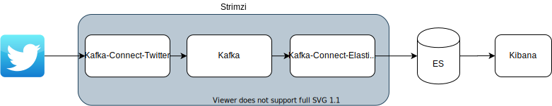

# kubernetes-training

# Version

- kubernetes: 1.15
- Helm: 3.2.1
- Traefik: 2.2

# Contents

- [helm](helm)
- [amazon-eks-workshop](amazon-eks-workshop)
- [ingress-nginx-controller](ingress-nginx-controller)
- [kubernetes-the-hard-way](kubernetes-the-hard-way)
- [traefik](traefik)
- [strimzi](strimzi)
- [postgres-operator](postgres-operator)

# Practice 1

```
kubectl create namespace eck
```

```
helm repo add elastic https://helm.elastic.co
```

```
helm install -n eck elasticsearch elastic/elasticsearch -f helm/es-config.yaml
```

```
helm install -n eck kibana elastic/kibana -f helm/kb-config.yaml
```

```
kubectl create namespace kafka-strimzi-18
kubectl apply -k strimzi/overlays/kafka-strimzi-18
```


