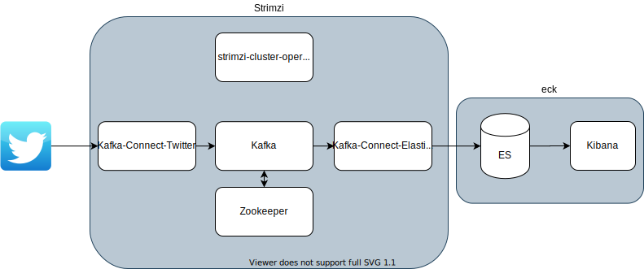

# kubernetes-training

# Version

- kubernetes: 1.15
- Helm: 3.2.1
- Traefik: 2.2
- ArgoCD: v1.6.0

# Contents

- General Kubernetes Usage
    - [amazon-eks-workshop](eksworkshop)
    - [helm](helm)
- Cluster Setup
    - [kubernetes-the-hard-way](kubernetes-the-hard-way)
    - [Kubeadm in local](kubeadm-local)
- Kubernetes Features
    - [Autoscaling HPA](autoscaling-hpa)
- Networking
    - [traefik](traefik)
    - [ingress-nginx-controller](ingress-nginx-controller)
- Middleware (Operator)
    - [strimzi](strimzi)
    - [postgres-operator](postgres-operator)
    - [eck](eck)
- Security
    - [open-policy-agent]
- Controller
    - [custom-controller]
- CD
    - [argocd](argocd)

# Practice 1: Install ES, Kibana & Filebeat with Helm

1. Create namespace

    ```
    kubectl create namespace eck
    ```

1. Add elastic Helm

    ```
    helm repo add elastic https://helm.elastic.co
    ```

1. Install ES

    ```
    helm install -n eck elasticsearch elastic/elasticsearch -f helm/es-config.yaml
    ```

1. Install Kibana

    ```
    helm install -n eck kibana elastic/kibana -f helm/kb-config.yaml
    ```

1. Install filebeat

    ```
    helm install -n eck filebeat elastic/filebeat --version 7.8.1 -f helm/filebeat-config.yaml
    ```

# Practice 2: Install Kafka Cluster + Kafka Connect with Strimzi

- Kafka

    1. Update the kafka-connect-twitter with your own API token
    1. Apply Kafka

        ```
        kubectl create namespace kafka-strimzi-18
        kubectl apply -k strimzi/overlays/kafka-strimzi-18
        ```




```
NAMESPACE          NAME                                                             READY   STATUS    RESTARTS   AGE
eck                elasticsearch-master-0                                           1/1     Running   0          14h
eck                kibana-kibana-55f4bc96f5-7fz65                                   1/1     Running   0          14h
kafka-strimzi-18   kafka-connect-sink-connect-847cfbf66-gwtkl                       1/1     Running   0          7h27m
kafka-strimzi-18   kafka-connect-source-connect-57bf7974f7-sz8ww                    1/1     Running   0          7h27m
kafka-strimzi-18   my-cluster-entity-operator-579cdc77bc-v6rxt                      3/3     Running   5          14h
kafka-strimzi-18   my-cluster-kafka-0                                               2/2     Running   0          14h
kafka-strimzi-18   my-cluster-kafka-1                                               2/2     Running   0          14h
kafka-strimzi-18   my-cluster-kafka-2                                               2/2     Running   2          14h
kafka-strimzi-18   my-cluster-zookeeper-0                                           1/1     Running   0          14h
kafka-strimzi-18   strimzi-cluster-operator-6c9d899778-nkd9q                        1/1     Running   0          14h
kube-system        kube-dns-869d587df7-7whsm                                        3/3     Running   0          14h
kube-system        kube-dns-869d587df7-z659j                                        3/3     Running   0          14h
kube-system        kube-dns-autoscaler-645f7d66cf-r9ttj                             1/1     Running   0          14h
kube-system        kube-proxy-gke-my-gke-cluster-my-gke-cluster-nod-9dff1786-x4wz   1/1     Running   0          14h
kube-system        kube-proxy-gke-my-gke-cluster-my-gke-cluster-pre-19639e01-7jsz   1/1     Running   0          93s
kube-system        kube-proxy-gke-my-gke-cluster-my-gke-cluster-pre-19639e01-cnl2   1/1     Running   0          14h
kube-system        kube-proxy-gke-my-gke-cluster-my-gke-cluster-pre-19639e01-f6cb   1/1     Running   0          14h
kube-system        kube-proxy-gke-my-gke-cluster-my-gke-cluster-pre-19639e01-vw9d   1/1     Running   0          14h
kube-system        l7-default-backend-678889f899-fvswg                              1/1     Running   0          14h
kube-system        metrics-server-v0.3.6-7b7d6c7576-msl8x                           2/2     Running   0          14h
```

# Practice 3: Install Prometheus & Grafana with kube-prometheus

- Prometheus & Grafana

    ```
    g clone https://github.com/coreos/kube-prometheus.git && kube-prometheus
    ```

    ```
    kubectl apply -f manifests/setup
    ```

    wait a few minutes

    ```
    kubectl create -f manifests
    ```

- Add strimzi monitoring

    ```
    kubectl apply -f strimzi/monitoring/prometheus-prometheus.yaml,strimzi/monitoring/prometheus-clusterRole.yaml
    ```

- Add elasticsearch monitoring


```
kubectl get pod --all-namespaces
NAMESPACE          NAME                                                             READY   STATUS    RESTARTS   AGE
eck                elasticsearch-master-0                                           1/1     Running   0          3d3h
eck                kibana-kibana-55f4bc96f5-7fz65                                   1/1     Running   0          3d4h
kafka-strimzi-18   kafka-connect-sink-connect-75db959966-sxqxx                      1/1     Running   0          43m
kafka-strimzi-18   kafka-connect-source-connect-6bc6d8797c-rr2x2                    1/1     Running   0          42m
kafka-strimzi-18   my-cluster-entity-operator-579cdc77bc-v6rxt                      3/3     Running   0          3d4h
kafka-strimzi-18   my-cluster-kafka-0                                               2/2     Running   0          2d13h
kafka-strimzi-18   my-cluster-kafka-1                                               2/2     Running   0          2d13h
kafka-strimzi-18   my-cluster-kafka-2                                               2/2     Running   0          2d13h
kafka-strimzi-18   my-cluster-zookeeper-0                                           1/1     Running   50         2d1h
kafka-strimzi-18   my-cluster-zookeeper-1                                           1/1     Running   16         2d1h
kafka-strimzi-18   my-cluster-zookeeper-2                                           1/1     Running   0          2d1h
kafka-strimzi-18   strimzi-cluster-operator-6c9d899778-nkd9q                        1/1     Running   0          3d4h
kube-system        kube-dns-869d587df7-7whsm                                        3/3     Running   0          3d4h
kube-system        kube-dns-869d587df7-z659j                                        3/3     Running   0          3d4h
kube-system        kube-dns-autoscaler-645f7d66cf-r9ttj                             1/1     Running   0          3d4h
kube-system        kube-proxy-gke-my-gke-cluster-my-gke-cluster-nod-9dff1786-x4wz   1/1     Running   0          3d4h
kube-system        kube-proxy-gke-my-gke-cluster-my-gke-cluster-pre-19639e01-7jsz   1/1     Running   0          2d13h
kube-system        kube-proxy-gke-my-gke-cluster-my-gke-cluster-pre-19639e01-cnl2   1/1     Running   0          3d4h
kube-system        kube-proxy-gke-my-gke-cluster-my-gke-cluster-pre-19639e01-f6cb   1/1     Running   0          3d4h
kube-system        kube-proxy-gke-my-gke-cluster-my-gke-cluster-pre-19639e01-vw9d   1/1     Running   0          3d4h
kube-system        l7-default-backend-678889f899-fvswg                              1/1     Running   0          3d4h
kube-system        metrics-server-v0.3.6-7b7d6c7576-msl8x                           2/2     Running   0          3d4h
monitoring         alertmanager-main-0                                              2/2     Running   0          13h
monitoring         alertmanager-main-1                                              2/2     Running   0          13h
monitoring         alertmanager-main-2                                              2/2     Running   0          13h
monitoring         grafana-58dc7468d7-vnsbh                                         1/1     Running   0          13h
monitoring         kube-state-metrics-765c7c7f95-fhkls                              3/3     Running   0          13h
monitoring         node-exporter-bjq6x                                              2/2     Running   0          13h
monitoring         node-exporter-d7dx8                                              2/2     Running   0          13h
monitoring         node-exporter-ddmxd                                              2/2     Running   0          13h
monitoring         node-exporter-mj6tx                                              2/2     Running   0          13h
monitoring         node-exporter-psf45                                              2/2     Running   0          13h
monitoring         prometheus-adapter-5cd5798d96-fkd75                              1/1     Running   0          13h
monitoring         prometheus-k8s-0                                                 3/3     Running   1          12h
monitoring         prometheus-k8s-1                                                 3/3     Running   1          12h
monitoring         prometheus-operator-5f75d76f9f-xtgqz                             1/1     Running   0          2d5h
```

# Practice 4: Kafka exporter & MirrorMaker2


1. Enable the cluster operator to watch the other namespace


    ```diff
    +  - strimzi-0.18.0/install/cluster-operator/050-Deployment-strimzi-cluster-operator.yaml
    ```

    ```
    kubectl apply -k strimzi/overlays/kafka-strimzi-18
    ```

1. Deploy new `Kafka` cluster and `KafkaMirrorMaker2` in the other namespace `kafka-strimzi-18-staging`

    ```
    kubectl apply -k strimzi/overlays/kafka-strimzi-18-staging
    ```

1. Clean up

    ```
    kubectl delete -k strimzi/overlays/kafka-strimzi-18-staging
    ```


# Practice 5: Open Policy Agent

[open-policy-agent]()

## gatekeeper

https://github.com/open-policy-agent/gatekeeper

1. Install gatekeeper

    ```
    kubectl apply -f https://raw.githubusercontent.com/open-policy-agent/gatekeeper/master/deploy/gatekeeper.yaml
    ```

1. Create `ConstraintTemplate`
1. Create custom policy defined in the previous step.

## conftest

https://github.com/open-policy-agent/conftest

# Practice 6: ArgoCD

1. Deploy argocd

    ```
    kubectl apply -k argocd/setup
    ```

1. Login

    ```
    kubectl -n argocd port-forward service/argocd-server 8080:80
    ```

    open: https://localhost:8080

    - user: `admin`
    - password: `kubectl get po -n argocd | grep argocd-server | awk '{print $1}'`

1. Deploy AppProject and Application

    ```
    kubectl apply -f argocd/project/dev
    ```

1. Manage ArgoCD by ArgoCD

    ```
    kubectl apply -f argocd/project/argocd
    ```

    

For more details: [argocd](argocd)
