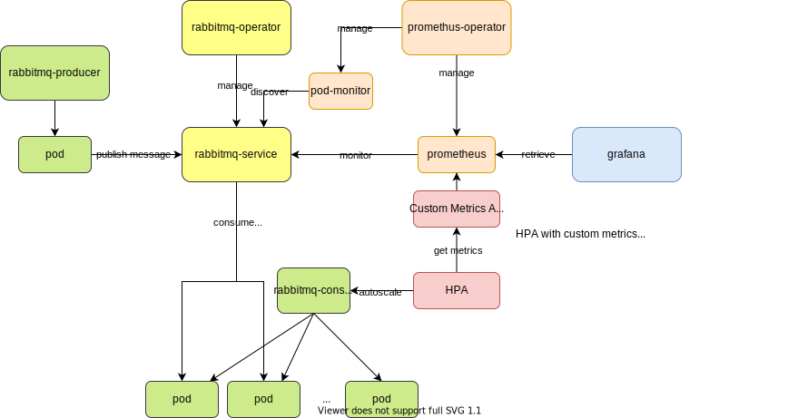

# kubernetes-training

# Versions

- Kubernetes: 1.15
- kustomize: [v4.2.0](https://github.com/kubernetes-sigs/kustomize/releases/tag/kustomize%2Fv4.2.0) (released on 2021-07-02)
- Helm: [3.6.3](https://github.com/helm/helm/releases/tag/v3.6.3) (released on 2021-07-15)
- Traefik: v2.2
- ArgoCD: [v2.1.0-rc1](https://github.com/argoproj/argo-cd/releases/tag/v2.1.0-rc1) (released on 2021-07-29)
- Prometheus-Operator: [v0.48.1](https://github.com/prometheus-operator/prometheus-operator/releases/tag/v0.48.1) (released on 2021-06-01)
- Prometheus: [v2.28.1](https://github.com/prometheus/prometheus/releases/tag/v2.28.1) (released on 2021-07-01)
- Grafana:
- Strimzi: [0.24.0](https://github.com/strimzi/strimzi-kafka-operator/releases/tag/0.24.0)
- Kind: v0.10.0
- Ingress Nginx Controller: v0.32.0
- Conftest: [0.25.0](https://github.com/open-policy-agent/conftest/releases/tag/v0.25.0) (released on 2021-05-08)

# Contents

- General Kubernetes Usage
    - [amazon-eks-workshop](eksworkshop)
    - [helm](helm)
- Cluster Setup
    - [kubernetes-the-hard-way](kubernetes-the-hard-way)
    - [Kubeadm in local](kubeadm-local)
- Kubernetes Features
    - [Autoscaler HPA with custom metrics](autoscaler/hpa/custom-metrics)
- Networking
    - [traefik](traefik)
    - [ingress-nginx-controller](ingress-nginx-controller)
- Middleware (Operator)
    - [strimzi](strimzi)
    - [postgres-operator](postgres-operator)
    - [eck](eck)
- Monitoring
    - [prometheus](prometheus-operator)
- Security
    - [open-policy-agent](open-policy-agent)
- Controller
    - custom-controller
- Yaml Management
    - [helm](helm)
    - [Helm vs Kustomize](helm-vs-kustomize)
- CI/CD
    - [conftest](open-policy-agent/conftest)
    - [argocd](argocd)

# Cloud Native Trail Map

- https://github.com/cncf/trailmap
- https://www.cncf.io/blog/2018/03/08/introducing-the-cloud-native-landscape-2-0-interactive-edition/


## 1. CONTAINERIZATION

## 2. CI/CD

### 2.1 ArgoCD

1. Create namespace.

    ```
    kubectl create namespace argocd
    ```

1. Deploy argocd.

    ```
    kubectl apply -k argocd/setup
    ```

1. Login

    ```
    kubectl -n argocd port-forward service/argocd-server 8080:80
    ```

    open: https://localhost:8080

    - user: `admin`
    - password: `kubectl get secret argocd-initial-admin-secret -n argocd -o jsonpath='{.data.password}' | base64 --decode`

1. Deploy AppProject and Application

    ```
    kubectl apply -f argocd/project/dev
    ```

1. Manage ArgoCD by ArgoCD

    ```
    kubectl apply -f argocd/project/argocd
    ```

    

For more details: [argocd](argocd)
## 3. ORCHESTRATION & APPLICATION DEFINITION

### 3.1 Kubernetes

#### Practice 1: Install Elasticsearch, Kibana & Filebeat with Helm

1. Create namespace

    ```
    kubectl create namespace eck
    ```

1. Add elastic Helm

    ```
    helm repo add elastic https://helm.elastic.co
    ```

1. Install ES

    ```
    helm install -n eck elasticsearch elastic/elasticsearch -f helm/es-config.yaml
    ```

1. Install Kibana

    ```
    helm install -n eck kibana elastic/kibana -f helm/kb-config.yaml
    ```

1. Install filebeat

    ```
    helm install -n eck filebeat elastic/filebeat --version 7.8.1 -f helm/filebeat-config.yaml
    ```

#### Practice 2: Install Kafka Cluster + Kafka Connect with Strimzi

- Kafka

    1. Update the kafka-connect-twitter with your own API token
    1. Apply Kafka

        ```
        kubectl create namespace kafka-strimzi-18
        kubectl apply -k strimzi/overlays/kafka-strimzi-18
        ```


<details>

```
NAMESPACE          NAME                                                             READY   STATUS    RESTARTS   AGE
eck                elasticsearch-master-0                                           1/1     Running   0          14h
eck                kibana-kibana-55f4bc96f5-7fz65                                   1/1     Running   0          14h
kafka-strimzi-18   kafka-connect-sink-connect-847cfbf66-gwtkl                       1/1     Running   0          7h27m
kafka-strimzi-18   kafka-connect-source-connect-57bf7974f7-sz8ww                    1/1     Running   0          7h27m
kafka-strimzi-18   my-cluster-entity-operator-579cdc77bc-v6rxt                      3/3     Running   5          14h
kafka-strimzi-18   my-cluster-kafka-0                                               2/2     Running   0          14h
kafka-strimzi-18   my-cluster-kafka-1                                               2/2     Running   0          14h
kafka-strimzi-18   my-cluster-kafka-2                                               2/2     Running   2          14h
kafka-strimzi-18   my-cluster-zookeeper-0                                           1/1     Running   0          14h
kafka-strimzi-18   strimzi-cluster-operator-6c9d899778-nkd9q                        1/1     Running   0          14h
kube-system        kube-dns-869d587df7-7whsm                                        3/3     Running   0          14h
kube-system        kube-dns-869d587df7-z659j                                        3/3     Running   0          14h
kube-system        kube-dns-autoscaler-645f7d66cf-r9ttj                             1/1     Running   0          14h
kube-system        kube-proxy-gke-my-gke-cluster-my-gke-cluster-nod-9dff1786-x4wz   1/1     Running   0          14h
kube-system        kube-proxy-gke-my-gke-cluster-my-gke-cluster-pre-19639e01-7jsz   1/1     Running   0          93s
kube-system        kube-proxy-gke-my-gke-cluster-my-gke-cluster-pre-19639e01-cnl2   1/1     Running   0          14h
kube-system        kube-proxy-gke-my-gke-cluster-my-gke-cluster-pre-19639e01-f6cb   1/1     Running   0          14h
kube-system        kube-proxy-gke-my-gke-cluster-my-gke-cluster-pre-19639e01-vw9d   1/1     Running   0          14h
kube-system        l7-default-backend-678889f899-fvswg                              1/1     Running   0          14h
kube-system        metrics-server-v0.3.6-7b7d6c7576-msl8x                           2/2     Running   0          14h
```

</details>

#### Practice 3: Install Prometheus & Grafana with kube-prometheus

- Prometheus & Grafana

    ```
    git clone https://github.com/coreos/kube-prometheus.git && kube-prometheus
    ```

    ```
    kubectl apply -f manifests/setup
    ```

    wait a few minutes

    ```
    kubectl create -f manifests
    ```

- Add strimzi monitoring

    ```
    kubectl apply -f strimzi/monitoring/prometheus-prometheus.yaml,strimzi/monitoring/prometheus-clusterRole.yaml
    ```

- Add elasticsearch monitoring


<details>

```
kubectl get pod --all-namespaces
NAMESPACE          NAME                                                             READY   STATUS    RESTARTS   AGE
eck                elasticsearch-master-0                                           1/1     Running   0          3d3h
eck                kibana-kibana-55f4bc96f5-7fz65                                   1/1     Running   0          3d4h
kafka-strimzi-18   kafka-connect-sink-connect-75db959966-sxqxx                      1/1     Running   0          43m
kafka-strimzi-18   kafka-connect-source-connect-6bc6d8797c-rr2x2                    1/1     Running   0          42m
kafka-strimzi-18   my-cluster-entity-operator-579cdc77bc-v6rxt                      3/3     Running   0          3d4h
kafka-strimzi-18   my-cluster-kafka-0                                               2/2     Running   0          2d13h
kafka-strimzi-18   my-cluster-kafka-1                                               2/2     Running   0          2d13h
kafka-strimzi-18   my-cluster-kafka-2                                               2/2     Running   0          2d13h
kafka-strimzi-18   my-cluster-zookeeper-0                                           1/1     Running   50         2d1h
kafka-strimzi-18   my-cluster-zookeeper-1                                           1/1     Running   16         2d1h
kafka-strimzi-18   my-cluster-zookeeper-2                                           1/1     Running   0          2d1h
kafka-strimzi-18   strimzi-cluster-operator-6c9d899778-nkd9q                        1/1     Running   0          3d4h
kube-system        kube-dns-869d587df7-7whsm                                        3/3     Running   0          3d4h
kube-system        kube-dns-869d587df7-z659j                                        3/3     Running   0          3d4h
kube-system        kube-dns-autoscaler-645f7d66cf-r9ttj                             1/1     Running   0          3d4h
kube-system        kube-proxy-gke-my-gke-cluster-my-gke-cluster-nod-9dff1786-x4wz   1/1     Running   0          3d4h
kube-system        kube-proxy-gke-my-gke-cluster-my-gke-cluster-pre-19639e01-7jsz   1/1     Running   0          2d13h
kube-system        kube-proxy-gke-my-gke-cluster-my-gke-cluster-pre-19639e01-cnl2   1/1     Running   0          3d4h
kube-system        kube-proxy-gke-my-gke-cluster-my-gke-cluster-pre-19639e01-f6cb   1/1     Running   0          3d4h
kube-system        kube-proxy-gke-my-gke-cluster-my-gke-cluster-pre-19639e01-vw9d   1/1     Running   0          3d4h
kube-system        l7-default-backend-678889f899-fvswg                              1/1     Running   0          3d4h
kube-system        metrics-server-v0.3.6-7b7d6c7576-msl8x                           2/2     Running   0          3d4h
monitoring         alertmanager-main-0                                              2/2     Running   0          13h
monitoring         alertmanager-main-1                                              2/2     Running   0          13h
monitoring         alertmanager-main-2                                              2/2     Running   0          13h
monitoring         grafana-58dc7468d7-vnsbh                                         1/1     Running   0          13h
monitoring         kube-state-metrics-765c7c7f95-fhkls                              3/3     Running   0          13h
monitoring         node-exporter-bjq6x                                              2/2     Running   0          13h
monitoring         node-exporter-d7dx8                                              2/2     Running   0          13h
monitoring         node-exporter-ddmxd                                              2/2     Running   0          13h
monitoring         node-exporter-mj6tx                                              2/2     Running   0          13h
monitoring         node-exporter-psf45                                              2/2     Running   0          13h
monitoring         prometheus-adapter-5cd5798d96-fkd75                              1/1     Running   0          13h
monitoring         prometheus-k8s-0                                                 3/3     Running   1          12h
monitoring         prometheus-k8s-1                                                 3/3     Running   1          12h
monitoring         prometheus-operator-5f75d76f9f-xtgqz                             1/1     Running   0          2d5h
```

</details>

#### Practice 4: Kafka exporter & MirrorMaker2


1. Enable the cluster operator to watch the other namespace


    ```diff
    +  - strimzi-0.18.0/install/cluster-operator/050-Deployment-strimzi-cluster-operator.yaml
    ```

    ```
    kubectl apply -k strimzi/overlays/kafka-strimzi-18
    ```

1. Deploy new `Kafka` cluster and `KafkaMirrorMaker2` in the other namespace `kafka-strimzi-18-staging`

    ```
    kubectl apply -k strimzi/overlays/kafka-strimzi-18-staging
    ```

1. Clean up

    ```
    kubectl delete -k strimzi/overlays/kafka-strimzi-18-staging
    ```


#### Practice 5: Horizontal Pod Autoscaler (HPA) (basic)

1. Install metrics-server

    ```
    kubectl apply -f https://github.com/kubernetes-sigs/metrics-server/releases/latest/download/components.yaml
    ```

1. Apply an apache application

    ```
    kubectl apply -f https://k8s.io/examples/application/php-apache.yaml
    ```

1. Set autoscale by kubectl

    ```
    kubectl autoscale deployment php-apache --cpu-percent=50 --min=1 --max=10
    ```

1. Increase load -> confirm HPA is working

    ```
    kubectl run -i --tty load-generator --rm --image=busybox --restart=Never -- /bin/sh -c "while sleep 0.01; do wget -q -O- http://php-apache; done"
    ```

    ```
    kubectl get hpa

    NAME         REFERENCE               TARGETS   MINPODS   MAXPODS   REPLICAS   AGE
    php-apache   Deployment/php-apache   76%/50%   1         10        7          4m10s
    ```

#### Practice 6: HPA with custom metrics (advanced)

[autoscaler/hpa/custom-metrics]()

Steps:

1. Prometheus Operator:
    ```
    kubectl apply -f https://raw.githubusercontent.com/prometheus-operator/prometheus-operator/master/bundle.yaml
    ```
1. Prometheus:
    ```
    kubectl create ns monitoring; kubectl apply -k prometheus-operator -n monitoring
    ```
1. RabbitMQ Operator:
    ```
    kubectl apply -f https://github.com/rabbitmq/cluster-operator/releases/latest/download/cluster-operator.yml
    ````
1. RabbitMQ:
    ```
    kubectl apply -f autoscaler/hpa/custom-metrics/rabbitmq/rabbitmq-cluster.yaml
    kubectl apply -f autoscaler/hpa/custom-metrics/rabbitmq/pod-monitor-rabbitmq.yaml
    ```
1. RabbitMQ producer:
    ```
    kubectl apply -f autoscaler/hpa/custom-metrics/rabbitmq-producer-cronjob.yaml
    ```
1. RabbitMQ consumer:
    ```
    kubectl apply -f autoscaler/hpa/custom-metrics/rabbitmq-consumer-deployment.yaml
    ```
1. Prometheus-Adapter: Extend the Kubernetes custom metrics API with the metrics. (https://github.com/kubernetes-sigs/prometheus-adapter)
    ```
    cd autoscaler/hpa/custom-metrics/k8s-prom-hpa
    touch metrics-ca.key metrics-ca.crt metrics-ca-config.json
    make certs
    cd -
    kubectl create -f autoscaler/hpa/custom-metrics/k8s-prom-hpa/custom-metrics-api
    ```
1. Apply HPA
    ```
    kubectl apply -f autoscaler/hpa/custom-metrics/rabbitmq-consumer-hpa.yaml
    ```



#### Practice 7: Set up Kubernetes Cluster with kubeadm (local)

[kubeadm-local]()
#### Practice 8: Set up Kubernetes Cluster on GCP (kubernetes-the-hard-way)

https://github.com/kelseyhightower/kubernetes-the-hard-way

### 3.2 Helm

1. Create Helm chart.

    ```
    helm create <chart-name e.g. helm-example>
    ```

1. Update files under `templates` and `values.yaml`
1. Test apply.

    ```
    helm install helm-example --debug ./helm-example
    ```

1. Make a package.

    ```
    helm package helm-example
    ```

1. Create repository and set index.

    ```
    helm repo index ./ --url https://nakamasato.github.io/helm-charts-repo
    ```

1. Install a chart.

    ```
    helm repo add nakamasato https://nakamasato.github.io/helm-charts-repo
    helm repo update # update the repository info
    helm install example-from-my-repo nakamasato/helm-example
    ```

## 4. OBSERVABILITY & ANALYTICS

### 4.1. Prometheus


### TBD
- fluentd
- Jaeger
- Open Tracing

## 5. SERVICE PROXY, DISCOVERY & MESH

### TBD
- envoy
- CoreDNS
- Linkerd

## 6. NETWORKING, POLICY & SECURITY

### 6.1 Open Policy Agent

[open-policy-agent]()

### gatekeeper

https://github.com/open-policy-agent/gatekeeper

1. Install gatekeeper

    ```
    kubectl apply -f https://raw.githubusercontent.com/open-policy-agent/gatekeeper/master/deploy/gatekeeper.yaml
    ```

1. Create `ConstraintTemplate`
1. Create custom policy defined in the previous step.

### conftest

https://github.com/open-policy-agent/conftest


1. Write policy in `policy` directory.

    ```rego
    deny[msg] {
      input.kind = "Deployment"
      not input.spec.template.spec.nodeSelector
      msg = "Deployment must have nodeSelector"
    }
    ```

1. Write tests in the same directory.

    ```rego
    test_no_nodeSelector {
      deny["Deployment must have nodeSelector"] with input as
      {
        "kind": "Deployment",
        "spec": {
          "template": {
            "spec": {
              "containers": [
              ],
            }
          }
        }
      }
    }
    ```

1. Run test.

    ```
    conftest verify

    1 tests, 1 passed, 0 warnings, 0 failures, 0 exceptions
    ```

1. Validate a manifest file.

    ```
    conftest test manifests/valid/deployment.yaml

    1 tests, 1 passed, 0 warnings, 0 failures, 0 exceptions
    ```


### TBD
- CNI
- falco

## 7. DISTRIBUTED DATABASE & STORAGE


### TBD
- Vitess
- Rook
- etcd
- TiKV

## 8. STREAMING & MESSAGING

### TBD
- gRPC
- NATS
- cloudevents

## 9. CONTAINER REGISTRY & RUNTIME

### TBD
- containerd
- harbor
- cri-o

## 10. SOFTWARE DISTRIBUTION

### TBD
- TUF
- notaru
