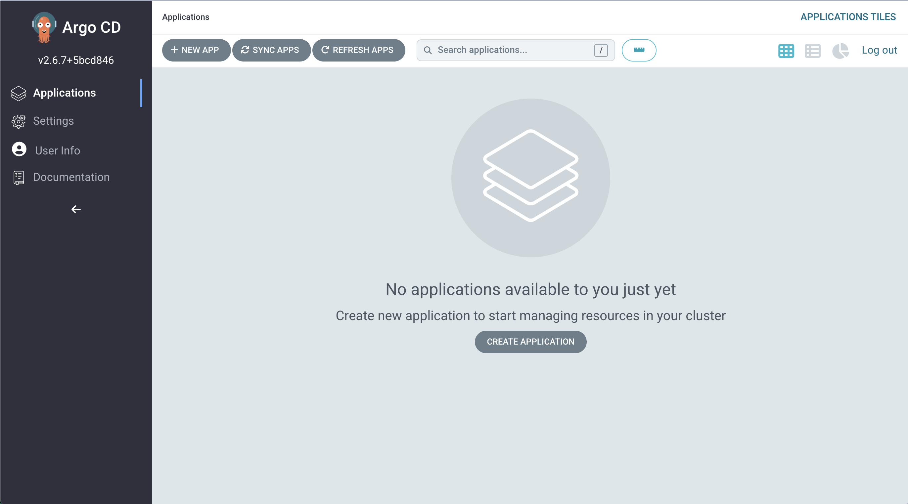

# ArgoCD

## Install

```
kubectl apply -k argocd/setup
```

Check all the pods are running

```
kubectl get pod -n argocd
NAME                                             READY   STATUS    RESTARTS   AGE
argocd-application-controller-74b8d7b888-5pcd6   1/1     Running   0          45s
argocd-dex-server-5654f7fc98-2gx7g               1/1     Running   0          45s
argocd-redis-6d7f9df848-97h7v                    1/1     Running   0          45s
argocd-repo-server-857d8d8b7b-xbqrc              1/1     Running   0          45s
argocd-server-78ffb87fd8-5rtb7                   1/1     Running   0          45s
```

## Login

```
kubectl -n argocd port-forward service/argocd-server 8080:80
```

- user: `admin`
- password: `kubectl get po -n argocd | grep argocd-server | awk '{print $1}'`



## Add ArgoCD AppProject & Application

- AppProject: `dev`
- Application: `guestbook-kustomize-dev`

1. Crate namespace

    ```
    kubectl create ns dev
    ```

1. Deploy application with ArgoCD

    ```
    kubectl apply -f argocd/project/dev
    ```
