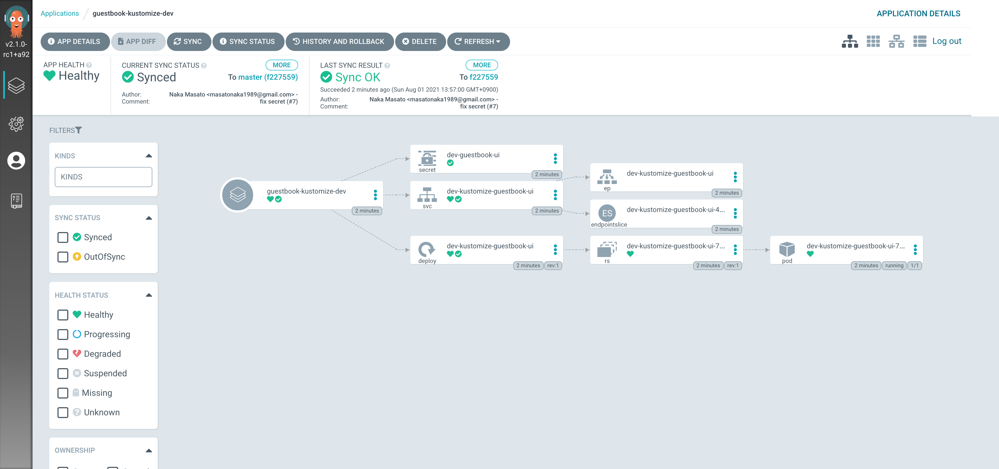

# ArgoCD

## Version

[v2.1.0-rc1](https://github.com/argoproj/argo-cd/releases/tag/v2.1.0-rc1)
## Install

```bash
kubectl create namespace argocd
kubectl kustomize argocd/setup | kubectl apply -f - # before v1.21
kubectl apply -k argocd/setup # v1.21 or later
```

Check all the pods are running

```bash
kubectl get pod -n argocd
NAME                                             READY   STATUS    RESTARTS   AGE
argocd-application-controller-74b8d7b888-5pcd6   1/1     Running   0          45s
argocd-dex-server-5654f7fc98-2gx7g               1/1     Running   0          45s
argocd-redis-6d7f9df848-97h7v                    1/1     Running   0          45s
argocd-repo-server-857d8d8b7b-xbqrc              1/1     Running   0          45s
argocd-server-78ffb87fd8-5rtb7                   1/1     Running   0          45s
```

## Login

```bash
kubectl -n argocd port-forward service/argocd-server 8080:80
```

- user: `admin`
- password: `kubectl get secret argocd-initial-admin-secret -n argocd -o jsonpath='{.data.password}' | base64 --decode` (v1.9.0 or later, there's a secret for initial admin password.)


## Add ArgoCD AppProject & Application

- AppProject: `dev`
- Application: `guestbook-kustomize-dev`

1. Deploy application with ArgoCD

    ```
    kubectl apply -f argocd/project/dev
    ```

1. Check in console

    ```
    kubectl get pod -n dev
    NAME                                          READY   STATUS    RESTARTS   AGE
    dev-kustomize-guestbook-ui-7574c75879-6cfnq   1/1     Running   0          95s
    ```

1. Check on ArgoCD

    

## Manage argocd by argocd

```
kubectl apply -f argocd/project/argocd
```


## Clean up

```
kubectl delete -f argocd/project/dev
kubectl delete -k argocd/setup
kubectl delete ns dev
```
