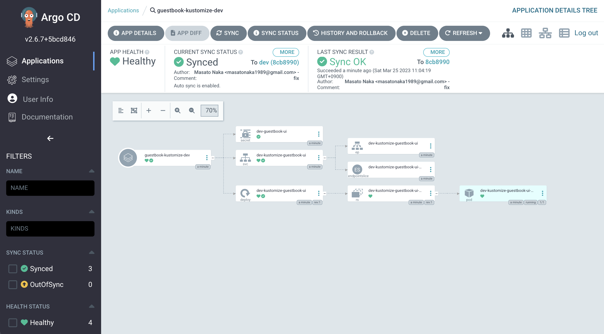
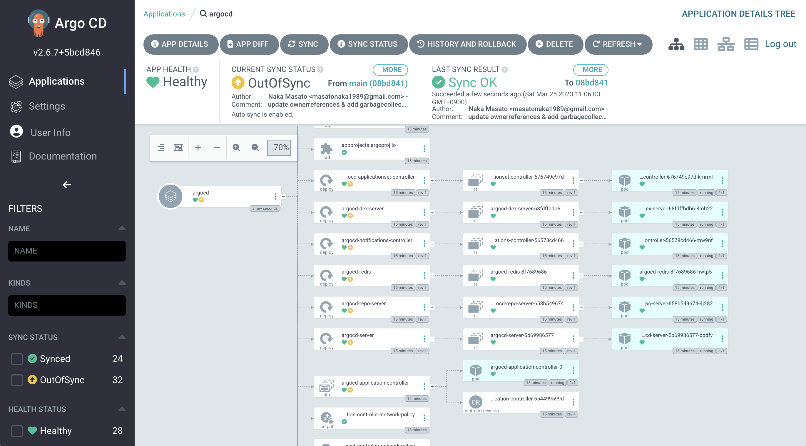

# ArgoCD

- Github: https://github.com/argoproj/argo-cd
- Docs: https://argo-cd.readthedocs.io/en/stable/
- Icon: https://cncf-branding.netlify.app/projects/argo/

## Version

- [v2.1.1](https://github.com/argoproj/argo-cd/releases/tag/v2.1.1)
## Install

```bash
kubectl create namespace argocd
kubectl kustomize argocd/setup | kubectl apply -f - # before v1.21
kubectl apply -k argocd/setup # v1.21 or later
```

Check all the pods are running

```bash
kubectl get pod -n argocd
NAME                                             READY   STATUS    RESTARTS   AGE
argocd-application-controller-74b8d7b888-5pcd6   1/1     Running   0          45s
argocd-dex-server-5654f7fc98-2gx7g               1/1     Running   0          45s
argocd-redis-6d7f9df848-97h7v                    1/1     Running   0          45s
argocd-repo-server-857d8d8b7b-xbqrc              1/1     Running   0          45s
argocd-server-78ffb87fd8-5rtb7                   1/1     Running   0          45s
```

## Login

```bash
kubectl -n argocd port-forward service/argocd-server 8080:80
```

- user: `admin`
- password: `kubectl get secret argocd-initial-admin-secret -n argocd -o jsonpath='{.data.password}' | base64 --decode` (v1.9.0 or later, there's a secret for initial admin password.)


## Add ArgoCD AppProject & Application

- AppProject: `dev`
- Application: `guestbook-kustomize-dev`gstEN13.

1. Deploy application with ArgoCD

    ```bash
    kubectl apply -f argocd/project/dev
    ```

1. Check in console

    ```bash
    kubectl get pod -n dev
    NAME                                          READY   STATUS    RESTARTS   AGE
    dev-kustomize-guestbook-ui-7574c75879-6cfnq   1/1     Running   0          95s
    ```

1. Check on ArgoCD

    

## Manage argocd by argocd

```bash
kubectl apply -f argocd/project/argocd/project.yaml,argocd/project/argocd/app-argocd.yaml
```



## Clean up

```bash
kubectl delete -f argocd/project/dev
kubectl delete -k argocd/setup
kubectl delete ns argocd
```

# ArgoCD Notifications

Github: https://github.com/argoproj-labs/argocd-notifications
Docs: https://argocd-notifications.readthedocs.io/en/stable/

## Prerequisite

ArgoCD is installed.

## Version

- [v1.1.1](https://github.com/argoproj-labs/argocd-notifications/releases/tag/v1.1.1)


## Manage by kustomize

### Basic

1. Install

    ```bash
    kubectl apply -k argocd/setup-notifications/base
    ```

1. Clean up

    ```
    kubectl delete -k argocd/setup-notifications/base
    ```

### Manage by ArgoCD


```bash
kubectl apply -f argocd/project/argocd/project.yaml,argocd/project/argocd/app-argocd-notifications.yaml
```

## Manage by Helm

1. Install

    ```
    helm repo add argo https://argoproj.github.io/argo-helm
    helm install argo/argocd-notifications --generate-name -n argocd -f argocd/setup-notification-with-helm/value.yaml
    ```

    <details>

    failed:

    ```
    Error: YAML parse error on argocd-notifications/templates/configmap.yaml: error converting YAML to JSON: yaml: line 15: did not find expected key
    ```

    https://github.com/argoproj/argo-helm/issues/616 → fixed in https://github.com/argoproj-labs/argocd-notifications/pull/315

    </details>

## Configure Slack Notification

https://argocd-notifications.readthedocs.io/en/stable/services/slack/

1. Prepare Slack bot and channel.
    1. Create Slack Application with `chat:write:bot` permission.
    1. Get OAuth token.
    1. Create Slack channel (e.g. `#argocd-notifications`).
    1. Add your bot to this channel. (`/invite @<your-app-name>`)
1. Install either by Kustomize or Helm:
    - Kustomize:
        1. Prepare Secret `argocd-notifications-secret` (`setup-notifications/overlays/slack/argocd-notification-secret.yaml`)
            ```
            cp setup-notifications/overlays/slack/argocd-notification-secret-sample.yaml setup-notifications/overlays/slack/argocd-notification-secret.yaml
            ```

            Fill your Slack token.

        1. Prepare `argocd-notifications-cm` (`setup-notifications/overlays/slack/argocd-notification-cm.yaml`)
            - `context`
            - `subscriptions`
            - `service.slack`
                - Optionally, you can set argo icon https://cncf-branding.netlify.app/projects/argo/ in your Slack workspace. (seems not working)
            - Just writing ConfigMap doesn't work -> Added annotation in Application or Project (Subscribe to notifications by adding the notifications.argoproj.io/subscribe.on-sync-succeeded.slack annotation to the Argo CD application or project)
                ```bash
                kubectl patch app <my-app> -n argocd -p '{"metadata": {"annotations": {"notifications.argoproj.io/subscribe.on-sync-succeeded.slack":"<my-channel>"}}}' --type merge
                ```
        1. Apply
            ```base
            kubectl apply -k argocd/setup-notifications/overlays/slack
            ```
    - Helm:

        ```
        helm install argo/argocd-notifications --generate-name -n argocd -f argocd/setup-notification-with-helm/value.yaml --set secret.items.slack-token=<SLACK BOT TOKEN>
        ```
