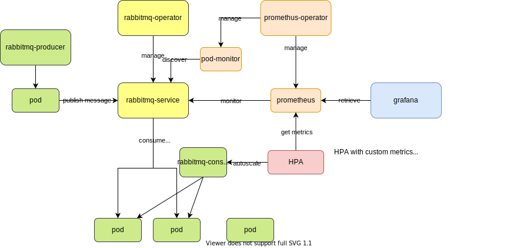
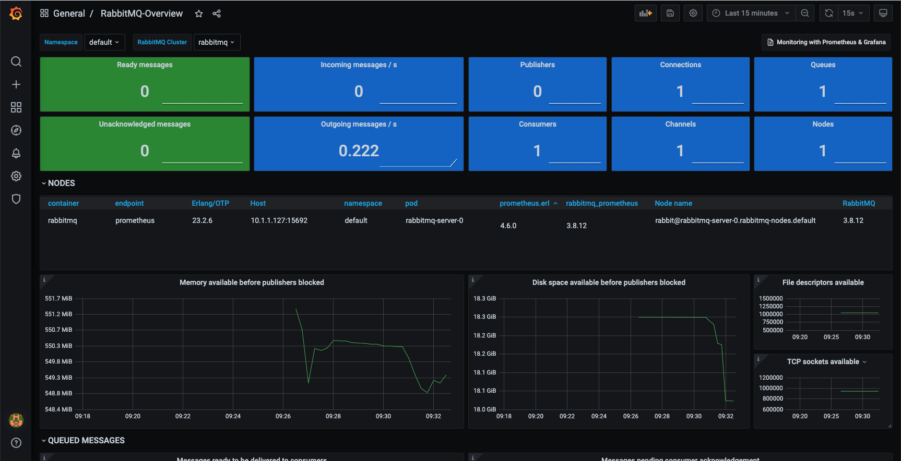
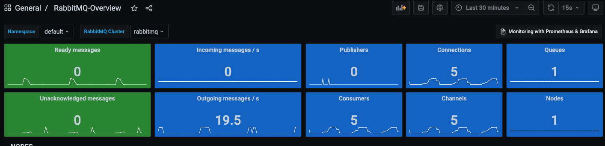

# HPA with custom metrics

## Overview

- RabbitMQ Producer (Java app)
- RabbitMQ
- RabbitMQ Consumer (Java app)
- Prometheus -> http://localhost:30900
- Grafana -> http://localhost:32111



## Deploy Prometheus

References:
- https://github.com/prometheus-operator/prometheus-operator#quickstart
- https://github.com/prometheus-operator/prometheus-operator/blob/master/Documentation/user-guides/getting-started.md

Steps:

1. Create prometheus operator

    ```
    kubectl apply -f https://raw.githubusercontent.com/prometheus-operator/prometheus-operator/master/bundle.yaml
    ```

1. Prometheus

    ```
    kubectl create ns monitoring
    ```

    ```
    kubectl apply -f ../../../prometheus-operator -n monitoring
    ```

1. Check UI at http://localhost:30900

    You can check [targets](http://localhost:30900/targets)

    


Monitoring RabbitMQ: https://www.rabbitmq.com/kubernetes/operator/operator-monitoring.html

We cannot use `ServiceMonitor` for RabbitMQ as RabbitMQ service doesn't have prometheus port (15692). We need to use `PodMonitor` as is recommended in the documentation.


## Deploy RabbitMQ with operator

https://www.rabbitmq.com/kubernetes/operator/quickstart-operator.html

1. RabbitMQ Operator

    ```
    kubectl apply -f https://github.com/rabbitmq/cluster-operator/releases/latest/download/cluster-operator.yml
    ```

1. Create a RabbitMQ cluster

    ```
    kubectl apply -f rabbitmq
    ```

1. Get username and password

    ```
    username="$(kubectl get secret rabbitmq-default-user -o jsonpath='{.data.username}' | base64 --decode)"
    echo "username: $username"
    password="$(kubectl get secret rabbitmq-default-user -o jsonpath='{.data.password}' | base64 --decode)"
    echo "password: $password"
    ```

1. port-forward

    ```
    kubectl port-forward "service/rabbitmq" 15672
    ```

    Open: http://localhost:15672/ and use the username and password got in the previous step.

Metrics:

> As of 3.8.0, RabbitMQ ships with built-in Prometheus & Grafana support.
> Support for Prometheus metric collector ships in the rabbitmq_prometheus plugin. The plugin exposes all RabbitMQ metrics on a dedicated TCP port, in Prometheus text format.

Check if `rabbitmq_prometheus` plugin is enabled.

```
kubectl exec -it rabbitmq-server-0 -- rabbitmq-plugins list | grep prometheus
[E*] rabbitmq_prometheus               3.8.12
```

## Deploy producer

Create `rabbitmq-producer` `CronJob` (run hourly)

```
kubectl apply -f rabbitmq-producer
```

If you want to run a job manually, you can run the following command after creating `CronJob`

```
kubectl create job --from=cronjob/rabbitmq-producer rabbitmq-producer-$(date '+%s')
```

## Deploy consumer

Create `rabbitmq-consumer` `Deployment`

```
kubectl apply -f rabbitmq-consumer
```

## Deploy Grafana

https://devopscube.com/setup-grafana-kubernetes/

```
kubectl apply -f grafana -n monitoring
```

log in to http://localhost:32111 with `admin` for both username and password

import dashboard https://grafana.com/grafana/dashboards/10991



## HPA with custom metrics

1. Collects metrics from your applications. (Prometheus)
1. Extends the Kubernetes custom metrics API with the metrics. (https://github.com/kubernetes-sigs/prometheus-adapter)

    Generate secrets

    ```
    git clone git@github.com:stefanprodan/k8s-prom-hpa.git
    cd k8s-prom-hpa
    touch metrics-ca.key metrics-ca.crt metrics-ca-config.json
    make certs
    ```

1. Deploy `prometheus-adapter`

    ```
    kubectl create -f ./custom-metrics-api
    ```

    ```
    kubectl get --raw "/apis/custom.metrics.k8s.io/v1beta1/namespaces/default/pods/*/rabbitmq_queue_messages_ready"| jq .
    {
      "kind": "MetricValueList",
      "apiVersion": "custom.metrics.k8s.io/v1beta1",
      "metadata": {
        "selfLink": "/apis/custom.metrics.k8s.io/v1beta1/namespaces/default/pods/%2A/rabbitmq_queue_messages_ready"
      },
      "items": [
        {
          "describedObject": {
            "kind": "Pod",
            "namespace": "default",
            "name": "rabbitmq-server-0",
            "apiVersion": "/v1"
          },
          "metricName": "rabbitmq_queue_messages_ready",
          "timestamp": "2021-03-27T12:01:15Z",
          "value": "1274"
        }
      ]
    }
    ```

1. With custom API

    ```
    kubectl apply -f rabbitmq-consumer-hpa.yaml
    ```

    ```
    kubectl describe hpa rabbitmq-consumer
    Name:                                                                               rabbitmq-consumer
    Namespace:                                                                          default
    Labels:                                                                             <none>
    Annotations:                                                                        <none>
    CreationTimestamp:                                                                  Sat, 27 Mar 2021 21:36:14 +0900
    Reference:                                                                          Deployment/rabbitmq-consumer
    Metrics:                                                                            ( current / target )
      "rabbitmq_queue_messages_ready" on Pod/rabbitmq-server-0 (target average value):  442 / 1
    Min replicas:                                                                       1
    Max replicas:                                                                       10
    Deployment pods:                                                                    4 current / 8 desired
    Conditions:
      Type            Status  Reason            Message
      ----            ------  ------            -------
      AbleToScale     True    SucceededRescale  the HPA controller was able to update the target scale to 8
      ScalingActive   True    ValidMetricFound  the HPA was able to successfully calculate a replica count from external metric rabbitmq_queue_messages_ready(nil)
      ScalingLimited  True    ScaleUpLimit      the desired replica count is increasing faster than the maximum scale rate
    Events:
      Type    Reason             Age   From                       Message
      ----    ------             ----  ----                       -------
      Normal  SuccessfulRescale  20s   horizontal-pod-autoscaler  New size: 8; reason: external metric rabbitmq_queue_messages_ready(nil) above target
    ```

## Observe the behavior




## Clean up

```
for component in grafana rabbitmq rabbitmq-consumer rabbitmq-producer; do
    kubectl delete -f $component
done
kubectl delete -f https://github.com/rabbitmq/cluster-operator/releases/latest/download/cluster-operator.yml
kubectl delete -f https://raw.githubusercontent.com/prometheus-operator/prometheus-operator/master/bundle.yaml
```

## References
- [Horizontal Pod Autoscaler#support-for-custom-metrics](https://kubernetes.io/docs/tasks/run-application/horizontal-pod-autoscale/#support-for-custom-metrics)
- [Prometheus ServiceMonitor vs PodMonitor](https://github.com/prometheus-operator/prometheus-operator/issues/3119)
- https://qiita.com/Kameneko/items/071c2a064775badd939e
    > ただし、1点注意が必要で、これはPodのラベルではなく、Service…更に正しく言えばEndpointsのラベルを指定する必要があります。
- https://grafana.com/docs/grafana-cloud/quickstart/prometheus_operator/
- [Troubleshooting ServiceMonitor Changes](https://github.com/prometheus-operator/prometheus-operator/blob/master/Documentation/troubleshooting.md)
- https://github.com/stefanprodan/k8s-prom-hpa
- https://github.com/kubernetes-sigs/prometheus-adapter
- https://github.com/luxas/kubeadm-workshop

## Related Topics

- [ ] [Shutdown RabbitMQ consumer gracefully](https://kiritox.me/archives/shutdown-rabbitmq-consumer-gracefully.html)
- [ ] [Issue] Too fast to scale out.
- [ ] Scale down to zero.
  - Actually Kubernetes supports the scaling to zero only by means of an API call, since the Horizontal Pod Autoscaler does support scaling down to 1 replica only. (https://stackoverflow.com/questions/61596711/in-kubernetes-how-can-i-scale-a-deployment-to-zero-when-idle#:~:text=Actually%20Kubernetes%20supports%20the%20scaling,or%20by%20inspecting%20some%20metrics.)
  - [zero-pod-autoscaler](https://github.com/greenkeytech/zero-pod-autoscaler)
  - [Allow HPA to scale to 0](https://github.com/kubernetes/kubernetes/issues/69687)
