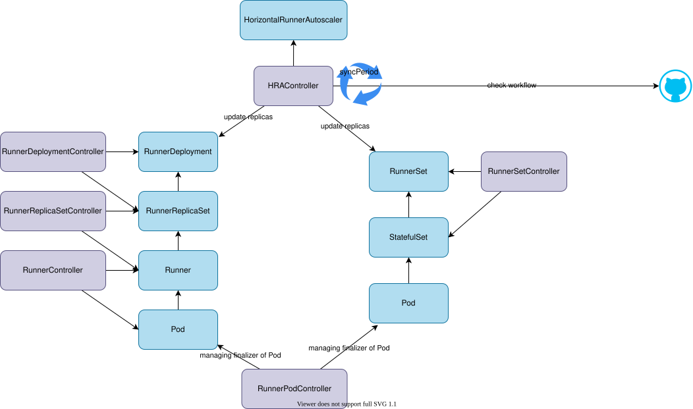

# Actions Runner Controller

https://github.com/actions/actions-runner-controller

The original runner-controller installation is superseded by the GitHub
Actions Runner Scale Set controller. Use the current
[gha-runner-scale-set quickstart](https://github.com/actions/actions-runner-controller/blob/master/docs/gha-runner-scale-set-controller/quickstart.md)
instead of applying an unversioned manifest.

Current Helm chart release: `gha-runner-scale-set-0.14.2`.

