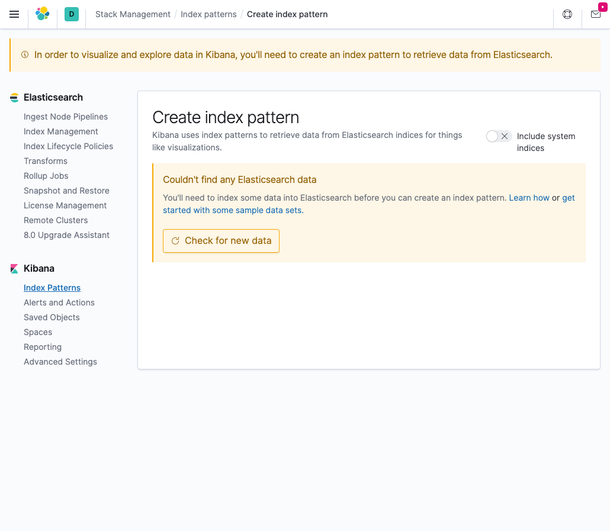
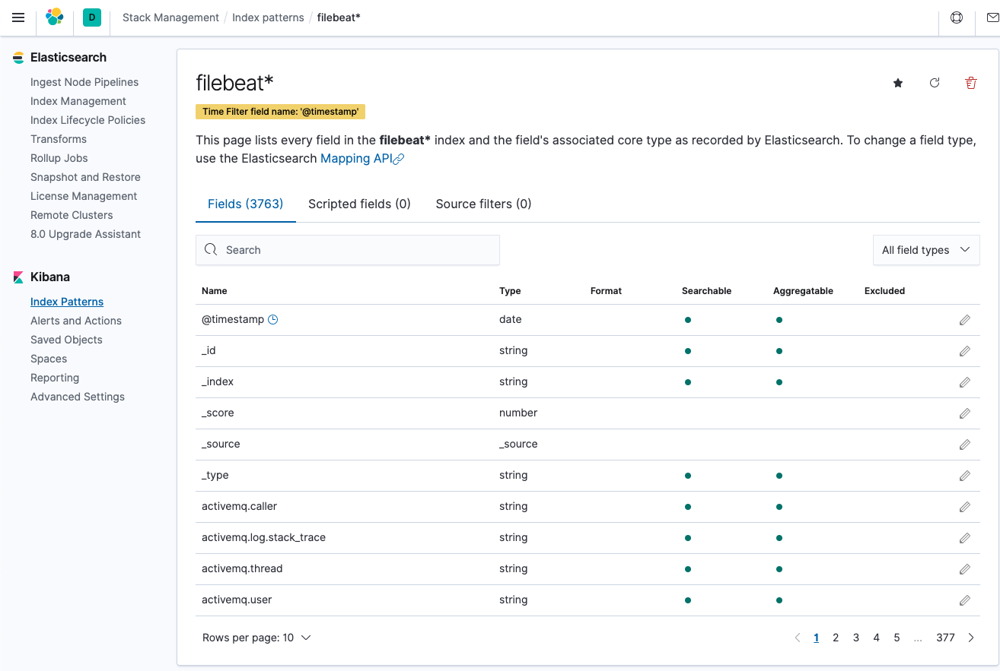

# Elastic Cloud on Kubernetes

The fresh-install example uses ECK 3.5.0 with Elasticsearch and Kibana
[9.5.4](https://github.com/elastic/elasticsearch/releases/tag/v9.5.4).
Run these commands from the repository root:

```sh
kubectl apply --server-side -k contents/eck/operator
kubectl -n elastic-system rollout status statefulset/elastic-operator --timeout=300s
kubectl create namespace eck
kubectl apply -f contents/eck/elasticsearch.yaml
kubectl apply -f contents/eck/kibana.yaml
kubectl -n eck wait --for=jsonpath='{.status.availableNodes}'=1 elasticsearch/quickstart --timeout=600s
kubectl -n eck wait --for=jsonpath='{.status.availableNodes}'=1 kibana/quickstart --timeout=600s
```

Elasticsearch uses `node.roles` in place of the removed `node.master`, `node.data`
and `node.ingest` settings. Kibana has a 1 GiB memory limit. Allow roughly 4 GiB
of free cluster memory for the operator and both applications.

Access Elasticsearch using its generated training credentials:

```sh
PASSWORD=$(kubectl -n eck get secret quickstart-es-elastic-user -o go-template='{{.data.elastic | base64decode}}')
kubectl -n eck port-forward service/quickstart-es-http 9200
# In another terminal with PASSWORD set:
curl -u "elastic:$PASSWORD" -k https://localhost:9200
```

For Kibana, forward `service/quickstart-kb-http` on port 5601 and log in at
https://localhost:5601 with the same `elastic` credentials.

```sh
bash scripts/e2e/run.sh eck
# For slow first-time image downloads:
ECK_WAIT_TIMEOUT=900s bash scripts/e2e/run.sh eck
```

E2E verifies both workloads, indexes and reads a document through the Elasticsearch
Service, and checks Kibana's `/api/status`. The test uses the generated HTTP CA
certificates to verify TLS. The local port-forward example above uses `-k` for
convenience with the generated certificate.

This updates a fresh training installation; existing 7.8.1 data requires Elastic's
[supported upgrade procedure](https://www.elastic.co/docs/deploy-manage/upgrade).
The historical Helm examples below remain separate from this ECK sample.

# Historical Helm examples (7.8.1, not covered by E2E)

## Elasticsearch

https://github.com/elastic/helm-charts/tree/master/elasticsearch

```
helm repo add elastic https://helm.elastic.co
```

Install with customized values

```
helm show values elastic/elasticsearch > helm/es-config.yaml
helm install -n eck elasticsearch elastic/elasticsearch -f helm/es-config.yaml
```

Check connection

```
kubectl -n kafka-strimzi-18 exec -it $(kubectl get pod -n kafka-strimzi-18 | grep kafka-connect-sink | awk '{print $1}' | tail -1) -- curl -k "http://elasticsearch-master-headless.eck:9200"
{
  "name" : "elasticsearch-master-0",
  "cluster_name" : "elasticsearch",
  "cluster_uuid" : "2Ou_PUP4TCSUoMNHD_rnkA",
  "version" : {
    "number" : "7.8.1",
    "build_flavor" : "default",
    "build_type" : "docker",
    "build_hash" : "b5ca9c58fb664ca8bf9e4057fc229b3396bf3a89",
    "build_date" : "2020-07-21T16:40:44.668009Z",
    "build_snapshot" : false,
    "lucene_version" : "8.5.1",
    "minimum_wire_compatibility_version" : "6.8.0",
    "minimum_index_compatibility_version" : "6.0.0-beta1"
  },
  "tagline" : "You Know, for Search"
}
```

Upgrade

```
helm upgrade elasticsearch elastic/elasticsearch -n eck -f helm/es-config.yaml
```

## Kibana

https://github.com/elastic/helm-charts/tree/master/kibana

```
helm install kibana elastic/kibana
```

```
helm show values elastic/kibana > helm/kb-config.yaml
helm install -n eck kibana elastic/kibana -f helm/kb-config.yaml
```

```
kubectl -n eck port-forward service/kibana-kibana 5601
```



## Filebeat

https://hub.helm.sh/charts/elastic/filebeat

```
helm repo add elastic https://helm.elastic.co
helm show values elastic/filebeat --version 7.8.1 > helm/filebeat-config.yaml
helm install -n eck filebeat elastic/filebeat --version 7.8.1 -f helm/filebeat-config.yaml
```


