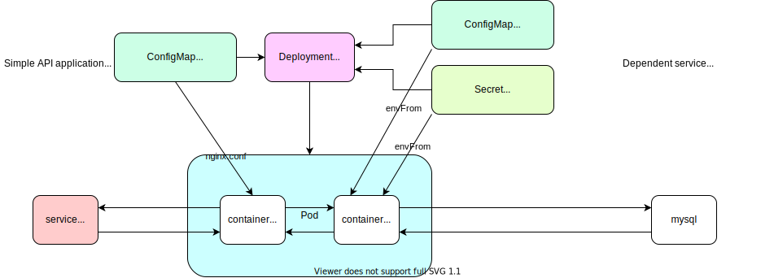

# Helm vs Kustomize

## Helm

### Steps to create a chart

1. Create directory for practice `helm-example` and move into the new directory.

    ```
    mkdir helm-example && cd helm-example
    ```

1. Create helm. -> would generate a folder `helm-example` and files in it.

    ```
    helm create helm-example
    ```

1. Go into the directory `helm-example` (a directory for chart) and check the generated files.

    ```
    cd helm-example
    ```

    ```
    tree
    .
    ├── Chart.yaml
    ├── charts
    ├── templates
    │   ├── NOTES.txt
    │   ├── _helpers.tpl
    │   ├── deployment.yaml
    │   ├── hpa.yaml
    │   ├── ingress.yaml
    │   ├── service.yaml
    │   ├── serviceaccount.yaml
    │   └── tests
    │       └── test-connection.yaml
    └── values.yaml

    3 directories, 10 files
    ```

1. Update templates to meet the requirements.

    1. Remove unnecessary templates.

    ```
    rm templates/hpa.yaml templates/ingress.yaml templates/serviceaccount.yaml
    ```

    1. Remove unnecessary values from values.yaml.

    1. Write your templates.

    1. You can use the following built-in objects.
        - [Built-in Objects](https://helm.sh/docs/chart_template_guide/builtin_objects/)
            - `Release`: This object describes the release itself.
                - `Release.Name`
                - `Release.Namespace`
                ...
            - `Values`: Values passed into the template from the values.yaml file.
            - `Chart`: The contents of the Chart.yaml file.
                - `Chart.Name`
                - `Chart.Version`
            - Others: `Files`, `Capabilities`, `Template`

    1. `Values`: write `values.yaml` and pass them into template yaml with `{{ Values.xxx.yyy }}`
    1. Template functions: `{{ quote .Values.favorite.drink }}` or pipelines: `{{ .Values.favorite.drink | quote }}`

1. Check with `--dry-run`.

    ```
    cd ..
    helm install helm-example --debug --dry-run ./helm-example
    ```

1. Lint

    ```
    helm lint helm-example
    ```

1. Install.

    ```
    helm install helm-example --debug ./helm-example
    ```

1. Check `helm`

    ```
    helm ls
    NAME            NAMESPACE       REVISION        UPDATED                                 STATUS   CHART                    APP VERSION
    helm-example    default         1               2021-05-24 07:22:45.809015 +0900 JST    deployed helm-example-0.1.0       1.16.0
    ```

1. Check pod

    ```
    kubectl get po
    NAME                            READY   STATUS    RESTARTS   AGE
    helm-example-5d796c89c7-v4pvw   2/2     Running   0          80m
    ```
1. Test

    ```
    helm test helm-example
    ```

1. Package a chart.

    ```
    helm package helm-example
    ```

1. Publish the chart. (Create a Github repo for Helm chart repository. https://github.com/nakamasato/helm-charts-repo)

    ```
    helm repo index ./ --url https://nakamasato.github.io/helm-charts-repo
    ```

    This would generate `index.yaml`. Push the `index.yaml` and `helm-example-0.1.0.tgz` to the chart repo.

1. Add the repo that is created above.

    ```
    helm repo add nakamasato https://nakamasato.github.io/helm-charts-repo
    helm repo update # update the repository info
    ```

    Search for your chart.

    ```
    helm search repo naka
    NAME                    CHART VERSION   APP VERSION     DESCRIPTION
    nakamasato/helm-example 0.1.0           v0.0.1          Simple API application.
    ```

1. Install your helm chart.

    ```
    helm install example-from-my-repo nakamasato/helm-example
    NAME: example-from-my-repo
    LAST DEPLOYED: Tue May 25 09:07:24 2021
    NAMESPACE: default
    STATUS: deployed
    REVISION: 1
    NOTES:
    1. Get the application URL by running these commands:
    export POD_NAME=$(kubectl get pods --namespace default -l "app.kubernetes.io/name=helm-example,app.kubernetes.io/instance=example-from-my-repo" -o jsonpath="{.items[0].metadata.name}")
    export CONTAINER_PORT=$(kubectl get pod --namespace default $POD_NAME -o jsonpath="{.spec.containers[0].ports[0].containerPort}")
    echo "Visit http://127.0.0.1:8080 to use your application"
    kubectl --namespace default port-forward $POD_NAME 8080:$CONTAINER_PORT
    ```

## Kustomize

### Steps to create yaml for multiple envs

1. Make a directory for two envs (`dev`, `prod` or any necessary envs)

    ```
    mkdir -p kustomize-example/{base,overlays/dev,overlays/prod} && cd kustomize-example
    ```

1. Check structure.

    ```
    tree
    .
    ├── base
    └── overlays
        ├── dev
        └── prod

    4 directories, 0 files
    ```

1. Add necessary resources to `base` folder.


    **Tips**: Generate `yaml` with `kubectl` with `--dry-run=client -o yaml`

    Examples:

    ```
    kubectl create deployment kustomize-example --image nginx --replicas=1 --dry-run=client --output yaml > kustomize-example/base/deployment.yaml # need manual modification
    ```

    ```
    kubectl create service clusterip kustomize-example --tcp=80:80 --dry-run=client --output yaml > kustomize-example/base/service.yaml
    ```

    ```
    kubectl create configmap kustomize-example-uwsgi --from-literal=MYSQL_HOST=mysql.database.svc.cluster.local --from-literal=MYSQL_USER=user --from-literal=MYSQL_PORT=3306 --from-literal=MYSQL_DATABASE=test --dry-run=client -o yaml > kustomize-example/base/configmap.yaml
    ```

    ```
    kubectl create secret generic kustomize-example-uwsgi --from-literal=MYSQL_PASSWORD=password --dry-run=client -o yaml > kustomize-example/base/secret.yaml
    ```

1. Check if `base` is valid.

    ```
    kubectl apply -k kustomize-example/base --dry-run=client
    ```


1. Create `Namespace` `kustomize-dev` and `kustomize-prod`.

    ```
    kubectl create ns kustomize-dev --dry-run=client -o yaml > kustomize-example/ns-kustomize-dev.yaml
    kubectl create ns kustomize-prod --dry-run=client -o yaml > kustomize-example/ns-kustomize-prod.yaml
    kubectl apply -f kustomize-example/ns-kustomize-dev.yaml,kustomize-example/ns-kustomize-prod.yaml
    ```

1. Create overlays.

    1. Make each overlay same as `base`.


        - `kustomize-example/overlays/dev/kustomization.yaml`:

            ```yaml
            namespace: kustomize-dev
            bases:
              - ../../base
            ```
        - `kustomize-example/overlays/prod/kustomization.yaml`:

            ```yaml
            namespace: kustomize-prod
            bases:
              - ../../base
            ```

        - Check

            ```
            kubectl diff -k kustomize-example/overlays/dev
            kubectl diff -k kustomize-example/overlays/prod
            ```

    1. Create files to overwrite `base`.

        Example:
        - Add resource request/limit to prod.
        - Increase replicas for prod.

        1. Add `patches` to `kustomize-example/overlays/prod/kustomization.yaml`.

            Example:

            ```diff
            + patches:
            +  - deployment.yaml
            ```

        1. Update resources to override `base`

            Example: `kustomize-example/overlays/prod/deployemnt.yaml`

            ```diff
            +        resources:
            +          requests:
            +            cpu: "100m"
            +            memory: "256Mi"
            +          limits:
            +            cpu: "1000m"
            +            memory: "256Mi"
            ```

1. Apply overlays (`prod` in this case.).

    ```
    kubectl diff -k kustomize-example/overlays/prod
    ```

    ```diff
    @@ -123,7 +141,7 @@
    uid: 8a415db8-48c3-4a5b-831a-b70dd9adbf4c
    spec:
    progressDeadlineSeconds: 600
    -  replicas: 1
    +  replicas: 2
    revisionHistoryLimit: 10
    selector:
        matchLabels:
    @@ -143,7 +161,13 @@
        - image: nginx
            imagePullPolicy: Always
            name: nginx
    -        resources: {}
    +        resources:
    +          limits:
    +            cpu: "1"
    +            memory: 256Mi
    +          requests:
    +            cpu: 100m
    +            memory: 256Mi
            terminationMessagePath: /dev/termination-log
            terminationMessagePolicy: File
            volumeMounts:
    @@ -158,7 +182,13 @@
            image: nakamasato/flask-test
            imagePullPolicy: Always
            name: uwsgi
    -        resources: {}
    +        resources:
    +          limits:
    +            cpu: "1"
    +            memory: 256Mi
    +          requests:
    +            cpu: 100m
    +            memory: 256Mi
            terminationMessagePath: /dev/termination-log
            terminationMessagePolicy: File
        dnsPolicy: ClusterFirst
    ```

    ```
    kubectl apply -k kustomize-example/overlays/prod
    ```

## Example 1 (web app with mysql)



1. Deploy dependencies.

    ```
    kubectl create ns database; kubectl apply -k dependencies/mysql
    ```

1. Set up with `kustomize`

    1. Create `Namespace`s.

        ```
        kubectl apply -f kustomize-example/ns-kustomize-dev.yaml,kustomize-example/ns-kustomize-prod.yaml
        ```

    1. Deploy `kustomize-example`.

        ```
        kubectl apply -k kustomize-example/overlays/dev
        kubectl apply -k kustomize-example/overlays/prod
        ```

    1. Port-forward the service.

        ```
        kubectl port-forward svc/kustomize-example 8080:80 -n <namespace>
        ```

    1. Check the application functionality.

        ```json
        curl -X POST -H "Content-Type: application/json" -d '{"name": "naka", "email": "naka@example.com"}' localhost:8080/users{"id":2,"name":"naka"}
        ```

1. Set up with `helm`

    1. Install Helm chart.
        ```
        helm install helm-example nakamasato/helm-example -n helm-dev --create-namespace
        helm install helm-example nakamasato/helm-example -n helm-prod --create-namespace
        ```

    1. Port-forward the service.

        ```
        kubectl port-forward svc/helm-example 8080:80 -n <namespace>
        ```

    1. Check `GET`

        ```
        curl localhost:8080/users/1
        ```

1. Update image.

    1. `helm`
        - `helm upgrade --set nginx.image.tag=1.23.0 helm-example nakamasato/helm-example -n helm-dev`

        or

        - Prepare `values-prod.yaml`
        - Apply

            ```
            helm upgrade -f values-prod.yaml helm-example nakamasato/helm-example -n helm-prod
            ```

    1. `kustomize`
        - Add the following code to `kustomize-example/overlays/prod/kustomization.yaml`

            ```yaml
            images:
              - name: nginx
                newName: nginx
                newTag: 1.23.0
            ```
        - Apply

            ```
            kubectl apply -k kustomize-example/overlays/prod
            ```

## ArgoCD

Version: [v2.0.3](https://github.com/argoproj/argo-cd/releases/tag/v2.0.3)

```
kubectl create namespace argocd
kubectl apply -n argocd -f https://raw.githubusercontent.com/argoproj/argo-cd/v2.0.3/manifests/install.yaml
```

1. Deploy using Kustomize

    1. Namespace

        ```
        kubectl apply -f kustomize-example/ns-kustomize-dev.yaml,kustomize-example/ns-kustomize-prod.yaml
        ```

    1. Apply `ArgoProject`, dev and prod `Application`.

        ```
        kubectl apply -f argocd/kustomize
        ```

1. Deploy using Helm

    1. Apply `ArgoProject`, dev and prod `Application`.

        ```
        kubectl apply -f argocd/helm
        ```


## References

- https://helm.sh/docs/chart_template_guide/builtin_objects/
