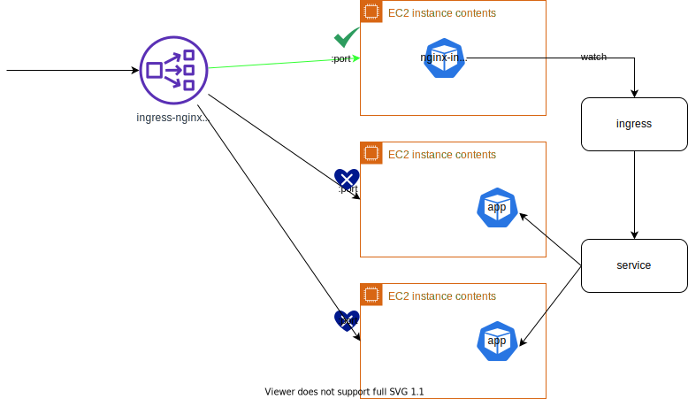

# Ingress Nginx Controller

https://kubernetes.github.io/ingress-nginx/deploy



## Prerequisite

If you use `kind`, you need to create with the following configuration

```
cat <<EOF | kind create cluster --config=-
kind: Cluster
apiVersion: kind.x-k8s.io/v1alpha4
nodes:
- role: control-plane
  kubeadmConfigPatches:
  - |
    kind: InitConfiguration
    nodeRegistration:
      kubeletExtraArgs:
        node-labels: "ingress-ready=true"
  extraPortMappings:
  - containerPort: 80
    hostPort: 80
    protocol: TCP
  - containerPort: 443
    hostPort: 443
    protocol: TCP
EOF
```

ref: https://kind.sigs.k8s.io/docs/user/ingress/#ingress-nginx

## Get started

- `namespace`: `ingress-nginx` (will be created)

1. apply

    ```bash
    kubectl apply -f https://raw.githubusercontent.com/kubernetes/ingress-nginx/controller-v1.7.0/deploy/static/provider/cloud/deploy.yaml
    ```

1. check the pods

    ```
    kubectl get pod -n ingress-nginx
    NAME                                        READY   STATUS      RESTARTS   AGE
    ingress-nginx-admission-create-j2mvc        0/1     Completed   0          62s
    ingress-nginx-admission-patch-vpfdn         0/1     Completed   2          62s
    ingress-nginx-controller-68649d49b8-8xld6   1/1     Running     0          62s
    ```

1. check nginx ingress controller's version

    ```
    kubectl exec -it $(kubectl get po -n ingress-nginx | grep ingress-nginx-controller | awk '{print $1}') -n ingress-nginx -- /nginx-ingress-controller --version
    -------------------------------------------------------------------------------
    NGINX Ingress controller
      Release:       v1.7.0
      Build:         72ff21ed9e26cb969052c753633049ba8a87ecf9
      Repository:    https://github.com/kubernetes/ingress-nginx
      nginx version: nginx/1.21.6

    -------------------------------------------------------------------------------
    ```

## Practice with an app

[Kubernetes ingress nginx contoller](https://medium.com/rahasak/kubernetes-ingress-nginx-contoller-fa60b8d7e5f1)

1. Deploy `Deployment`
    ```
    kubectl create deployment demo --image=httpd --port=80
    ```
1. Create `Service`
    ```
    kubectl expose deployment demo
    ```
1. Create `Ingress`
    ```
    kubectl create ingress demo-localhost --class=nginx --rule="demo.localdev.me/*=demo:80"
    ```

    ```yaml
    apiVersion: networking.k8s.io/v1
    kind: Ingress
    metadata:
      creationTimestamp: null
      name: demo-localhost
    spec:
      ingressClassName: nginx
      rules:
      - host: demo.localdev.me
        http:
          paths:
          - backend:
              service:
                name: demo
                port:
                  number: 80
            path: /
            pathType: Prefix
    status:
      loadBalancer: {}
    ```

1. Port-forward ingress
    ```
    kubectl port-forward --namespace=ingress-nginx service/ingress-nginx-controller 8080:80
    ```
1. Curl http://demo.localdev.me:8080

    ```
    curl http://demo.localdev.me:8080
    <html><body><h1>It works!</h1></body></html>
    ```
## [Changelogs](https://github.com/kubernetes/ingress-nginx/blob/main/Changelog.md)
- 1.4.0: Deprecated Kubernetes versions 1.20-1.21, Added support for, 1.25, currently supported versions v1.22, v1.23, v1.24, v1.25
- 1.3.0:
    - This release removes support for Kubernetes v1.19.0
    - This release adds support for Kubernetes v1.24.0
- [1.0.0](https://github.com/kubernetes/ingress-nginx/blob/main/Changelog.md#100): networking.k8s.io/v1beta is being dropped
- 0.40.0: Following the Ingress [extensions/v1beta1 deprecation](https://kubernetes.io/blog/2019/07/18/api-deprecations-in-1-16/), `networking.k8s.io/v1beta1` or `networking.k8s.io/v1` (Kubernetes v1.19 or higher)
- 0.25.0: Support new `networking.k8s.io/v1beta1` package (for Kubernetes cluster > v1.14.0)
