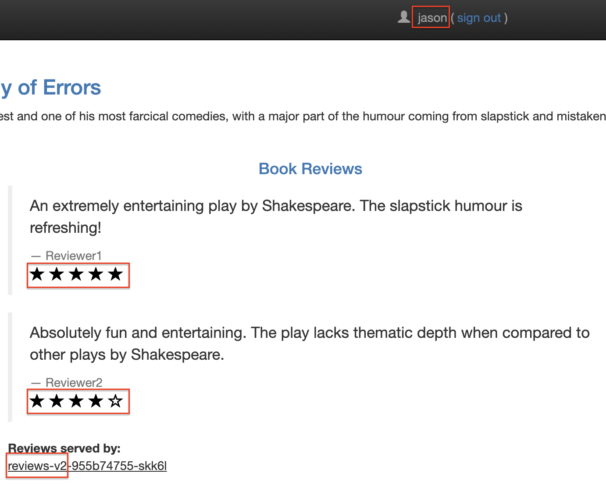
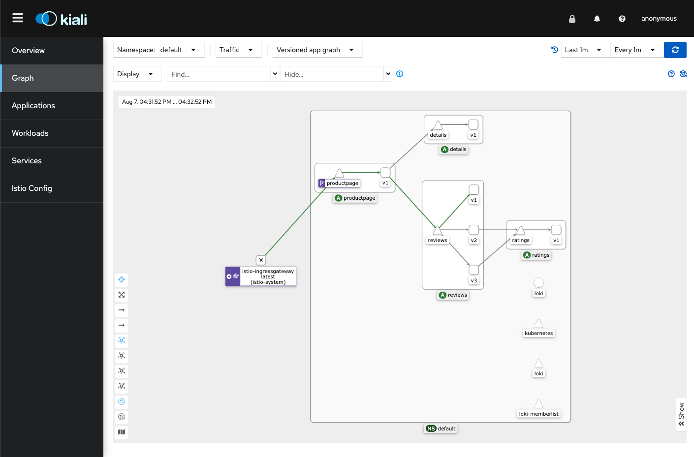

# [Istio](https://istio.io/)

## 1. Overview

An Istio service mesh is logically split into a **data plane** and a **control plane**.

- The **data plane** is composed of a set of intelligent proxies ([Envoy](https://www.envoyproxy.io/)) deployed as sidecars. These proxies mediate and control all network communication between microservices. They also collect and report telemetry on all mesh traffic.
- The **control plane** manages and configures the proxies to route traffic.


*A service mesh is a dedicated infrastructure layer that you can add to your applications. It allows you to transparently add capabilities like observability, traffic management, and security, without adding them to your own code. The term “service mesh” describes both the type of software you use to implement this pattern, and the security or network domain that is created when you use that software.*


Istio uses [Envoy](https://www.envoyproxy.io/), *AN OPEN SOURCE EDGE AND SERVICE PROXY, DESIGNED FOR CLOUD-NATIVE APPLICATIONS*, proxy as its data plane.

## 2. Summary

CRDs and their roles

1. [VirtualService](https://istio.io/latest/docs/concepts/traffic-management/#virtual-services): along with destination rules, the key building blocks of Istio’s traffic routing functionality (e.g. routing to a specific version based on the request header, A/B testing, Canary release). `hosts`, `http`([match](https://istio.io/latest/docs/reference/config/networking/virtual-service/#HTTPMatchRequest) and `route`)
    <details><summary>example</summary>

    ```yaml
    apiVersion: networking.istio.io/v1alpha3
    kind: VirtualService
    metadata:
      name: bookinfo
    spec:
      hosts:
        - bookinfo.com # can be ip address, DNS, kubernetes service short name
      http:
      - match:
        - uri:
            prefix: /reviews
        route:
        - destination:
            host: reviews
      - match:
        - uri:
            prefix: /ratings
        route:
        - destination:
            host: ratings
    ```

    </details>

    <details><summary>example with weight (A/B testing and canary rollouts)</summary>

    ```yaml
    spec:
      hosts:
      - reviews
      http:
      - route:
        - destination:
            host: reviews
            subset: v1
          weight: 75
        - destination:
            host: reviews
            subset: v2
          weight: 25
    ```

    </details>

1. [DestinationRule](https://istio.io/latest/docs/concepts/traffic-management/#destination-rules): use destination rules to configure what happens to traffic for that destination. Destination rules are applied **after** virtual service routing rules are evaluated. specify named service **`subsets`** (Ref [Destination Rule](https://istio.io/latest/docs/reference/config/networking/destination-rule/))

    <details><summary>example</summary>

    ```yaml
    apiVersion: networking.istio.io/v1alpha3
    kind: DestinationRule
    metadata:
      name: my-destination-rule
    spec:
      host: my-svc
      trafficPolicy:
        loadBalancer:
          simple: RANDOM
      subsets:
      - name: v1
        labels:
          version: v1
      - name: v2
        labels:
          version: v2
        trafficPolicy:
          loadBalancer:
            simple: ROUND_ROBIN
      - name: v3
        labels:
          version: v3
    ```

    </details>

1. [Gateway](https://istio.io/latest/docs/concepts/traffic-management/#gateways) (Istio): manage inbound and outbound traffic for your mesh. Gateway configurations are applied to standalone Envoy proxies that are running at the edge of the mesh, rather than sidecar Envoy proxies running alongside your service workloads. Istio provides some preconfigured gateway proxy deployments (`istio-ingressgateway` and `istio-egressgateway`). **You also need to bind the gateway to a virtual service.**
    <details><summary>example</summary>

    ```yaml
    apiVersion: networking.istio.io/v1alpha3
    kind: Gateway
    metadata:
      name: ext-host-gwy
    spec:
      selector:
        app: my-gateway-controller
      servers:
      - port:
          number: 443
          name: https
          protocol: HTTPS
        hosts:
        - ext-host.example.com
        tls:
          mode: SIMPLE
          credentialName: ext-host-cert
    ```

    specify routing

    ```yaml
    apiVersion: networking.istio.io/v1alpha3
    kind: VirtualService
    metadata:
      name: virtual-svc
    spec:
      hosts:
      - ext-host.example.com
      gateways:
      - ext-host-gwy
    ```

    </details>

1. [ServiceEntry](https://istio.io/latest/docs/concepts/traffic-management/#service-entries): Configuring service entries allows you to **manage traffic for services running outside of the mesh.** (ref: [Service Entry](https://istio.io/latest/docs/reference/config/networking/service-entry/))
1. [Sidecar](https://istio.io/latest/docs/concepts/traffic-management/#sidecars)
1. `Gateway` (Kubernetes Gateway API): To overcome Ingress's shortcomings with a standard Kubernetes API (beta). You can consider migration of ingress traffic from Kubernetes Ignress or Gateway/VirtualService to the new Gateway API. (e.g. **Istio Implementation of the Gateway API**) Ref: [Getting started with the Kubernetes Gateway API](https://istio.io/latest/blog/2022/getting-started-gtwapi/)
    Configure with **Gateway** in `gateway.networking.k8s.io/v1beta1` and `HTTPRoute`


## 3. [Getting Started](https://istio.io/latest/docs/setup/getting-started/)

### 3.1. Prepare Kubernetes Cluster

**If you test on your local cluster, pleasee use docker-desktop, minikube, or kind.**

1. [kind](../local-cluster/kind): **Istio Gateway might not work**

    ```
    kind create cluster --config=../local-cluster/kind/cluster-with-port-mapping.yaml
    ```


1. [minikube](../local-cluster/minikube): **Confirmed everything works**
    ```
    minikube start
    ```
1. Docker Desktop
### 3.2. [Install Istio](https://istio.io/latest/docs/setup/getting-started/#bookinfo)

1. Install `istioctl` (you can skip this step if you already installed `istioctl`)

    ```
    ISTIO_VERSION=1.20.0
    curl -L https://istio.io/downloadIstio | ISTIO_VERSION=$ISTIO_VERSION sh -
    export PATH="$PATH:/$PWD/istio-${ISTIO_VERSION}/bin"
    ```

    Check istioctl version

    ```
    istioctl version
    no ready Istio pods in "istio-system"
    1.20.0
    ```

1. Install istio

    ```
    istioctl install --set profile=demo -y
    ```

    <details><summary>Result</summary>

    ```
    ✔ Istio core installed
    ✔ Istiod installed
    ✔ Ingress gateways installed
    ✔ Egress gateways installed
    ✔ Installation complete
    Making this installation the default for injection and validation.
    ```

    </details>

    `istio-egressgateway`, `istio-ingressgateway`, and `istiod` are deployed in `istio-system` namespace:

    ```
    kubectl get po -n istio-system
    NAME                                   READY   STATUS    RESTARTS   AGE
    istio-egressgateway-6c4796c98-4q45f    1/1     Running   0          2m48s
    istio-ingressgateway-d94b4444b-v4tbq   1/1     Running   0          2m48s
    istiod-85669db8fd-5lz4s                1/1     Running   0          2m58s
    ```

### 3.3. Add `istio-injection=enabled` to the target Namespace

1. Add a namespace label `istio-injection=enabled` to `default` Namespace to instruct Istio to automatically inject Envoy sidecar proxies when you deploy your application later:

    ```
    kubectl label namespace default istio-injection=enabled
    ```

    Check labels

    ```
    kubectl get ns default --show-labels
    NAME      STATUS   AGE     LABELS
    default   Active   4m57s   istio-injection=enabled,kubernetes.io/metadata.name=default
    ```

### 3.4. [Deploy the sample application](https://istio.io/latest/docs/setup/getting-started/#bookinfo)


1. Deploy sample app

    ```
    kubectl apply -f https://raw.githubusercontent.com/istio/istio/release-${ISTIO_VERSION%.*}/samples/bookinfo/platform/kube/bookinfo.yaml
    ```

    Deployed resources:

    1. `Deployment`: `details-v1`, `ratings-v1`, `reviews-v1`, `reviews-v2`, `reviews-v3`, `productpage-v1`
    1. `Service`: `details`, `ratings`, `reviews`, `productpage`
    1. `ServiceAccount`: `bookinfo-details`, `bookinfo-ratings`, `bookinfo-reviews`, `bookinfo-productpage`

    <details>

    ```
    service/details created
    serviceaccount/bookinfo-details created
    deployment.apps/details-v1 created
    service/ratings created
    serviceaccount/bookinfo-ratings created
    deployment.apps/ratings-v1 created
    service/reviews created
    serviceaccount/bookinfo-reviews created
    deployment.apps/reviews-v1 created
    deployment.apps/reviews-v2 created
    deployment.apps/reviews-v3 created
    service/productpage created
    serviceaccount/bookinfo-productpage created
    deployment.apps/productpage-v1 created
    ```

    </details>

    Envoy sider is added to all pods (2 containers are running in each pod).

    ```
    kubectl get po
    NAME                              READY   STATUS    RESTARTS   AGE
    details-v1-79f774bdb9-ctf75       2/2     Running   0          28s
    productpage-v1-6b746f74dc-7zgpg   2/2     Running   0          28s
    ratings-v1-b6994bb9-rw74b         2/2     Running   0          28s
    reviews-v1-545db77b95-t6gkl       2/2     Running   0          28s
    reviews-v2-7bf8c9648f-n9tmq       2/2     Running   0          28s
    reviews-v3-84779c7bbc-tmzlr       2/2     Running   0          28s
    ```

    </details>

    **If you deploy to another namespace without `istio-injection=enabled` label, Envoy sidecar container will not be injected.**

1. Verify app is running.

    ```
    kubectl exec "$(kubectl get pod -l app=ratings -o jsonpath='{.items[0].metadata.name}')" -c ratings -- curl -sS productpage:9080/productpage | grep -o "<title>.*</title>"

    <title>Simple Bookstore App</title>
    ```

### 3.5. [Open the app to outside traffic](https://istio.io/latest/docs/setup/getting-started/#ip) (Gateway & VirtualService)

1. Istio Gateway (`Gateway` and `VirtualService` (`networking.istio.io/v1alpha3`))

    ```
    kubectl apply -f https://raw.githubusercontent.com/istio/istio/release-${ISTIO_VERSION%.*}/samples/bookinfo/networking/bookinfo-gateway.yaml
    ```

    <details><summary>yaml details</summary>


    ```yaml
    apiVersion: networking.istio.io/v1alpha3
    kind: Gateway
    metadata:
      name: bookinfo-gateway
    spec:
      # The selector matches the ingress gateway pod labels.
      # If you installed Istio using Helm following the standard documentation, this would be "istio=ingress"
      selector:
        istio: ingressgateway # use istio default controller
      servers:
      - port:
          number: 80
          name: http
          protocol: HTTP
        hosts:
        - "*"
    ---
    apiVersion: networking.istio.io/v1alpha3
    kind: VirtualService
    metadata:
      name: bookinfo
    spec:
      hosts:
      - "*"
      gateways:
      - bookinfo-gateway
      http:
      - match:
        - uri:
            exact: /productpage
        - uri:
            prefix: /static
        - uri:
            exact: /login
        - uri:
            exact: /logout
        - uri:
            prefix: /api/v1/products
        route:
        - destination:
            host: productpage
            port:
              number: 9080
    ```

    </details>

    **Notes: If you deploy `Gateway` and `VirtualService` in different namespaces, you need to specify the gateway in `VirtualService` with namespace as a prefix.**

    ```yaml
    gateways:
    - gateway/bookinfo-gateway # <namespace of gateway>/<gateway name>
    ```

    Alternatively, `kubectl apply -f https://raw.githubusercontent.com/istio/istio/release-${ISTIO_VERSION%.*}/samples/bookinfo/gateway-api/bookinfo-gateway.yaml` to install (`Gateway` and `HTTPRoute` in `gateway.networking.k8s.io/v1beta1`)

1. Check
    ```
    istioctl analyze
    ✔ No validation issues found when analyzing namespace: default.
    ```

1. Check ingress gateway

    ```
    kubectl get svc istio-ingressgateway -n istio-system
    NAME                   TYPE           CLUSTER-IP     EXTERNAL-IP   PORT(S)                                                                      AGE
    istio-ingressgateway   LoadBalancer   10.103.34.38   localhost     15021:31476/TCP,80:31411/TCP,443:32714/TCP,31400:30467/TCP,15443:30550/TCP   44m
    ```

    You might see `EXTERNAL-IP` is `<pending>`. You need to run `minikube tunnel`

1. Set ingress ip and ports:

    Most platforms:

    ```
    export INGRESS_HOST=$(kubectl -n istio-system get service istio-ingressgateway -o jsonpath='{.status.loadBalancer.ingress[0].ip}')
    export INGRESS_PORT=$(kubectl -n istio-system get service istio-ingressgateway -o jsonpath='{.spec.ports[?(@.name=="http2")].port}')
    export SECURE_INGRESS_PORT=$(kubectl -n istio-system get service istio-ingressgateway -o jsonpath='{.spec.ports[?(@.name=="https")].port}')
    ```

    Docker Desktop or Kind:

    ```
    export INGRESS_HOST=127.0.0.1
    ```

    ```
    export GATEWAY_URL=$INGRESS_HOST:$INGRESS_PORT
    ```

    Check

    ```
    echo "$GATEWAY_URL"
    127.0.0.1:80
    ```

1. Open http://127.0.0.1:80/productpage on your browser:

    

    TODO: You might not be able to open it when `EXTERNAL-IP` is `<pending>` (this happens when using `kind`).

### 3.6. [Define the service versions](https://istio.io/latest/docs/examples/bookinfo/#define-the-service-versions)

Before you can use Istio to control the Bookinfo version routing, you need to define the available versions.


Create `DestinationRule` for each service `productpage`, `reviews`, `ratings` and `details`.

```
kubectl apply -f https://raw.githubusercontent.com/istio/istio/release-${ISTIO_VERSION%.*}/samples/bookinfo/networking/destination-rule-all.yaml
```

```yaml
apiVersion: networking.istio.io/v1alpha3
kind: DestinationRule
metadata:
  name: reviews
spec:
  host: reviews
  subsets:
  - name: v1
    labels:
      version: v1
  - name: v2
    labels:
      version: v2
  - name: v3
    labels:
      version: v3
```


### 3.7. [Request Routing](https://istio.io/latest/docs/tasks/traffic-management/request-routing/)

Istio includes beta support for the Kubernetes Gateway API

#### 3.7.1. (Optional) Install necessary CRDs (only for `Gateway API` not needed for Istio APIs)

```
kubectl get crd gateways.gateway.networking.k8s.io &> /dev/null || \
  { kubectl kustomize "github.com/kubernetes-sigs/gateway-api/config/crd?ref=v0.8.0-rc1" | kubectl apply -f -; }
```

The following custom resource definitions will be created:

1. `GatewayClass`
1. `Gateway`
1. `HttpRoute`
1. `ReferenceGrant`

For more details, please check https://github.com/kubernetes-sigs/gateway-api

#### 3.7.2. Route to version 1 (Istio APIs)

```
kubectl apply -f https://raw.githubusercontent.com/istio/istio/release-${ISTIO_VERSION%.*}/samples/bookinfo/networking/virtual-service-all-v1.yaml
```

```yaml
apiVersion: networking.istio.io/v1alpha3
kind: VirtualService
metadata:
  name: reviews
spec:
  hosts:
  - reviews
  http:
  - route:
    - destination:
        host: reviews
        subset: v1
```


#### 3.7.3. Route based on user identity (Istio APIs)

> Istio also supports routing based on strongly authenticated JWT on ingress gateway, refer to the JWT claim based routing for more details.

```
kubectl apply -f https://raw.githubusercontent.com/istio/istio/release-${ISTIO_VERSION%.*}/samples/bookinfo/networking/virtual-service-reviews-test-v2.yaml
```

```yaml
apiVersion: networking.istio.io/v1alpha3
kind: VirtualService
metadata:
  name: reviews
spec:
  hosts:
    - reviews
  http:
  - match:
    - headers:
        end-user:
          exact: jason
    route:
    - destination:
        host: reviews
        subset: v2
  - route:
    - destination:
        host: reviews
        subset: v1
```

Login to `jason`:



What's done?

> In this task, you used Istio to send 100% of the traffic to the v1 version of each of the Bookinfo services. You then set a rule to selectively send traffic to version v2 of the reviews service based on a custom end-user header added to the request by the productpage service.


### 3.8. [View the dashboard](https://istio.io/latest/docs/setup/getting-started/#dashboard)

1. Install [kiali](https://istio.io/latest/docs/ops/integrations/kiali/) dashboard

    ```
    for f in https://raw.githubusercontent.com/istio/istio/release-${ISTIO_VERSION%.*}/samples/addons/{grafana,jaeger,kiali,loki,prometheus}.yaml; do kubectl apply -f $f; done
    kubectl rollout status deployment/kiali -n istio-system
    ```

1. Open dashboard

    ```
    istioctl dashboard kiali
    ```

    The traffic is visualized in the graph.

    

## 4. Cleanup

```
istioctl uninstall --purge
```

```bash
for f in https://raw.githubusercontent.com/istio/istio/release-${ISTIO_VERSION%.*}/samples/addons/{grafana,jaeger,kiali,loki,prometheus}.yaml; do kubectl delete -f $f; done # delete kilia
kubectl delete -f https://raw.githubusercontent.com/istio/istio/release-${ISTIO_VERSION%.*}/samples/bookinfo/networking/bookinfo-gateway.yaml # delete gateway
kubectl delete -f kubectl apply -f https://raw.githubusercontent.com/istio/istio/release-${ISTIO_VERSION%.*}/samples/bookinfo/platform/kube/bookinfo.yaml # delete application
istioctl manifest generate --set profile=demo | kubectl delete --ignore-not-found=true -f - # delete istio
istioctl tag remove default
```

```
kubectl delete namespace istio-system
kubectl label namespace default istio-injection-
```

## 5. More

1. [Ingress](ingress.md)
1. Ingress Gateway


## 5. FAQ

1. Istio APIs vs Gateway APIs

## 7. Experiment

### 7.1. Deploy Gateway and VirtualService in different namespaces

Delete gateway and virtual service:

```
kubectl delete -f https://raw.githubusercontent.com/istio/istio/release-${ISTIO_VERSION%.*}/samples/bookinfo/networking/bookinfo-gateway.yaml
```

Create a namespace for gateway

```
kubectl create ns gateway
```

Create `productpage-v2`

```
kubectl deploy -f productpage-v2.yaml
```

Gateway and multiple VirtualServices


`bookinfo-gateway.yaml`: `Gateway` and `VirtualService` (one for Gateway)


```
kubectl apply -f - <<EOF
apiVersion: networking.istio.io/v1alpha3
kind: Gateway
metadata:
  name: bookinfo-gateway
  namespace: gateway
spec:
  # The selector matches the ingress gateway pod labels.
  # If you installed Istio using Helm following the standard documentation, this would be "istio=ingress"
  selector:
    istio: ingressgateway # use istio default controller
  servers:
  - port:
      number: 8080
      name: http
      protocol: HTTP
    hosts:
    - "*"
---
apiVersion: networking.istio.io/v1alpha3
kind: VirtualService
metadata:
  name: bookinfo
  namespace: gateway
spec:
  hosts:
  - "*"
  gateways:
  - bookinfo-gateway # <namespace of gateway>/<gateway name>
  http:
  - match:
    - uri:
        exact: /productpage
    - uri:
        prefix: /static
    route:
    - destination:
        host: productpage.default.svc.cluster.local
        port:
          number: 9080
  - match:
    - uri:
        exact: /login
    - uri:
        exact: /logout
    - uri:
        prefix: /api/v1/products
    route:
    - destination:
        host: productpage-v2.default.svc.cluster.local
        port:
          number: 9080
EOF
```

You can check `/api/v1/products` is routed to `productpage-v2`, while `/productpage` is routed to `productpage-v1`.

Clean up the resources:

```
kubectl delete gateway -n gateway bookinfo-gateway
kubectl delete virtualservice -n gateway bookinfo
```

### 7.2. Gateway with Multiple VirtualServices

If you have mulitple `VirtualService` for the same host, the one corresponding to `Gateway` will be used. [here](https://istio.io/latest/docs/ops/common-problems/network-issues/#route-rules-have-no-effect-on-ingress-gateway-requests)

```
kubectl apply -f - <<EOF
apiVersion: networking.istio.io/v1alpha3
kind: Gateway
metadata:
  name: bookinfo-gateway
  namespace: gateway
spec:
  # The selector matches the ingress gateway pod labels.
  # If you installed Istio using Helm following the standard documentation, this would be "istio=ingress"
  selector:
    istio: ingressgateway # use istio default controller
  servers:
  - port:
      number: 8080
      name: http
      protocol: HTTP
    hosts:
    - "*"
---
apiVersion: networking.istio.io/v1alpha3
kind: VirtualService
metadata:
  name: bookinfo
  namespace: gateway
spec:
  hosts:
  - "*"
  gateways:
  - bookinfo-gateway # <namespace of gateway>/<gateway name>
  http:
  - route:
    - destination:
        host: productpage.default.svc.cluster.local
        port:
          number: 9080
---
apiVersion: networking.istio.io/v1alpha3
kind: VirtualService
metadata:
  name: productpage
spec:
  hosts:
  - productpage
  http:
  - match:
    - uri:
        exact: /productpage
    - uri:
        prefix: /static
    route:
    - destination:
        host: productpage
        port:
          number: 9080
  - match:
    - uri:
        exact: /login
    - uri:
        exact: /logout
    - uri:
        prefix: /api/v1/products
    route:
    - destination:
        host: productpage-v2
        port:
          number: 9080
EOF
```

Result:

- All the requests via gateway are routed to `productpage` service.
    - http://localhost/productpage
    - http://localhost/api/v1/products
- If you access `productpage` service directly, the routing is based on `productpage` VirtualService. (it seems that all the requests are routed to `productpage` not `productpage-v2`?)
    - http://productpage.default.svc.cluster.local/productpage
    - http://productpage.default.svc.cluster.local/api/v1/products


    ```
    for p in productpage api/v1/products; do kubectl run -i --tty --rm debug --image=curlimages/curl:latest --restart=Never --overrides='{"apiVersion": "v1","metadata": {"annotations": {"sidecar.istio.io/inject": "false"}}}' -- http://productpage.default.svc.cluster.local:9080/$p; done
    ```

## 6. Ref

1. [How to install kind and istio ingress controller](https://medium.com/@s4l1h/how-to-install-kind-and-istio-ingress-controller-3b510834c762)
1. Official
    1. [Istio operator code overview](https://github.com/istio/istio/blob/353f722394f90c48212dfd2e04962eafcfbbcfd4/architecture/environments/operator.md)
    1. [Istio Operator](https://github.com/istio/istio/blob/e81a033756b37768a68913fbe2505e03442d3836/operator/README.md)
1. [ConflictingMeshGatewayVirtualServiceHosts](https://istio.io/latest/docs/reference/config/analysis/ist0109/): We can use `exportTo` to specify the target namespace.
1. [Route rules have no effect on ingress gateway requests](https://istio.io/latest/docs/ops/common-problems/network-issues/#route-rules-have-no-effect-on-ingress-gateway-requests)
    *The ingress requests are using the gateway host (e.g., myapp.com) which will activate the rules in the myapp VirtualService that routes to any endpoint of the helloworld service. Only internal requests with the host helloworld.default.svc.cluster.local will use the helloworld VirtualService which directs traffic exclusively to subset v1.*
1. [Split large virtual services and destination rules into multiple resources](https://istio.io/latest/docs/ops/best-practices/traffic-management/#split-virtual-services)
1. [#45332 Istio virtual service multiple services with the same host](https://github.com/istio/istio/issues/45332)
1. [Introducing istiod: simplifying the control plane](https://istio.io/latest/blog/2020/istiod/)
1. Relationship between the CLI and controller: *The CLI and controller share the same API and codebase for generating manifests from the API. You can think of the controller as the CLI command istioctl install running in a loop in a pod in the cluster and using the config from the in-cluster IstioOperator custom resource (CR).*
