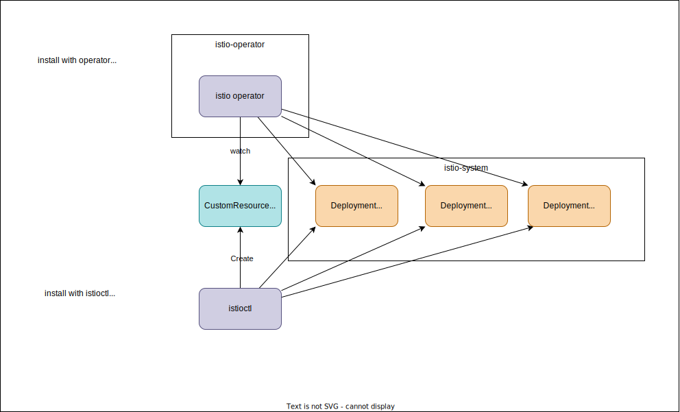

# Istio Implementation

## 1. Must-read

1. [Architecture of Istiod](https://github.com/istio/istio/blob/master/architecture/networking/pilot.md)

## 2. Getting Started

### 2.1. [Components](https://github.com/istio/istio/tree/1.19.0#introduction)

Need to understand the Istio components

1. **Envoy**: sidecar proxies for microservices to handle ingress/egress traffic between services in the cluster and from a service to external services.
1. [Istiod](https://github.com/istio/istio/blob/master/architecture/networking/pilot.md): Istio control plane, which provides service discovery, configuration and certificate management <- This is a modular monolith
    1. **Pilot**: Responsible for configuring the proxies at runtime
    1. **Citadel**: Responsible for certificate issuance and rotation.
    1. **Gallery**: Responsible for validating, ingesting, aggregating, transforming, and distributing config within Istio
1. **Operator**: The component provides user friendly options to operate the Istio service mesh. The role is management of istio components (`istiod`, `istio-ingressgateway`, and `istio-egressgateway`) with `IstioOperator` Custom Resource, which is also same role of `istioctl` ([Istio Operator Inatall](https://istio.io/latest/docs/setup/install/operator/))

Memo

1. **Istiod from microservices to a single binary** [istiod in 2020](https://istio.io/latest/blog/2020/istiod/): <- Very interesting story!

    > Istio’s control plane is, itself, a modern, cloud-native application. Thus, it was built from the start as a set of microservices. Individual Istio components like service discovery (Pilot), configuration (Galley), certificate generation (Citadel) and extensibility (Mixer) were all written and deployed as separate microservices.

    > Having established that many of the common benefits of microservices didn’t apply to the Istio control plane, we decided to unify them into a single binary: istiod (the ’d’ is for daemon).
1. **Pilot** seems to represent **istiod**: https://github.com/istio/istio/blob/master/architecture/networking/pilot.md <- **You must read this to know the details about Istiod**
1. **Ingress**: In addition to `VirtualService` and `Gateway`, Istio supports the `Ingress` core resource type. Like CRDs, the `Ingress` controller implements `ConfigStore`, but a bit differently. **`Ingress` resources are converted on the fly to `VirtualService` and `Gateway`**, [read more](https://github.com/istio/istio/blob/353f722394f90c48212dfd2e04962eafcfbbcfd4/architecture/networking/pilot.md#ingress)
1. **Gateway API**: `Gateway` (referring to the Kubernetes API, not the same-named Istio type) works very similarly to Ingress. **The `Gateway` controller also coverts Gateway API types into `VirtualService` and `Gateway`, implementing the `ConfigStore` interface.**


### 2.2. Repository

Better to know the structure of the repository! Please read https://github.com/istio/istio/tree/1.19.0#repositories

## 3. Installation



### 3.1. Install with Istio Operator

Install Istio Operator

```
istioctl operator init
```

`istio-operator` Deployment will be deployed in `istio-operator` Namespace.

Install Istio with `IstioOperator` CR

```
kubectl apply -f - <<EOF
apiVersion: install.istio.io/v1alpha1
kind: IstioOperator
metadata:
  namespace: istio-system
  name: example-istiocontrolplane
spec:
  profile: demo
EOF
```

### 3.2. Install with `istioctl`

```bash
istioctl profile list
istioctl profile dump demo # demo is one of the profiles
```

<details>

```yaml
apiVersion: install.istio.io/v1alpha1
kind: IstioOperator
spec:
  components:
    base:
      enabled: true
    cni:
      enabled: false
    egressGateways:
    - enabled: true
      k8s:
        resources:
          requests:
            cpu: 10m
            memory: 40Mi
      name: istio-egressgateway
    ingressGateways:
    - enabled: true
      k8s:
        resources:
          requests:
            cpu: 10m
            memory: 40Mi
        service:
          ports:
          - name: status-port
            port: 15021
            targetPort: 15021
          - name: http2
            port: 80
            targetPort: 8080
          - name: https
            port: 443
            targetPort: 8443
          - name: tcp
            port: 31400
            targetPort: 31400
          - name: tls
            port: 15443
            targetPort: 15443
      name: istio-ingressgateway
    istiodRemote:
      enabled: false
    pilot:
      enabled: true
      k8s:
        env:
        - name: PILOT_TRACE_SAMPLING
          value: "100"
        resources:
          requests:
            cpu: 10m
            memory: 100Mi
  hub: docker.io/istio
  meshConfig:
    accessLogFile: /dev/stdout
    defaultConfig:
      proxyMetadata: {}
    enablePrometheusMerge: true
    extensionProviders:
    - envoyOtelAls:
        port: 4317
        service: opentelemetry-collector.istio-system.svc.cluster.local
      name: otel
    - name: skywalking
      skywalking:
        port: 11800
        service: tracing.istio-system.svc.cluster.local
    - name: otel-tracing
      opentelemetry:
        port: 4317
        service: opentelemetry-collector.otel-collector.svc.cluster.local
  profile: demo
  tag: 1.19.0
  values:
    base:
      enableCRDTemplates: false
      validationURL: ""
    defaultRevision: ""
    gateways:
      istio-egressgateway:
        autoscaleEnabled: false
        env: {}
        name: istio-egressgateway
        secretVolumes:
        - mountPath: /etc/istio/egressgateway-certs
          name: egressgateway-certs
          secretName: istio-egressgateway-certs
        - mountPath: /etc/istio/egressgateway-ca-certs
          name: egressgateway-ca-certs
          secretName: istio-egressgateway-ca-certs
        type: ClusterIP
      istio-ingressgateway:
        autoscaleEnabled: false
        env: {}
        name: istio-ingressgateway
        secretVolumes:
        - mountPath: /etc/istio/ingressgateway-certs
          name: ingressgateway-certs
          secretName: istio-ingressgateway-certs
        - mountPath: /etc/istio/ingressgateway-ca-certs
          name: ingressgateway-ca-certs
          secretName: istio-ingressgateway-ca-certs
        type: LoadBalancer
    global:
      configValidation: true
      defaultNodeSelector: {}
      defaultPodDisruptionBudget:
        enabled: true
      defaultResources:
        requests:
          cpu: 10m
      imagePullPolicy: ""
      imagePullSecrets: []
      istioNamespace: istio-system
      istiod:
        enableAnalysis: false
      jwtPolicy: third-party-jwt
      logAsJson: false
      logging:
        level: default:info
      meshNetworks: {}
      mountMtlsCerts: false
      multiCluster:
        clusterName: ""
        enabled: false
      network: ""
      omitSidecarInjectorConfigMap: false
      oneNamespace: false
      operatorManageWebhooks: false
      pilotCertProvider: istiod
      priorityClassName: ""
      proxy:
        autoInject: enabled
        clusterDomain: cluster.local
        componentLogLevel: misc:error
        enableCoreDump: false
        excludeIPRanges: ""
        excludeInboundPorts: ""
        excludeOutboundPorts: ""
        image: proxyv2
        includeIPRanges: '*'
        logLevel: warning
        privileged: false
        readinessFailureThreshold: 30
        readinessInitialDelaySeconds: 1
        readinessPeriodSeconds: 2
        resources:
          limits:
            cpu: 2000m
            memory: 1024Mi
          requests:
            cpu: 10m
            memory: 40Mi
        statusPort: 15020
        tracer: zipkin
      proxy_init:
        image: proxyv2
      sds:
        token:
          aud: istio-ca
      sts:
        servicePort: 0
      tracer:
        datadog: {}
        lightstep: {}
        stackdriver: {}
        zipkin: {}
      useMCP: false
    istiodRemote:
      injectionURL: ""
    pilot:
      autoscaleEnabled: false
      autoscaleMax: 5
      autoscaleMin: 1
      configMap: true
      cpu:
        targetAverageUtilization: 80
      env: {}
      image: pilot
      keepaliveMaxServerConnectionAge: 30m
      nodeSelector: {}
      podLabels: {}
      replicaCount: 1
      traceSampling: 1
    telemetry:
      enabled: true
      v2:
        enabled: true
        metadataExchange:
          wasmEnabled: false
        prometheus:
          enabled: true
          wasmEnabled: false
        stackdriver:
          configOverride: {}
          enabled: false
          logging: false
          monitoring: false
          topology: false
```

</details>

What `istioctl install` (you can install with `-p demo` to specify a profile) does is to create an `IstioOperator` Custom Resource and Istio Controller does the actual work.


**Relationship between the CLI and controller**:
> The CLI and controller share the same API and codebase for generating manifests from the API. You can think of the controller as the CLI command istioctl install running in a loop in a pod in the cluster and using the config from the in-cluster IstioOperator custom resource (CR).


## 4. Code Reading

### 4.1. pilot-discovery (istiod)

1. [pilot/cmd/pilot-discovery/main.go](https://github.com/istio/istio/blob/1.19.0/pilot/cmd/pilot-discovery/main.go)
    1. [pilot/cmd/pilot-discovery/app/cmd.go](https://github.com/istio/istio/blob/1.19.0/pilot/cmd/pilot-discovery/app/cmd.go#L100)
        ```go
        discoveryServer, err := bootstrap.NewServer(serverArgs)
        ```
1. [bootstrap.NewServer](https://github.com/istio/istio/blob/1.19.0/pilot/pkg/bootstrap/server.go#L208)
    1. aggregate.NewController
    1. Initialize `Server` -> `s`
    1. xds.NewDiscoveryServer
    1. initServers
    1. initKubeClient
    1. initMeshConfiguration
    1. initMeshNetworks
    1. initMeshHandlers
    1. s.environment.InitNetworksManager
    1. maybeCreateCA
    1. initControllers
    1. s.XDSServer.InitGenerators
    1. s.initWorkloadTrustBundle
    1. s.initIstiodCerts
    1. s.initSecureDiscoveryService
    1. s.initSecureWebhookServer
    1. s.initSidecarInjector
    1. s.initConfigValidation
    1. s.initRegistryEventHandlers
    1. s.initDiscoveryService

### 4.2. Ingress

1. [pilot/pkg/config/kube/ingress/controller.go](https://github.com/istio/istio/blob/1.19.0/pilot/pkg/config/kube/ingress/controller.go)
    1. Ingress、Gateway、VirtualServiceを管理してるけど、pilotとは？ -> Istiod内のComponentでTraffic Managementなどを担当する主要コンポーネント

    ```
    // In 1.0, the Gateway is defined in the namespace where the actual controller runs, and needs to be managed by
    // user.
    // The gateway is named by appending "-istio-autogenerated-k8s-ingress" to the name of the ingress.
    //
    // Currently the gateway namespace is hardcoded to istio-system (model.IstioIngressNamespace)
    //
    // VirtualServices are also auto-generated in the model.IstioIngressNamespace.
    //
    // The sync of Ingress objects to IP is done by status.go
    // the 'ingress service' name is used to get the IP of the Service
    // If ingress service is empty, it falls back to NodeExternalIP list, selected using the labels.
    // This is using 'namespace' of pilot - but seems to be broken (never worked), since it uses Pilot's pod labels
    // instead of the ingress labels.

    // Follows mesh.IngressControllerMode setting to enable - OFF|STRICT|DEFAULT.
    // STRICT requires "kubernetes.io/ingress.class" == mesh.IngressClass
    // DEFAULT allows Ingress without explicit class.

    // In 1.1:
    // - K8S_INGRESS_NS - namespace of the Gateway that will act as ingress.
    // - labels of the gateway set to "app=ingressgateway" for node_port, service set to 'ingressgateway' (matching default install)
    //   If we need more flexibility - we can add it (but likely we'll deprecate ingress support first)
    // -
    ```
1. [pilot/pkg/config/kube/gateway/controller.g](https://github.com/istio/istio/blob/e81a033756b37768a68913fbe2505e03442d3836/pilot/pkg/config/kube/gateway/controller.go): This is for Gateway API

## Local Development

1. https://github.com/istio/istio/wiki/Preparing-for-Development
1. https://github.com/istio/istio/wiki/Using-the-Code-Base
    1. Clone
        ```bash
        mkdir -p $GOPATH/src/istio.io/istio
        git clone https://github.com/istio/istio $GOPATH/src/istio.io/istio
        cd $GOPATH/src/istio.io/istio
        ```
    1. Set env var

        ```bash
        USER=nakamasato # in my case
        ```

        ```bash
        # This defines the docker hub to use when running integration tests and building docker images
        # eg: HUB="docker.io/istio", HUB="gcr.io/istio-testing"
        export HUB="docker.io/$USER"

        # This defines the docker tag to use when running integration tests and
        # building docker images to be your user id. You may also set this variable
        # this to any other legitimate docker tag.
        export TAG=$USER

        # This defines a shortcut to change directories to $HOME/istio.io
        export ISTIO=$GOPATH/src/istio.io/istio
        ```

## Memo

### Overview

1. `istio-ingressgateway`, `istio-egressgateway`
    1. Helmはここ
    1. imageは`proxyv2`が使われてる
    1. `proxyv2` はpilot-agentにも使われているからどういう違いかが不明
1. `pilot-agent` sidecar
    1. `proxyv2`
    1. [Dockerfile.proxyv2](https://github.com/istio/istio/blob/1.19.0/pilot/docker/Dockerfile.proxyv2): Entrypoint: `"/usr/local/bin/pilot-agent"`
    1. InjectされるSidecarのことが `pilot-agent`と呼ばれているっぽい
    1. The code for sidecar injection: https://github.com/istio/istio/blob/1.19.0/pkg/kube/inject/inject.go
    1. main.go: https://github.com/istio/istio/blob/1.19.0/pilot/cmd/pilot-agent/main.go
1. `pilot-discovery` controller <- `istiod` Deployment
    1. Docker: https://github.com/istio/istio/blob/1.19.0/pilot/docker/Dockerfile.pilot
    1. `main.go`: Entrypoint of istiod server
        1. [pilot/cmd/pilot-discovery/main.go](https://github.com/istio/istio/blob/1.19.0/pilot/cmd/pilot-discovery/main.go)
        1. [pilot/cmd/pilot-discovery/app/cmd.go](https://github.com/istio/istio/blob/1.19.0/pilot/cmd/pilot-discovery/app/cmd.go#L100)
        ```go
        discoveryServer, err := bootstrap.NewServer(serverArgs)
        ```
    1. From Logs, https://github.com/istio/istio/blob/1.19.0/pilot/pkg/bootstrap/server.go is the istiod server initialization.
        1. [bootstrap.NewServer](https://github.com/istio/istio/blob/1.19.0/pilot/pkg/bootstrap/server.go#L208)
            1. initializing istiod admin server: [initServers](https://github.com/istio/istio/blob/1.19.0/pilot/pkg/bootstrap/server.go#L614)
            1. `initIstiodAdminServer`
            1. `initControllers`
            1. initializing secure discovery service: [initSecureDiscoveryService](https://github.com/istio/istio/blob/1.19.0/pilot/pkg/bootstrap/server.go#L740)
            1. initializing secure webhook server for istiod webhooks: [initSecureWebhookServer](https://github.com/istio/istio/blob/1.19.0/pilot/pkg/bootstrap/webhook.go#L53)
            1. initializing sidecar injector: [initSidecarInjector](https://github.com/istio/istio/blob/1.19.0/pilot/pkg/bootstrap/sidecarinjector.go#L76)
            1. initializing config validator: [initConfigValidation](https://github.com/istio/istio/blob/1.19.0/pilot/pkg/bootstrap/validation.go#L30)
            1. initializing registry event handlers: [initRegistryEventHandlers](https://github.com/istio/istio/blob/1.19.0/pilot/pkg/bootstrap/server.go#L844)
            1. starting discovery service: [initDiscoveryService](https://github.com/istio/istio/blob/1.19.0/pilot/pkg/bootstrap/server.go#L643)


### FAQ

1. How `sidecar` container is injected -> https://istio.io/latest/docs/setup/additional-setup/sidecar-injection/#automatic-sidecar-injection
    > Sidecars can be automatically added to applicable Kubernetes pods using a mutating webhook admission controller provided by Istio.

    Implementation: https://github.com/istio/istio/blob/1.19.0/pkg/kube/inject/webhook.go


## Ref

1. [Istio operator code overview](https://github.com/istio/istio/blob/1.19.0/operator/ARCHITECTURE.md)
1. [Istio Operator](https://github.com/istio/istio/tree/1.19.0/operator)
