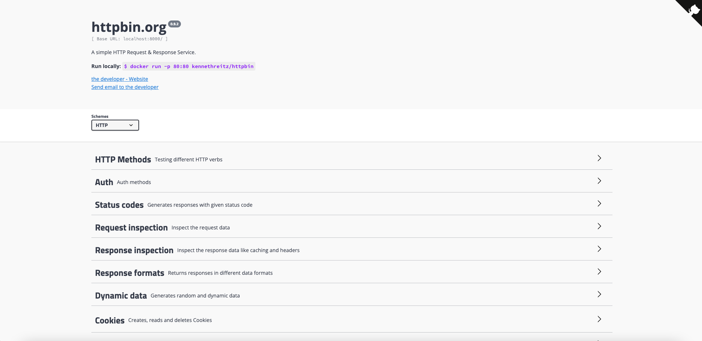

# [Kubernetes Ingress](https://istio.io/latest/docs/tasks/traffic-management/ingress/kubernetes-ingress/)

1. In this page, we'll use `Istio APIs` not `Gateway API`.
1. For local Kubernetes, I use [Kubernetes in Docker Desktop](../local-cluster/docker-desktop/) as we can directly use `LoadBalancer` type `Service`.
1. For `Ingress` resource, The `spec.ingressClassName` is required to tell **the Istio gateway controller** that it should handle this **Ingress**, otherwise it will be ignored.


## 1. Setup

```
istioctl install --set profile=demo -y
```

```
export INGRESS_NAME=istio-ingressgateway
export INGRESS_NS=istio-system
```

```
kubectl get svc "$INGRESS_NAME" -n "$INGRESS_NS"
NAME                   TYPE           CLUSTER-IP     EXTERNAL-IP   PORT(S)                                                                      AGE
istio-ingressgateway   LoadBalancer   10.96.30.107   localhost     15021:30627/TCP,80:30740/TCP,443:31354/TCP,31400:31161/TCP,15443:30423/TCP   33s
```

```
kubectl apply -f https://raw.githubusercontent.com/istio/istio/release-1.19/samples/httpbin/httpbin.yaml
```

```
kubectl port-forward svc/httpbin 8000:8000
```

http://localhost:8000



## 2. [Configure ingress using a Gateway](https://istio.io/latest/docs/tasks/traffic-management/ingress/ingress-control/#configuring-ingress-using-a-gateway)

Gateway:

```
kubectl apply -f - <<EOF
apiVersion: networking.istio.io/v1alpha3
kind: Gateway
metadata:
  name: httpbin-gateway
spec:
  # The selector matches the ingress gateway pod labels.
  # If you installed Istio using Helm following the standard documentation, this would be "istio=ingress"
  selector:
    istio: ingressgateway
  servers:
  - port:
      number: 80
      name: http
      protocol: HTTP
    hosts:
    - "httpbin.example.com"
EOF
```

VirtualService:

```yaml
kubectl apply -f - <<EOF
apiVersion: networking.istio.io/v1alpha3
kind: VirtualService
metadata:
  name: httpbin
spec:
  hosts:
  - "httpbin.example.com"
  gateways:
  - httpbin-gateway
  http:
  - match:
    - uri:
        prefix: /status
    - uri:
        prefix: /delay
    route:
    - destination:
        port:
          number: 8000
        host: httpbin
EOF
```

```
kubectl get gw
NAME              AGE
httpbin-gateway   2m7s
```

```
kubectl get vs
NAME      GATEWAYS              HOSTS                     AGE
httpbin   ["httpbin-gateway"]   ["httpbin.example.com"]   104s
```

## 3. [Determine Ingress IP and ports](https://istio.io/latest/docs/tasks/traffic-management/ingress/ingress-control/#determining-the-ingress-ip-and-ports)


```
kubectl get svc "$INGRESS_NAME" -n "$INGRESS_NS"
NAME                   TYPE           CLUSTER-IP     EXTERNAL-IP   PORT(S)                                                                      AGE
istio-ingressgateway   LoadBalancer   10.96.30.107   localhost     15021:30627/TCP,80:30740/TCP,443:31354/TCP,31400:31161/TCP,15443:30423/TCP   2m13s
```

```
export INGRESS_HOST=$(kubectl -n "$INGRESS_NS" get service "$INGRESS_NAME" -o jsonpath='{.status.loadBalancer.ingress[0].hostname}')
export INGRESS_PORT=$(kubectl -n "$INGRESS_NS" get service "$INGRESS_NAME" -o jsonpath='{.spec.ports[?(@.name=="http2")].port}')
```

## 4. [Access ingress service](https://istio.io/latest/docs/tasks/traffic-management/ingress/ingress-control/#accessing-ingress-services)

```
curl -s -I -HHost:httpbin.example.com "http://$INGRESS_HOST:$INGRESS_PORT/status/200"
HTTP/1.1 200 OK
server: istio-envoy
date: Mon, 25 Sep 2023 08:41:17 GMT
content-type: text/html; charset=utf-8
access-control-allow-origin: *
access-control-allow-credentials: true
content-length: 0
x-envoy-upstream-service-time: 53
```

## 5. [Configuring ingress using an Ingress resource](https://istio.io/latest/docs/tasks/traffic-management/ingress/kubernetes-ingress/#configuring-ingress-using-an-ingress-resource)

```yaml
kubectl apply -f - <<EOF
apiVersion: networking.k8s.io/v1
kind: Ingress
metadata:
  name: ingress
spec:
  ingressClassName: istio
  rules:
  - host: httpbin.example.com
    http:
      paths:
      - path: /status
        pathType: Prefix
        backend:
          service:
            name: httpbin
            port:
              number: 8000
EOF
```

The `spec.ingressClassName` is required to tell the Istio gateway controller that it should handle this Ingress, otherwise it will be ignored.

```
curl -s -I -HHost:httpbin.example.com "http://$INGRESS_HOST:$INGRESS_PORT/status/200"
```

## Ref

1. ([ingress controller](https://kubernetes.io/docs/concepts/services-networking/ingress-controllers/))
    1. In order for the Ingress resource to work, the cluster must have an ingress controller running.
    1. Istio Ingress is an Istio based ingress controller.


