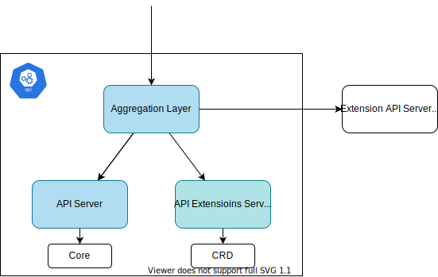
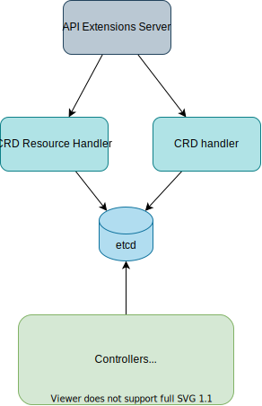

# kube-apiserver

## Overview



Components:
1. **API Extensions Server**: Create HTTP handlers for CRD.
1. **API Server**: Manage core API and core Kubernetes components.
1. **Aggregator Layer**: Proxy the requests sent to the registered extended resource to the *extension API server* that runs in a Pod in the same cluster.

## Run kube-apiserver in local

### Prerequisite

- Bash version 4 or later
    Mac:
    ```
    brew install bash
    ```

    <details><summary>version</summary>

    ```
    bash --version

    GNU bash, version 5.1.16(1)-release (x86_64-apple-darwin21.1.0)
    Copyright (C) 2020 Free Software Foundation, Inc.
    License GPLv3+: GNU GPL version 3 or later <http://gnu.org/licenses/gpl.html>

    This is free software; you are free to change and redistribute it.
    There is NO WARRANTY, to the extent permitted by law.
    ```

    </details>

- Openssl: `LibreSSL` is also ok. (`brew install openssl` <- this should also work.)

    <details><summary>version</summary>

    ```sh
    openssl version
    LibreSSL 2.8.3
    ```

    </details>

- etcd: `brew install etcd`

    <details><summary>version</summary>

    ```sh
    etcd --version
    etcd Version: 3.5.2
    Git SHA: 99018a77b
    Go Version: go1.17.6
    Go OS/Arch: darwin/amd64
    ```

    </details>
### Steps
1. Build Kubernetes binary (ref: [Build Kubernetes](../README.md#build-kubernetes)).
    1. Clone Kubernetes repo.
        ```sh
        git clone https://github.com/kubernetes/kubernetes
        ```
    1. Build the version you want to use.
        ```sh
        git checkout release-1.23 # you can choose any
        make
        ```
1. Run `etcd`. (ref: [etcd](../etcd/))

    start:

    ```sh
    etcd
    ```
1. Create certificates for `service-account`. (You can skip this step by running `./generate_certificate.sh`)

    ```sh
    openssl genrsa -out service-account-key.pem 4096
    openssl req -new -x509 -days 365 -key service-account-key.pem -subj "/CN=test" -sha256 -out service-account.pem
    ```

1. Create certificate for `apiserver`. (You can skip this step by running `./generate_certificate.sh`)

    <details><summary>Steps</summary>

    1. Generate a `ca.key` with 2048bit:
        ```
        openssl genrsa -out ca.key 2048
        ```
    1. According to the `ca.key` generate a `ca.crt` (use -days to set the certificate effective time):
        ```
        openssl req -x509 -new -nodes -key ca.key -subj "/CN=127.0.0.1" -days 10000 -out ca.crt
        ```
    1. `server.key`
        ```
        openssl genrsa -out server.key 2048
        ```
    1. `csr.conf`
    1. generate certificate signing request (`server.csr`)
        ```
        openssl req -new -key server.key -out server.csr -config csr.conf
        ```
    1. generate server certificate `server.crt` using `ca.key`, `ca.crt` and `server.csr`.
        ```
        openssl x509 -req -in server.csr -CA ca.crt -CAkey ca.key \
        -CAcreateserial -out server.crt -days 10000 \
        -extensions v3_ext -extfile csr.conf
        ```

    <details>

1. Run the built binary.

    ```
    PATH_TO_KUBERNETES_DIR=~/repos/kubernetes/kubernetes
    ```

    ```
    ${PATH_TO_KUBERNETES_DIR}/_output/bin/kube-apiserver --version
    Kubernetes v1.23.7-rc.0.21+dcce2357ffda4b
    ```

    ```
    ${PATH_TO_KUBERNETES_DIR}/_output/bin/kube-apiserver --etcd-servers http://localhost:2379 \
    --service-account-key-file=service-account-key.pem \
    --service-account-signing-key-file=service-account-key.pem \
    --service-account-issuer=api \
    --tls-cert-file=server.crt \
    --tls-private-key-file=server.key \
    --client-ca-file=ca.crt
    ```

1. Configure `kubeconfig`. (You can skip this step by running `./generate_certificate.sh`)

    (I'm too lazy to generate crt and key for kubectl. So used the same one as server here.)

    ```
    kubectl config set-cluster local-apiserver \
    --certificate-authority=ca.crt \
    --embed-certs=true \
    --server=https://127.0.0.1:6443 \
    --kubeconfig=kubeconfig

    kubectl config set-credentials admin \
    --client-certificate=server.crt \
    --client-key=server.key \
    --embed-certs=true \
    --kubeconfig=kubeconfig

    kubectl config set-context default \
    --cluster=local-apiserver \
    --user=admin \
    --kubeconfig=kubeconfig

    kubectl config use-context default --kubeconfig=kubeconfig
    ```

1. Check component status. (only `etcd` is healthy.)
    ```
    kubectl get componentstatuses --kubeconfig kubeconfig
    Warning: v1 ComponentStatus is deprecated in v1.19+
    NAME                 STATUS      MESSAGE                                                                                        ERROR
    controller-manager   Unhealthy   Get "https://127.0.0.1:10257/healthz": dial tcp 127.0.0.1:10257: connect: connection refused
    scheduler            Unhealthy   Get "https://127.0.0.1:10259/healthz": dial tcp 127.0.0.1:10259: connect: connection refused
    etcd-0               Healthy     {"health":"true","reason":""}
    ```

### Errors

1. Error1: mkdir /var/run/kubernetes: permission denied

    ```
    E0302 06:40:09.767084   37385 run.go:74] "command failed" err="error creating self-signed certificates: mkdir /var/run/kubernetes: permission denied"
    ```

    Run
    ```
    sudo mkdir /var/run/kubernetes
    chown -R `whoami` /var/run/kubernetes
    ```

1. Error2: service-account-issuer is a required flag, --service-account-signing-key-file and --service-account-issuer are required flags

    ```
    E0302 07:14:46.234431   79468 run.go:74] "command failed" err="[service-account-issuer is a required flag, --service-account-signing-key-file and --service-account-issuer are required flags]"
    ```

    `BoundServiceAccountTokenVolume` is now GA from 1.22. Need to pass `--service-account-signing-key-file` and `--service-account-issuer`.

## [apiextensions-apiserver](https://github.com/kubernetes/apiextensions-apiserver)



*It provides an API for registering `CustomResourceDefinitions`.*

When creating CRD:
1. Store CRD resource.
1. Validate the CRD with several controllers.
1. CRD handler automatically creates HTTP handler for the CRD.

When deleting CRD:
1. Wait until `finalizingController` deletes all the custom resources.

- [NewCustomResourceDefinitionHandler](https://github.com/kubernetes/kubernetes/blob/master/staging/src/k8s.io/apiextensions-apiserver/pkg/apiserver/customresource_handler.go) is called in [CompletedConfig.New](https://github.com/kubernetes/kubernetes/blob/16c9d59d2d646a77fa5de0532fa7c583c013b8d6/staging/src/k8s.io/apiextensions-apiserver/pkg/apiserver/apiserver.go#L133)
- [CompletedConfig.New](https://github.com/kubernetes/kubernetes/blob/16c9d59d2d646a77fa5de0532fa7c583c013b8d6/staging/src/k8s.io/apiextensions-apiserver/pkg/apiserver/apiserver.go#L133)
    1. Prepare genericServer with [completedConfig.New](https://github.com/kubernetes/kubernetes/blob/16c9d59d2d646a77fa5de0532fa7c583c013b8d6/staging/src/k8s.io/apiserver/pkg/server/config.go#L567).
    1. Initialize `CustomResourceDefinitions` with `GenericAPIServer`.
    1. Initialize `apiGroupInfo` with [genericapiserver.NewDefaultAPIGroupInfo](https://github.com/kubernetes/kubernetes/blob/16c9d59d2d646a77fa5de0532fa7c583c013b8d6/staging/src/k8s.io/apiserver/pkg/server/genericapiserver.go#L697).
    1. Install API group with `s.GenericAPIServer.InstallAPIGroup`.
    1. Initialize clientset for CRD with `crdClient, err := clientset.NewForConfig(s.GenericAPIServer.LoopbackClientConfig)`
    1. Initialize and set informer with `s.Informers = externalinformers.NewSharedInformerFactory(crdClient, 5*time.Minute)`
    1. Prepare handlers
        1. delegateHandler
        1. versionDiscoveryHandler
        1. groupDiscoveryHandler
    1. Initialize `EstablishingController`.
    1. Initialize `crdHandler` by `NewCustomResourceDefinitionHandler` with `versionDiscoveryHandler`, `groupDiscoveryHandler`, informer, `delegateHandler`, `establishingController`, etc.
    1. Set HTTP handler for GenericAPIServer with `crdHandler`.
        ```go
        s.GenericAPIServer.Handler.NonGoRestfulMux.Handle("/apis", crdHandler)
        s.GenericAPIServer.Handler.NonGoRestfulMux.HandlePrefix("/apis/", crdHandler)
        ```
    1. Initialize controllers.
        - discoveryController
        - namingController
        - nonStructuralSchemaController
        - apiApprovalController
        - finalizingController
        - [openapicontroller](https://github.com/kubernetes/kubernetes/blob/ea0764452222146c47ec826977f49d7001b0ea8c/staging/src/k8s.io/apiextensions-apiserver/pkg/controller/openapi/controller.go#L62)
    1. Set `AddPostStartHookOrDie` for `GenericAPIServer` to start informer.
    1. Set `AddPostStartHookOrDie` for `GenericAPIServer` to start controllers.
    1. Set `AddPostStartHookOrDie` for `GenericAPIServer` to wait until CRD informer is synced.

## References
- [Feature Gates](https://kubernetes.io/docs/reference/command-line-tools-reference/feature-gates/)
- [kube-apiserver fails init. receive "--service-account-signing-key-file and --service-account-issuer are required flag" #626](https://github.com/kelseyhightower/kubernetes-the-hard-way/issues/626)
- [Kubernetes The Hard Way On VirtualBox 6日目](https://headtonirvana.hatenablog.com/entry/2021/10/11/Kubernetes_The_Hard_Way_On_VirtualBox_6%E6%97%A5%E7%9B%AE)
- [Certificates](https://kubernetes.io/docs/tasks/administer-cluster/certificates/)
- [Generating Kubernetes Configuration Files for Authentication](https://github.com/kelseyhightower/kubernetes-the-hard-way/blob/ca96371e4d2d2176e8b2c3f5b656b5d92973479e/docs/05-kubernetes-configuration-files.md)
- [OpenSSLコマンドの備忘録](https://qiita.com/takech9203/items/5206f8e2572e95209bbc)
