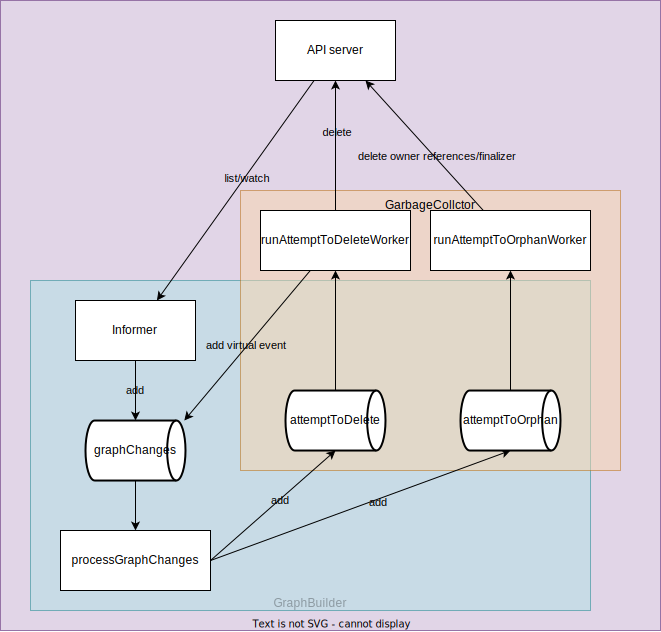
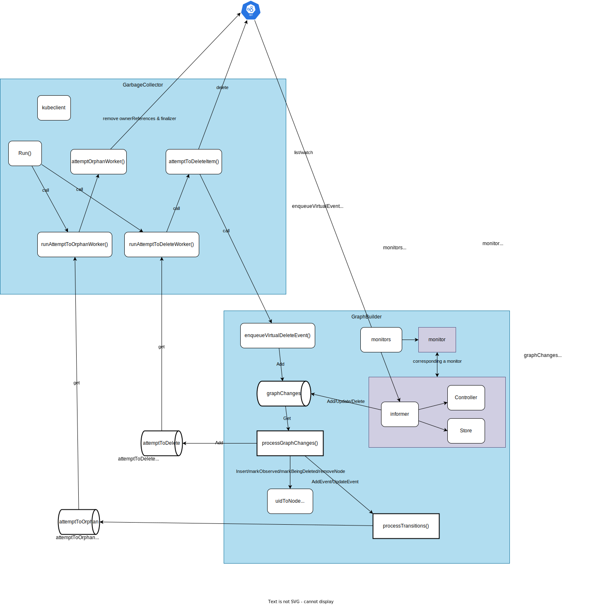

# kube-controller-manager

## 1. Kube Controller Manager


**kube-controller-manager** runs built-in controllers.

Entrypoint:

1. [controller-manager.go](https://github.com/kubernetes/kubernetes/blob/v1.26.0/cmd/kube-controller-manager/controller-manager.go) starts kube-controller-manager with only three lines.
	```go
	func main() {
		command := app.NewControllerManagerCommand()
		code := cli.Run(command)
		os.Exit(code)
	}
	```
1. [NewControllerManagerCommand](https://github.com/kubernetes/kubernetes/blob/v1.26.0/cmd/kube-controller-manager/app/controllermanager.go#L103) returns a [cobra.Command](https://github.com/spf13/cobra)
1. [NewControllerInitializers](https://github.com/kubernetes/kubernetes/blob/v1.26.0/cmd/kube-controller-manager/app/controllermanager.go#L423) defines a set of controllers to start in the controller manager. Specifically, the following controllers are registered with the `startXXXController` with type `InitFunc`
	```go
	type InitFunc func(ctx context.Context, controllerCtx ControllerContext) (controller controller.Interface, enabled bool, err error)
	```
	```go
	register("endpoint", startEndpointController)
	register("endpointslice", startEndpointSliceController)
	register("endpointslicemirroring", startEndpointSliceMirroringController)
	register("replicationcontroller", startReplicationController)
	register("podgc", startPodGCController)
	register("resourcequota", startResourceQuotaController)
	register("namespace", startNamespaceController)
	register("serviceaccount", startServiceAccountController)
	register("garbagecollector", startGarbageCollectorController)
	register("daemonset", startDaemonSetController)
	register("job", startJobController)
	register("deployment", startDeploymentController)
	register("replicaset", startReplicaSetController)
	register("horizontalpodautoscaling", startHPAController)
	register("disruption", startDisruptionController)
	register("statefulset", startStatefulSetController)
	register("cronjob", startCronJobController)
	register("csrsigning", startCSRSigningController)
	register("csrapproving", startCSRApprovingController)
	register("csrcleaner", startCSRCleanerController)
	register("ttl", startTTLController)
	register("bootstrapsigner", startBootstrapSignerController)
	register("tokencleaner", startTokenCleanerController)
	register("nodeipam", startNodeIpamController)
	register("nodelifecycle", startNodeLifecycleController)
	```
1. The core function [Run](https://github.com/kubernetes/kubernetes/blob/v1.26.0/cmd/kube-controller-manager/app/controllermanager.go#L180) calls [StartControllers](https://github.com/kubernetes/kubernetes/blob/v1.26.0/cmd/kube-controller-manager/app/controllermanager.go#L567) to start the controllers specified by `controllers` (`map[string]InitFunc{}` defined in the previous step)

Each Controller:

1.  `InitFunc` of each controller is defined in [kube-controller-manager/app/core.go](https://github.com/kubernetes/kubernetes/blob/master/cmd/kube-controller-manager/app/core.go). e.g. [startGarbageCollectorController](https://github.com/kubernetes/kubernetes/blob/master/cmd/kube-controller-manager/app/core.go#L508)
	```go
	garbageCollector, err := garbagecollector.NewGarbageCollector(
		gcClientset,
		metadataClient,
		controllerContext.RESTMapper,
		ignoredResources,
		controllerContext.ObjectOrMetadataInformerFactory,
		controllerContext.InformersStarted,
	)
	```
1. Each controller is defined under [pkg/controller](https://github.com/kubernetes/kubernetes/tree/master/pkg/controller). e.g. [pkg/controller/garbagecollector/garbagecollector.go](https://github.com/kubernetes/kubernetes/blob/master/pkg/controller/garbagecollector/garbagecollector.go)
	```go
	type GarbageCollector struct {
		restMapper     meta.ResettableRESTMapper
		metadataClient metadata.Interface
		// garbage collector attempts to delete the items in attemptToDelete queue when the time is ripe.
		attemptToDelete workqueue.RateLimitingInterface
		// garbage collector attempts to orphan the dependents of the items in the attemptToOrphan queue, then deletes the items.
		attemptToOrphan        workqueue.RateLimitingInterface
		dependencyGraphBuilder *GraphBuilder
		// GC caches the owners that do not exist according to the API server.
		absentOwnerCache *ReferenceCache

		kubeClient       clientset.Interface
		eventBroadcaster record.EventBroadcaster

		workerLock sync.RWMutex
	}
	```
## 2. Controller Overview


Components:

- **Reflector**:
- **Delta FIFO queue**:
- [Informer](https://pkg.go.dev/k8s.io/client-go/informers): Monitor Object's event and EventHandler is called for each event (usually add item to WorkQueue in event handlers in a controller).
    - [sharedIndexInformer](https://github.com/kubernetes/client-go/blob/b425fb657986de75a11b1844886c70b486728935/tools/cache/shared_informer.go#L274-L286): Usually created for a specific resource (e.g. `deploymentInformer`) with `NewSharedIndexInformer`, which creates a new instance for the listwatcher.
        1. [Indexer](https://github.com/kubernetes/client-go/blob/b425fb657986de75a11b1844886c70b486728935/tools/cache/index.go#L35-L56): indexed local cache. Indexer extends [Store](https://github.com/kubernetes/client-go/blob/4ae0d1917adff2d93ea4c6a7ae3a9e5c19280b9f/tools/cache/store.go#L39) with multiple indices and restricts each accumulator to simply hold the current object.
        1. `Controller` that pulls objects/notifications using the ListerWatcher and pushes them into a `DeltaFIFO`.
        1. `sharedProcessor` responsible for relaying those notifications to each of the informer's clients. <- `EventHandler` is set to `processorListener`, which is stored in `listeners` of a `sharedProcessor`.
        1. `listerWatcher` for the target resource. e.g. for [deploymentInformer](https://github.com/kubernetes/client-go/blob/b425fb657986de75a11b1844886c70b486728935/informers/apps/v1/deployment.go#L60-L73)

            <details>

            ```go
    		&cache.ListWatch{
    			ListFunc: func(options metav1.ListOptions) (runtime.Object, error) {
    				if tweakListOptions != nil {
    					tweakListOptions(&options)
    				}
    				return client.AppsV1().Deployments(namespace).List(context.TODO(), options)
    			},
    			WatchFunc: func(options metav1.ListOptions) (watch.Interface, error) {
    				if tweakListOptions != nil {
    					tweakListOptions(&options)
    				}
    				return client.AppsV1().Deployments(namespace).Watch(context.TODO(), options)
    			},
    		},
            ```

            </details>

- **Lister**: Retrieve object from in-memory-cache.
- **WorkQueue**: Store item for which Reconcile loop is executed.
- **Scheme**: Scheme defines methods for serializing and deserializing API objects, a type registry for converting group, version, and kind information to and from Go schemas, and mappings between Go schemas of different versions. (ref: [scheme.go](https://github.com/kubernetes/apimachinery/blob/2936d3f03931b9c06a641799605d8e806cb2a58b/pkg/runtime/scheme.go#L31-L33))
- **processNextWorkItem**: Process an item in WorkQueue.
- **syncHandler**: Reconcile loop called by `processNextWorkItem` function (Function name can be different).

## 3. Built-in Controllers
### 3.1. EndpointsController


[[Kubernetes] EndpointsがよくわかってないのでEndpointsControllerを読んでみた](https://qiita.com/gymnstcs/items/13698c24af0a60f71bcd)

### 3.2. GarbageCollector



<details>



</details>


#### 3.2.1. Components

##### 3.2.1.1. [GarbageCollector](https://github.com/kubernetes/kubernetes/blob/v1.26.0/pkg/controller/garbagecollector/garbagecollector.go):

<details>

```go
type GarbageCollector struct {
	restMapper     meta.ResettableRESTMapper
	metadataClient metadata.Interface
	// garbage collector attempts to delete the items in attemptToDelete queue when the time is ripe.
	attemptToDelete workqueue.RateLimitingInterface
	// garbage collector attempts to orphan the dependents of the items in the attemptToOrphan queue, then deletes the items.
	attemptToOrphan        workqueue.RateLimitingInterface
	dependencyGraphBuilder *GraphBuilder
	// GC caches the owners that do not exist according to the API server.
	absentOwnerCache *ReferenceCache

	kubeClient       clientset.Interface
	eventBroadcaster record.EventBroadcaster

	workerLock sync.RWMutex
}
```

</details>

1. [RestMapper](https://pkg.go.dev/k8s.io/apimachinery/pkg/api/meta#RESTMapper): map resources to kind, and map kind and version to interfaces

##### 3.2.1.2. [GraphBuilder](https://github.com/kubernetes/kubernetes/blob/v1.26.0/pkg/controller/garbagecollector/graph_builder.go)

builds a graph caching the dependencies among objects.

<details>

```go
type GraphBuilder struct {
	restMapper meta.RESTMapper

	// each monitor list/watches a resource, the results are funneled to the
	// dependencyGraphBuilder
	monitors    monitors
	monitorLock sync.RWMutex
	// informersStarted is closed after after all of the controllers have been initialized and are running.
	// After that it is safe to start them here, before that it is not.
	informersStarted <-chan struct{}

	// stopCh drives shutdown. When a receive from it unblocks, monitors will shut down.
	// This channel is also protected by monitorLock.
	stopCh <-chan struct{}

	// running tracks whether Run() has been called.
	// it is protected by monitorLock.
	running bool

	eventRecorder record.EventRecorder

	metadataClient metadata.Interface
	// monitors are the producer of the graphChanges queue, graphBuilder alters
	// the in-memory graph according to the changes.
	graphChanges workqueue.RateLimitingInterface
	// uidToNode doesn't require a lock to protect, because only the
	// single-threaded GraphBuilder.processGraphChanges() reads/writes it.
	uidToNode *concurrentUIDToNode
	// GraphBuilder is the producer of attemptToDelete and attemptToOrphan, GC is the consumer.
	attemptToDelete workqueue.RateLimitingInterface
	attemptToOrphan workqueue.RateLimitingInterface
	// GraphBuilder and GC share the absentOwnerCache. Objects that are known to
	// be non-existent are added to the cached.
	absentOwnerCache *ReferenceCache
	sharedInformers  informerfactory.InformerFactory
	ignoredResources map[schema.GroupResource]struct{}
}
```

</details>

1. **monitors**: a set of monitors, each of which runs a [cache.Controller](https://pkg.go.dev/k8s.io/client-go/tools/cache#Controller) (1. construct and run a Reflector and pumps objects/notifications to the **Config.Queue**. 2. pop from the queue and process with **Config.ProcessFunc**).
1. **graphChanges**: workqueue to store events from informer (input of all process)
1. **absentOwnerCache**: Objects that are known to be non-existent are added to the cached.
1. **uidToNode** (graph): a pointer of [concurrentUIDToNode](https://github.com/kubernetes/kubernetes/blob/b46a3f887ca979b1a5d14fd39cb1af43e7e5d12d/pkg/controller/garbagecollector/graph.go#L195)
	```go
	type concurrentUIDToNode struct {
		uidToNodeLock sync.RWMutex
		uidToNode     map[types.UID]*node
	}
	```
1. **node**
	```go
	type node struct {
		identity objectReference
		// dependents will be read by the orphan() routine, we need to protect it with a lock.
		dependentsLock sync.RWMutex
		// dependents are the nodes that have node.identity as a
		// metadata.ownerReference.
		dependents map[*node]struct{}
		// this is set by processGraphChanges() if the object has non-nil DeletionTimestamp
		// and has the FinalizerDeleteDependents.
		deletingDependents     bool
		deletingDependentsLock sync.RWMutex
		// this records if the object's deletionTimestamp is non-nil.
		beingDeleted     bool
		beingDeletedLock sync.RWMutex
		// this records if the object was constructed virtually and never observed via informer event
		virtual     bool
		virtualLock sync.RWMutex
		// when processing an Update event, we need to compare the updated
		// ownerReferences with the owners recorded in the graph.
		owners []metav1.OwnerReference
	}
	```
	1. `isObserved`: `!virtual`
	1. `vitual`: In [attemptToDeleteItem](https://github.com/kubernetes/kubernetes/blob/v1.26.0/pkg/controller/garbagecollector/garbagecollector.go#L513-L529), if there's no corresponding object in API server or the latest uid is not same as item.identity.UID, the item is added back to graphChanges with virtual = true


#### 3.2.2. Steps

[NewGarbageCollector](https://github.com/kubernetes/kubernetes/blob/v1.26.0/pkg/controller/garbagecollector/garbagecollector.go#L87):

1. **GarbageCollector** and **GraphBuilder** are initialized

[GarbageCollector.Run()](https://github.com/kubernetes/kubernetes/blob/v1.26.0/pkg/controller/garbagecollector/garbagecollector.go#L143):

1. Start **gc.dependencyGraphBuilder.Run()** (wait until cache is synced)
	```go
	go gc.dependencyGraphBuilder.Run(ctx.Done())
	```
	1. Start `gb.startMonitors()`: ensure the current set of monitors are running. Start each of the monitors
		```go
		gb.sharedInformers.Start(gb.stopCh)
		go monitor.Run()
		```
	1. Run `runProcessGraphChanges` every second
		```go
		wait.Until(gb.runProcessGraphChanges, 1*time.Second, stopCh)
		```
	1. [runProcessGraphChanges](https://github.com/kubernetes/kubernetes/blob/v1.26.0/pkg/controller/garbagecollector/graph_builder.go#L600) calls **processGraphChanges** in a for loop.
		```go
		func (gb *GraphBuilder) runProcessGraphChanges() {
			for gb.processGraphChanges() {
			}
		}
		```
	1. `processGraphChanges`: Get an item from `graphChanges` and put the corresponding node to `attemptToDelete` or `attemptToOrphan` queue.
		1. if the node in `uidToNode` is not observed and now observed -> node.`markObserved()` (Add a potentially invalid dependent to `attemptToDelete` queue) [ref](https://github.com/kubernetes/kubernetes/blob/b46a3f887ca979b1a5d14fd39cb1af43e7e5d12d/pkg/controller/garbagecollector/graph_builder.go#L638-L666)
		1. [`addEvent` or `updateEvent`] if not found in `uidToNode`, `insertNode` + `processTransitions` [ref](https://github.com/kubernetes/kubernetes/blob/b46a3f887ca979b1a5d14fd39cb1af43e7e5d12d/pkg/controller/garbagecollector/graph_builder.go#L668-L679)
		1. [`addEvent` or `updateEvent`] if found in `uidToNode`, reflect changes in ownerReferences and if being deleted, `markBeingDeleted()` + `processTransitions` [ref](https://github.com/kubernetes/kubernetes/blob/v1.26.0/pkg/controller/garbagecollector/graph_builder.go#L680-L699)
		1. [`deleteEvent`] if found
			1. if `event.virtual` (event from GarbageCollector) -> in some case set `removeExistingNode` to false as it's not certain. Detail: [ref](https://github.com/kubernetes/kubernetes/blob/v1.26.0/pkg/controller/garbagecollector/graph_builder.go#L708-L760)
			1. if `removeExistingNode`, `removeNode`, add dependents to `attemptToDelete`, and add owners to `attemptToDelete`
1. Start gc workers
	```go
	// gc workers
	for i := 0; i < workers; i++ {
		go wait.UntilWithContext(ctx, gc.runAttemptToDeleteWorker, 1*time.Second)
		go wait.Until(gc.runAttemptToOrphanWorker, 1*time.Second, ctx.Done())
	}
	```
	1. run [runAttemptToDeleteWorker()](https://github.com/kubernetes/kubernetes/blob/v1.26.0/pkg/controller/garbagecollector/garbagecollector.go#L302-L305)
		```go
		func (gc *GarbageCollector) runAttemptToDeleteWorker(ctx context.Context) {
			for gc.processAttemptToDeleteWorker(ctx) {
			}
		}
		```
		[processAttemptToDeleteWorker](https://github.com/kubernetes/kubernetes/blob/v1.26.0/pkg/controller/garbagecollector/garbagecollector.go#L311-L326):
		1. Get an item (node) from **attemptToDelete** queue.
			```go
			action := gc.attemptToDeleteWorker(ctx, item)
			```
		1. Process it in [attemptToDeleteWorker](https://github.com/kubernetes/kubernetes/blob/v1.26.0/pkg/controller/garbagecollector/garbagecollector.go#L338-L392)
			1. In case the node, converted from the item in the queue, is not observed (meaning that it's added from `objectReference` whose object is not found in API server), forget the item if it doesn't exist in the graph or it's observed. [ref](https://github.com/kubernetes/kubernetes/blob/v1.26.0/pkg/controller/garbagecollector/garbagecollector.go#L345-L359)
		1. Delete the item with [attemptToDeleteItem](https://github.com/kubernetes/kubernetes/blob/v1.26.0/pkg/controller/garbagecollector/garbagecollector.go#L494-L617)
			```go
			err := gc.attemptToDeleteItem(ctx, n)
			```
			1. `item.isBeingDeleted` & `!item.isDeletingDependents` -> Do nothing and return `nil`
			1. Get the latest object from API server
				```go
				latest, err := gc.getObject(item.identity)
				```
			1. err=NotFound -> `enqueueVirtualDeleteEvent`(enqueue event to `graphChanges` with `virtual=true`)
				```go
				gc.dependencyGraphBuilder.enqueueVirtualDeleteEvent(item.identity)
				```
			1. `latest.GetUID() != item.identity.UID` -> `enqueueVirtualDeleteEvent`(enqueue event to `graphChanges` with `virtual=true`) and return `enqueuedVirtualDeleteEventErr`
				```go
				gc.dependencyGraphBuilder.enqueueVirtualDeleteEvent(item.identity)
				```
			1. `item.isDeletingDependents()` -> `gc.processDeletingDependentsItem(item)` and return `enqueuedVirtualDeleteEventErr`
				1. If no `blockingDependents` -> `gc.removeFinalizer(item, metav1.FinalizerDeleteDependents)`
				1. For `blockingDependents`, if not `isBeingDeleted` -> `gc.attemptToDelete.Add(dep)`
			1. If there's no `OwnerReferences` -> nil
			1. Classify ownerReferences
				```go
				solid, dangling, waitingForDependentsDeletion, err := gc.classifyReferences(ctx, item, ownerReferences)
				```
			1. `len(solid) != 0`
				1. `len(dangling) == 0 && len(waitingForDependentsDeletion) == 0` -> return `nil`
				1. Delete owner references for `dangling` and `waitingForDependentsDeletion` (send PATCH request to API server)
			1. `len(waitingForDependentsDeletion) != 0 && item.dependentsLength() != 0`
				for all dependents, if `isBeingDeleted` -> send `unblockOwnerReferencesStrategicMergePatch` PATCH request to API server
				1. delete with for `DeletePropagationForeground` (API server)
			1. default
				1. `hasOrphanFinalizer` -> delete with `DeletePropagationOrphan`
				1. `hasDeleteDependentsFinalizer` -> delete with `DeletePropagationForeground`
				1. default -> delete with `DeletePropagationBackground`
	1. run **runAttemptToOrphanWorker()** every second
		1. Get owner from **attemptToOrphan**
		1. `attemptToOrphanWorker`
			1. `orphanDependents(owner, dependents)`: remove owner references via PATCH (API server)
			1. `gc.removeFinalizer(owner, metav1.FinalizerOrphanDependents)`


[GarbageCollector.Sync](https://github.com/kubernetes/kubernetes/blob/b46a3f887ca979b1a5d14fd39cb1af43e7e5d12d/pkg/controller/garbagecollector/garbagecollector.go#L181) keeps updating the resources to monitor periodically. -> `GraphBuilder.syncMonitors(resources)` but not found where it's called.


TestCase:

1. [TestCascadingDeletion](https://github.com/kubernetes/kubernetes/blob/b46a3f887ca979b1a5d14fd39cb1af43e7e5d12d/test/integration/garbagecollector/garbage_collector_test.go#L454-L538):
	1. Pod with ownerreference to `toBeDeletedRC` replicationcontroller -> deleted
	1. Pod with ownerrefrerece to `remainingRC` and `toBeDeletedRC` replicatioincontroller -> remain
	1. Pod without ownerreference -> remain
	1. Delete `toBeDeletedRCName` replicationcontroller
1. [TestOrphaning](https://github.com/kubernetes/kubernetes/blob/b46a3f887ca979b1a5d14fd39cb1af43e7e5d12d/test/integration/garbagecollector/garbage_collector_test.go#L728-L806)
	1. If deleted with `DeleteOptions.propagationPolicy=Orphan`, the ownerreferences are just removed without deleting the object itself.

	<details>

	```
	kubectl create deploy nginx --image=nginx --replicas=1
	deployment.apps/nginx created
	kubectl get deploy
	NAME    READY   UP-TO-DATE   AVAILABLE   AGE
	nginx   1/1     1            1           3m25s
	kubectl delete deployment nginx --cascade=orphan
	deployment.apps "nginx" deleted
	kubectl get deploy
	No resources found in default namespace.
	kubectl get rs
	NAME              DESIRED   CURRENT   READY   AGE
	nginx-76d6c9b8c   1         1         1       3m40s
	kubectl get pod
	NAME                    READY   STATUS    RESTARTS   AGE
	nginx-76d6c9b8c-jcwxv   1/1     Running   0          3m46s
	```

	</details>

#### 3.2.3. Ref

1. [gabagecollector.go](https://github.com/kubernetes/kubernetes/blob/v1.26.0/pkg/controller/garbagecollector/garbagecollector.go)
1. [graph_builder.go](https://github.com/kubernetes/kubernetes/blob/v1.26.0/pkg/controller/garbagecollector/graph_builder.go#L132)
1. [test/integration/gabagecollector/garbage_collector_test.go](https://github.com/kubernetes/kubernetes/blob/v1.26.0/test/integration/garbagecollector/garbage_collector_test.go)
1. [Enable garbage collection of custom resources](https://github.com/kubernetes/kubernetes/pull/47665)


#### 3.2.4. Memo

1. Delete
	1. `propagationPolicy=Forground` -> API-server updates `metadata.deletionTimestamp` and adds `foregroundDeletion` finalizer instead of removing the object itself.
		1. curl: with `'{"kind":"DeleteOptions","apiVersion":"v1","propagationPolicy":"Foreground"}'`
		1. kubectl: `kubectl delete --cascade=foregraound`
	1. `PropagationPolicy=Backgound` (default) -> API-server immediately deletes the object and its dependents.
		1. curl: with `'{"kind":"DeleteOptions","apiVersion":"v1","propagationPolicy":"Background"}'`
		1. `kubectl delete --cascade=background` (or `kubectl delete`)
	1. `PropagationPolicy=Orphan` -> API-server deletes the object but not deletes the dependent objects. Instead its dependent objects remain as *orphan*s
		1. curl: with `'{"kind":"DeleteOptions","apiVersion":"v1","propagationPolicy":"Orphan"}'`
		1. `kubectl delete --cascade=orphan`
1. OwnerReferences
1. Finalizers

### 3.3. [NamespaceController](https://github.com/kubernetes/kubernetes/blob/v1.26.0/pkg/controller/namespace/namespace_controller.go)

```go
// NamespaceController is responsible for performing actions dependent upon a namespace phase
type NamespaceController struct {
	// lister that can list namespaces from a shared cache
	lister corelisters.NamespaceLister
	// returns true when the namespace cache is ready
	listerSynced cache.InformerSynced
	// namespaces that have been queued up for processing by workers
	queue workqueue.RateLimitingInterface
	// helper to delete all resources in the namespace when the namespace is deleted.
	namespacedResourcesDeleter deletion.NamespacedResourcesDeleterInterface
}
```

1. API: https://github.com/kubernetes/api/blob/master/core/v1/types.go#L5601
1. [startNamespaceController](https://github.com/kubernetes/kubernetes/blob/master/cmd/kube-controller-manager/app/core.go#L451-L483)
	```go
	namespaceController := namespacecontroller.NewNamespaceController(
		ctx,
		namespaceKubeClient,
		metadataClient,
		discoverResourcesFn,
		controllerContext.InformerFactory.Core().V1().Namespaces(),
		controllerContext.ComponentConfig.NamespaceController.NamespaceSyncPeriod.Duration,
		v1.FinalizerKubernetes,
	)
	go namespaceController.Run(ctx, int(controllerContext.ComponentConfig.NamespaceController.ConcurrentNamespaceSyncs))
	```
	[FinalizerKubernetes](https://github.com/kubernetes/api/blob/master/core/v1/types.go#L5596-L5598)
	```go
	const (
		FinalizerKubernetes FinalizerName = "kubernetes"
	)
	```


1. [NewNamespaceController](https://github.com/kubernetes/kubernetes/blob/v1.26.0/pkg/controller/namespace/namespace_controller.go#L65):
	1. Init NamespaceController
		```go
		namespaceController := &NamespaceController{
			queue:                      workqueue.NewNamedRateLimitingQueue(nsControllerRateLimiter(), "namespace"),
			namespacedResourcesDeleter: deletion.NewNamespacedResourcesDeleter(kubeClient.CoreV1().Namespaces(), metadataClient, kubeClient.CoreV1(), discoverResourcesFn, finalizerToken),
		}
		```
	1. Prepare event handler for namespaceInformer
		```go
		namespaceInformer.Informer().AddEventHandlerWithResyncPeriod(
			cache.ResourceEventHandlerFuncs{
				AddFunc: func(obj interface{}) {
					namespace := obj.(*v1.Namespace)
					namespaceController.enqueueNamespace(namespace)
				},
				UpdateFunc: func(oldObj, newObj interface{}) {
					namespace := newObj.(*v1.Namespace)
					namespaceController.enqueueNamespace(namespace)
				},
			},
			resyncPeriod,
		)
		```
1. Run -> worker -> workFunc
1. [workFunc](https://github.com/kubernetes/kubernetes/blob/v1.26.0/pkg/controller/namespace/namespace_controller.go#L136-L160):
	1. get key from queue
		```go
		key, quit := nm.queue.Get()
		```
	1. sync
		```go
		err := nm.syncNamespaceFromKey(key.(string))
		```
	1. [syncNamespaceFromKey](https://github.com/kubernetes/kubernetes/blob/v1.26.0/pkg/controller/namespace/namespace_controller.go#L172):
		1. get namespace
			```go
			namespace, err := nm.lister.Get(key)
			```
		1. run deleter
			```go
			nm.namespacedResourcesDeleter.Delete(namespace.Name)
			```
			1. Get namespace
				```go
				namespace, err := d.nsClient.Get(context.TODO(), nsName, metav1.GetOptions{})
				```
			1. `namespace.DeletionTimestamp == nil` -> return nil
			1. Update namespace status to terminating
				```go
				namespace, err = d.retryOnConflictError(namespace, d.updateNamespaceStatusFunc)
				```
				`newNamespace.Status.Phase = v1.NamespaceTerminating`
			1. Delete all contents in the namespace
				```go
				estimate, err := d.deleteAllContent(namespace)
				```
			1. finalizeNamespace removes the specified finalizerToken and finalizes the namespace
				```go
				_, err = d.retryOnConflictError(namespace, d.finalizeNamespace)
				```

### 3.4. DeploymentController

ToDo
## References
- https://engineering.bitnami.com/articles/a-deep-dive-into-kubernetes-controllers.html
- https://engineering.bitnami.com/articles/kubewatch-an-example-of-kubernetes-custom-controller.html
- https://cloudnative.to/blog/client-go-informer-source-code/
- Start each controller: https://github.com/kubernetes/kubernetes/blob/fe099b2abdb023b21a17cd6a127e381b846c1a1f/cmd/kube-controller-manager/controller-manager.go
- Definition of each controller: https://github.com/kubernetes/kubernetes/tree/master/pkg/controller
