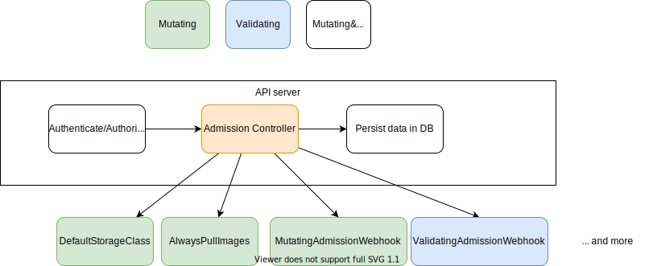

# Kubernetes Features

## [Namespaces]([Namespaces](https://kubernetes.io/docs/concepts/overview/working-with-objects/namespaces/))

*Kubernetes supports multiple virtual clusters backed by the same physical cluster. These virtual clusters are called namespaces.*

When to use multiple namespaces seems to be arguable.

- [Kubernetes - Namespaces](https://kubernetes.io/docs/concepts/overview/working-with-objects/namespaces/)
    - *For clusters with a few to tens of users, you should not need to create or think about namespaces at all.* (in the Kubernetes document.)
- [RedHat - Kubernetes Namespaces Demystified - How To Make The Most of Them](https://cloud.redhat.com/blog/kubernetes-namespaces-demystified-how-to-make-the-most-of-them)
    - Do not overload namespaces with multiple workloads that perform unrelated tasks.
    - Users should **create namespaces for a specific application or microservice and all of the application requirements**. Reasons:
        - Simplified recreation of the entire application
        - Fine-grained network management
        - Greater scalability
        - Greater observability
- [Google Cloud - Kubernetes best practices: Organizing with Namespaces](https://cloud.google.com/blog/products/containers-kubernetes/kubernetes-best-practices-organizing-with-namespaces)
    - Small team: 5~10 microservices → **`default` Namespace**
    - Rapidly growing teams: 10+ microservices → each team owns their own microservices -> **Use multiple clusters or namespaces for production and development** or **Each team may choose to have their own namespace**
    - Large: not everyone knows everyone else. → **each team definitely needs its own namespace. Each team might even opt for multiple namespaces to run its development and production environments.**

## [Admission Controllers](https://kubernetes.io/docs/reference/access-authn-authz/admission-controllers/#what-does-each-admission-controller-do)

An **admission controller** is a piece of code that intercepts requests to the Kubernetes API server prior to persistence of the object, but after the request is authenticated and authorized.

Admission controllers may be **"validating"**, **"mutating"**, or **both**.

You can turn on each of them by the argument `--enable-admission-plugins` of api-server.

```
kube-apiserver --enable-admission-plugins=NamespaceLifecycle,LimitRanger ...
```



Admission controllers list:

1. **DefaultStorageClass**: Set default storage class for `PersistentVolumeClaim`
1. **AlwaysPullIMages**: Set imagePullPolicy to `Always`
1. **MutatingAdmissionWebhook** ([dynamic admission control](https://kubernetes.io/docs/reference/access-authn-authz/extensible-admission-controllers/)): execute mutating admission control webhook
1. **ValidatingAdmissionWebhook** ([dynamic admission control](https://kubernetes.io/docs/reference/access-authn-authz/extensible-admission-controllers/)): execute validating admission control webhook
1. [and more...](https://kubernetes.io/docs/reference/access-authn-authz/admission-controllers/#what-does-each-admission-controller-do)

## Owner References

[Owner References](owner-references/README.md)

## Garbage Collection

If you want to know about garbage collection, please read [Garbage Collection](../kubernetes-components/kube-controller-manager/README.md#garbagecollector).
