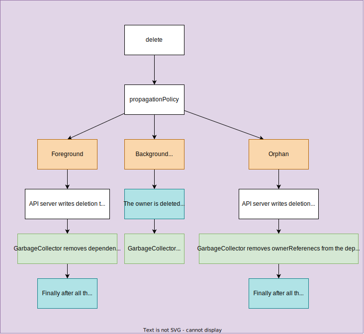

# [Resource deletion](https://kubernetes.io/docs/reference/using-api/api-concepts/#resource-deletion)

1. finalization
1. removal

For more details in the logic of API server, please read [kube-apiserver#delete](../../kubernetes-components/kube-apiserver/README.md#delete)

## Ref

1. https://thenewstack.io/deletion-garbage-collection-kubernetes-objects/
