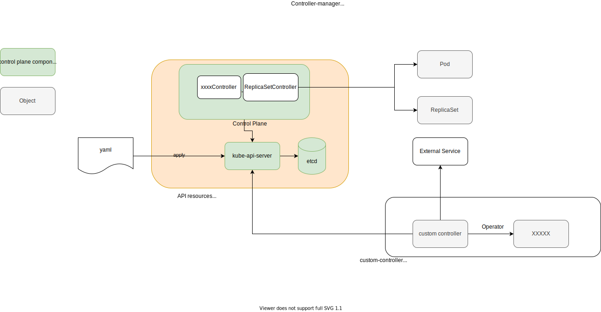
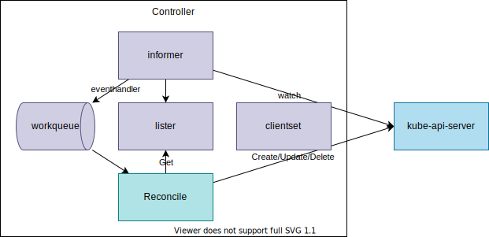
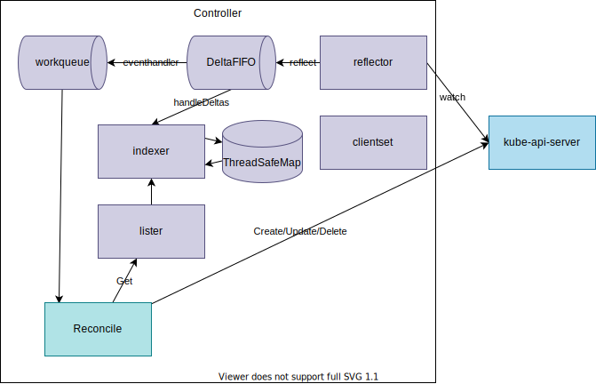
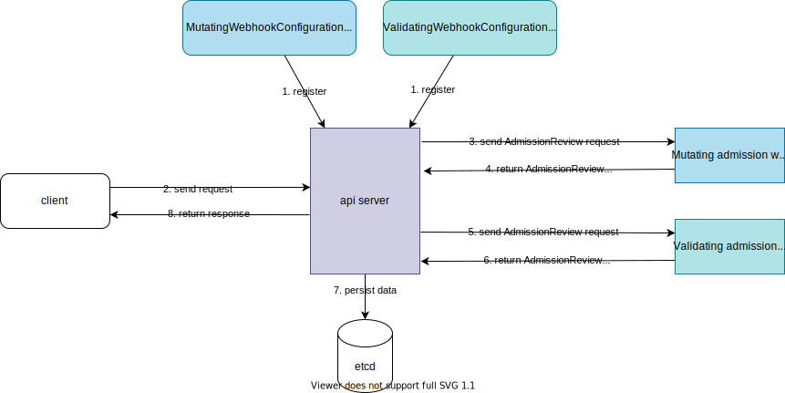
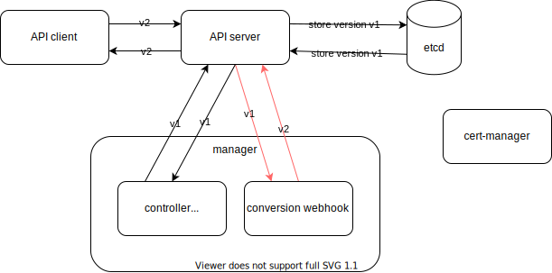

# Kubernetes Operator Study Journey
## 1. Try using existing operators

1. [prometheus-operator](../prometheus-operator)
1. [postgres-operator](../databases/postgres-operator)
1. [strimzi](../strimzi)
1. [argocd](../argocd): [appcontroller.go](https://github.com/argoproj/argo-cd/blob/9025318adf367ae8f13b1a99e5c19344402b7bb9/controller/appcontroller.go)
1. [grafana-operator](../grafana-operator)
1. [mysql-operator](../databases/mysql-operator)
1. [terraform-k8s](../terraform-k8s)

## 2. Understand what is Kubernetes operator.



1. Kubernetes Controller components.
1. How Kubernetes Controlloer works.
1. Custom Resource.

**Kubernetes Operator**

> A Kubernetes operator is an application-specific controller that extends the functionality of the Kubernetes API to create, configure, and manage instances of complex applications on behalf of a Kubernetes user.

From [What is a Kubernetes operator?](https://www.redhat.com/en/topics/containers/what-is-a-kubernetes-operator)

> Operators are software extensions to Kubernetes that make use of custom resources to manage applications and their components. Operators follow Kubernetes principles, notably the control loop.

From https://kubernetes.io/docs/concepts/extend-kubernetes/operator/

> An Operator is like an automated Site Reliability Engineer for its application.

From [Kubernetes Operators ~ Automating the Container Orchestration Platform ~](https://www.redhat.com/rhdc/managed-files/cl-oreilly-kubernetes-operators-ebook-f21452-202001-en_2.pdf)

**Operator vs. Controller**

> - Controller（Custom Controller）:Custom Resourceの管理を行うController。Control Loop（Reconciliation Loop）を実行するコンポーネント
> - Operator: CRDとCustom Controllerのセット。etcd operatorやmysql operatorなどのように、特定のソフトウェアの管理を自動化するためのソフトウェア

From [実践入門Kubernetesカスタムコントローラーへの道](https://www.amazon.co.jp/dp/B0851QCR81)

> - Controllers can act on core resources such as deployments or services, which are typically part of the Kubernetes controller manager in the control plane, or can watch and manipulate user-defined custom resources.
> - Operators are controllers that encode some operational knowledge, such as application lifecycle management, along with the custom resources defined in Chapter 4.

From [Programming Kubernetes](https://www.oreilly.com/library/view/programming-kubernetes/9781492047094/ch01.html)

> - A **controller** is a loop that reads desired state ("spec), observed cluster state (others' "status"), and external state, and the reconciles cluster state and external state with the desired state, writing any observations down (to our own "status").
> - All of Kubernetes functions on this model.
> - An **operator** is a controller that encodes human operational knowledge: how do I run and manage a specific piece of complex software.
> - All operators are controllers, but not all controllers are operators.

From [Tutorial: Zero to Operator in 90 Minutes! - Solly Ross, Google (YouTube)](https://www.youtube.com/watch?v=KBTXBUVNF2I)

For more detail:
- [CNCF Operator White Paper - Final Version](https://github.com/cncf/tag-app-delivery/blob/main/operator-wg/whitepaper/Operator-WhitePaper_v1-0.md)
- [CNCF White Paper](https://www.cncf.io/wp-content/uploads/2021/07/CNCF_Operator_WhitePaper.pdf)

## 3. Create a sample operator following a tutorial

There are several ways to create an operator. You can try any of them:

1. [sample-controller](https://github.com/kubernetes/sample-controller): https://github.com/nakamasato/foo-controller-kubebuilder
1. [operator-sdk](https://sdk.operatorframework.io/)
    - [go-based](https://sdk.operatorframework.io/docs/building-operators/golang/quickstart/): https://github.com/nakamasato/memcached-operator
    - [helm-based](https://sdk.operatorframework.io/docs/building-operators/helm/quickstart/): https://github.com/nakamasato/nginx-operator
    - [ansible-based](https://sdk.operatorframework.io/docs/building-operators/ansible/quickstart/): https://github.com/nakamasato/memcached-operator-with-ansible
1. [kubebuilder](https://book.kubebuilder.io/)
    - [Tutorial: Building CronJob](https://book.kubebuilder.io/cronjob-tutorial/cronjob-tutorial.html)
1. [metacontroller](https://github.com/metacontroller/metacontroller)
1. [KUDO (Kubernetes Universal Declarative Operator)](https://kudo.dev/)
1. [つくって学ぶKubebuilder](https://zoetrope.github.io/kubebuilder-training/)

## 4. Understand more detail about each compoenent

Simplified:



Detailed:



More Detailed:


*from https://github.com/kubernetes/sample-controller/blob/master/docs/images/client-go-controller-interaction.jpeg*

1. [client-go](client-go):
    1. [clientset](client-go/clientset) is a client for the built-in API resources.
    1. [informer](client-go/informer): watch the changes of objects and reflect the changes to the in-memory-cache.
        1. factory: `informers.NewSharedInformerFactory`
        1. watcher
        1. lister
        1. indexer
        1. event handler
        1. reflector
    1. [lister](client-go/lister): Get data from in-memory cache.
    1. [indexer](client-go/indexer): in-memory cache
    1. workqueue: A queue to store items that the controller will process.
1. [code-generator](https://github.com/kubernetes/code-generator):
    1. Generate codes for clientset for a custom resource.
1. [apimachinery](apimachinery):
    1. Scheme: connects Kubernetes API and Go Types, API version conversion

Reference
- https://adevjoe.com/post/client-go-informer/
- https://www.huweihuang.com/kubernetes-notes/code-analysis/kube-controller-manager/sharedIndexInformer.html
## 5. Create your own operator

After creating a sample operator, you should have deeper understanding of Kubernetes operator. Now you can think about what kind of problem that you want to resolve by utilizing operator pattern.

To clarify a problem to resolve with a new operator, you can reference existing operators:

|operator|role|language|
|---|---|---|
|prometheus-operator|Manage Prometheus, Alertmanager and their configuration|Golang|
|mysql-operator|Manage MySQL cluster|Python|
|postgres-operator|Manage PostgreSQL cluster (version upgrade, live volume resize, ...)|Golang|
|strimzi-kafka-operator|Manage Kafka cluster, user, and topic|Java|
|...|...|...|


Considerations:

- Finalizer
- [Owners and Dependents](https://kubernetes.io/docs/concepts/overview/working-with-objects/owners-dependents/)
- Reconciliation Loop
    - [operator-sdk] Based on the return value of Reconcile() the reconcile Request may be requeued and the loop may be triggered again: ([Building a Go-based Memcached Operator using the Operator SDK](https://docs.openshift.com/container-platform/4.1/applications/operator_sdk/osdk-getting-started.html#building-memcached-operator-using-osdk_osdk-getting-started))
        ```go
        // Reconcile successful - don't requeue
        return reconcile.Result{}, nil
        // Reconcile failed due to error - requeue
        return reconcile.Result{}, err
        // Requeue for any reason other than error
        return reconcile.Result{Requeue: true}, nil
        ```
    - https://github.com/operator-framework/operator-sdk/issues/4209#issuecomment-729916367
    - [How can I have separate logic for Create, Update, and Delete events? When reconciling an object can I access its previous state?](https://sdk.operatorframework.io/docs/faqs/#how-can-i-have-separate-logic-for-create-update-and-delete-events-when-reconciling-an-object-can-i-access-its-previous-state) -> You should not have separate logic. Instead design your reconciler to be idempotent.
        - [Q: How do I have different logic in my reconciler for different types of events (e.g. create, update, delete)? in controller-runtime](https://github.com/kubernetes-sigs/controller-runtime/blob/master/FAQ.md#q-how-do-i-have-different-logic-in-my-reconciler-for-different-types-of-events-eg-create-update-delete)
- Testing
    - **KUbernetes Testing TooL (kuttl)**: https://kuttl.dev/ KUTTL is built to support some kubernetes integration test scenarios and is most valuable as an end-to-end (e2e) test harness.
    - **Ginkgo** (A Golang BDD Testing Framework): https://onsi.github.io/ginkgo/
    - **Gomega** (Ginkgo's preferred matcher library): https://onsi.github.io/gomega/
    - **kubetest2**: https://github.com/kubernetes-sigs/kubetest2: Kubetest2 is the framework for launching and running end-to-end tests on Kubernetes. It is intended to be the next significant iteration of kubetest.
- Managing Errors
    - https://cloud.redhat.com/blog/kubernetes-operators-best-practices
    1. Return the error in the status of the object.
    1. Generate an event describing the error.
- Webhook
    - **Admission Webhook**
        - two types:
            - **Mutating Webhook**: Make some modifications for a request. e.g. set default value. (Defined with `MutatingAdmissionConfiguration`)
            - **Validating Webhook**: Validate a request. (Defined by `ValidatingAdmissionConfiguration`)
        - Request: `AdmissionReview`
        - Response: `AdmissionReview` with `response.allowed` boolean field.
        
    - **Conversion Webhook**
        - hub & spoke
        - isConvertible: need to have Hub & all non-Hub types must be able to convert to/from Hub
        - request & response: ConversionReview
        

- [Indexing](https://pkg.go.dev/sigs.k8s.io/controller-runtime@v0.10.0/pkg/client#hdr-Indexing)
## 6. Tools
- https://pkg.go.dev/sigs.k8s.io/controller-runtime/pkg/controller/controllerutil
- https://github.com/spf13/cobra: a library for creating powerful modern CLI applications & a program to generate applications and command files.
    - Cobra is used in many Go projects such as Kubernetes, Hugo, and Github CLI to name a few. This list contains a more extensive list of projects using Cobra.

## 7. Study Golang for better code quality

- [golang-standanrds/project-layout](https://github.com/golang-standards/project-layout)
- [Learn Go with tests](https://quii.gitbook.io/learn-go-with-tests/)
- [GoとDependency Injectionの現在](https://note.com/timakin/n/nc95d66a75b3d)
- [Go Blog](https://go.dev/blog)
- [Gopher Reading List](https://github.com/enocom/gopher-reading-list)

## 8. Other Topics

1. Write Kubernetes Operator in other languages
    - [kopf](https://kopf.readthedocs.io/en/stable/) for Python
    - [fabric8io/kubernetes-client](https://github.com/fabric8io/kubernetes-client) for Java
    - [java-operator-sdk/java-operator-sdk](https://github.com/java-operator-sdk/java-operator-sdk) Build Kubernetes Operators in Java Without Hassle
1. [Optimistic Concurrency Control](https://en.wikipedia.org/wiki/Optimistic_concurrency_control)

## 9. Keep learning

- [47 Things To Become a Kubernetes Expert](https://ymmt2005.hatenablog.com/entry/k8s-things)
- [Kubernetes API Basics - Resources, Kinds, and Objects](https://iximiuz.com/en/posts/kubernetes-api-structure-and-terminology/)
- [Kubernetes API Conventions](https://github.com/kubernetes/community/blob/master/contributors/devel/sig-architecture/api-conventions.md)
- [How To Call Kubernetes API using Simple HTTP Client](https://iximiuz.com/en/posts/kubernetes-api-call-simple-http-client/)
- [How To Call Kubernetes API using Go - Types and Common Machinery](https://iximiuz.com/en/posts/kubernetes-api-go-types-and-common-machinery/)
- [How To Extend Kubernetes API - Kubernetes vs. Django](https://iximiuz.com/en/posts/kubernetes-api-how-to-extend/)
- [在不生成 crd client 代码的情况下通过 client-go 增删改查 k8s crd 资源](https://mozillazg.com/2020/07/k8s-kubernetes-client-go-list-get-create-update-patch-delete-crd-resource-without-generate-client-code-update-or-create-via-yaml.html)
- [kubebuilder vs operator-sdk (2019-04-10)](https://tiewei.github.io/posts/kubebuilder-vs-operator-sdk)
- [client-go 中的 informer 源码分析](https://jimmysong.io/kubernetes-handbook/develop/client-go-informer-sourcecode-analyse.html)
