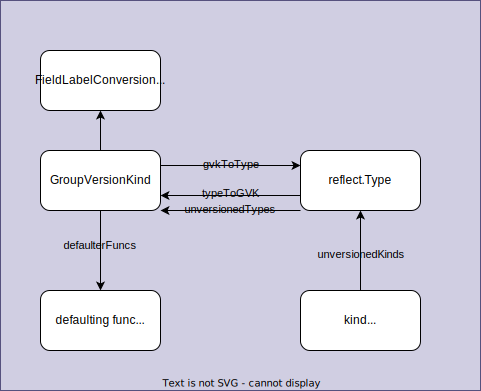

# [apimachinery](https://pkg.go.dev/k8s.io/apimachinery)

Scheme, typing, encoding, decoding, and conversion packages for Kubernetes and Kubernetes-like API objects.

This library is a shared dependency for servers and clients to work with Kubernetes API infrastructure without direct type dependencies. Its first consumers are k8s.io/kubernetes, k8s.io/client-go, and k8s.io/apiserver.

Packages:
1. api
1. apis
1. conversion
1. fields
1. labels
1. runtime
1. selection
1. test
1. types
1. util
1. version
1. watch

## [runtime](https://pkg.go.dev/k8s.io/apimachinery/pkg/runtime)

### Scheme

Scheme defines
1. methods for **serializing and deserializing API objects**,
1. a type registry for **converting group, version, and kind information to and from Go schemas**, and
1. **mappings between Go schemas of different versions**.

A scheme is the foundation for a versioned API and versioned configuration over time.



<details>

```go
type Scheme struct {
	// gvkToType allows one to figure out the go type of an object with
	// the given version and name.
	gvkToType map[schema.GroupVersionKind]reflect.Type

	// typeToGVK allows one to find metadata for a given go object.
	// The reflect.Type we index by should *not* be a pointer.
	typeToGVK map[reflect.Type][]schema.GroupVersionKind

	// unversionedTypes are transformed without conversion in ConvertToVersion.
	unversionedTypes map[reflect.Type]schema.GroupVersionKind

	// unversionedKinds are the names of kinds that can be created in the context of any group
	// or version
	// TODO: resolve the status of unversioned types.
	unversionedKinds map[string]reflect.Type

	// Map from version and resource to the corresponding func to convert
	// resource field labels in that version to internal version.
	fieldLabelConversionFuncs map[schema.GroupVersionKind]FieldLabelConversionFunc

	// defaulterFuncs is a map to funcs to be called with an object to provide defaulting
	// the provided object must be a pointer.
	defaulterFuncs map[reflect.Type]func(interface{})

	// converter stores all registered conversion functions. It also has
	// default converting behavior.
	converter *conversion.Converter

	// versionPriority is a map of groups to ordered lists of versions for those groups indicating the
	// default priorities of these versions as registered in the scheme
	versionPriority map[string][]string

	// observedVersions keeps track of the order we've seen versions during type registration
	observedVersions []schema.GroupVersion

	// schemeName is the name of this scheme.  If you don't specify a name, the stack of the NewScheme caller will be used.
	// This is useful for error reporting to indicate the origin of the scheme.
	schemeName string
}
```


Methods:
1. Converter
1. AddUnversionedTypes: add
1. AddKnownTypes: add
1. AddKnownTypeWithName: add
1. KnownTypes:
1. VersionsForGroupKind: `GroupKind` -> `[]schema.GroupVersion{}`
1. AllKnownTypes: -> `gvkToType`
1. ObjectKinds: Object -> `GroupVersionKind`
1. Recognizes: GroupVersionKind -> bool
1. IsUnversioned: Object -> bool
1. New: GroupVersionKind -> Object
1. AddIgnoredConversionType
1. AddConversionFunc
1. AddGeneratedConversionFunc
1. AddFieldLabelConversionFunc
1. AddTypeDefaultingFunc
1. Default
1. Convert: convert `in` into `out`
1. ConvertFieldLabel
...

</details>

#### Usage

In an API types definition, there's `register.go`.

```go
SchemeBuilder      = runtime.NewSchemeBuilder(addKnownTypes)
localSchemeBuilder = &SchemeBuilder
AddToScheme        = localSchemeBuilder.AddToScheme
```

<details><summary>Example: register.go</summary>

[apps/v1/register.go](https://github.com/kubernetes/api/blob/v0.24.3/apps/v1/register.go)

```go
// GroupName is the group name use in this package
const GroupName = "apps"

// SchemeGroupVersion is group version used to register these objects
var SchemeGroupVersion = schema.GroupVersion{Group: GroupName, Version: "v1"}

// Resource takes an unqualified resource and returns a Group qualified GroupResource
func Resource(resource string) schema.GroupResource {
	return SchemeGroupVersion.WithResource(resource).GroupResource()
}

var (
	// TODO: move SchemeBuilder with zz_generated.deepcopy.go to k8s.io/api.
	// localSchemeBuilder and AddToScheme will stay in k8s.io/kubernetes.
	SchemeBuilder      = runtime.NewSchemeBuilder(addKnownTypes)
	localSchemeBuilder = &SchemeBuilder
	AddToScheme        = localSchemeBuilder.AddToScheme
)

// Adds the list of known types to the given scheme.
func addKnownTypes(scheme *runtime.Scheme) error {
	scheme.AddKnownTypes(SchemeGroupVersion,
		&Deployment{},
		&DeploymentList{},
		&StatefulSet{},
		&StatefulSetList{},
		&DaemonSet{},
		&DaemonSetList{},
		&ReplicaSet{},
		&ReplicaSetList{},
		&ControllerRevision{},
		&ControllerRevisionList{},
	)
	metav1.AddToGroupVersion(scheme, SchemeGroupVersion)
	return nil
}
```

</details>

**What exactly does it mean?**

1. `SchemeBuilder` type is just a container to store functions that are applied to Scheme.

    ```go
    type SchemeBuilder []func(*Scheme) error
    ```
1. With `NewSchemeBuilder`, initialize a `SchemeBuilder` with the given functions via the arguments.
1. `SchemeBuilder.AddToScheme(s *Scheme)` is a function to apply all the stored functions to the given Scheme and return error if any of the stored functions fails to apply.

**Where is `AddToScheme` used?**

`AddToScheme` is used in `scheme` package of clientset.

[kubernetes/scheme/register.go](https://github.com/kubernetes/client-go/blob/master/kubernetes/scheme/register.go) registers all the built-in API groups.

```go
var Scheme = runtime.NewScheme()
var Codecs = serializer.NewCodecFactory(Scheme)
var ParameterCodec = runtime.NewParameterCodec(Scheme)
var localSchemeBuilder = runtime.SchemeBuilder{
	admissionregistrationv1.AddToScheme,
	admissionregistrationv1beta1.AddToScheme,
	internalv1alpha1.AddToScheme,
    ...
}
var AddToScheme = localSchemeBuilder.AddToScheme

func init() {
	v1.AddToGroupVersion(Scheme, schema.GroupVersion{Version: "v1"})
	utilruntime.Must(AddToScheme(Scheme))
}
```

`init()` is executed prior to the `main()` function.

#### Example

```
tree
.
├── main.go
└── scheme
    └── register.go

1 directory, 2 files
```

```
go run main.go
```

<details>

```
scheme/register.go is called
main
GroupVersionKind[Group: Version:v1      Kind:Status], reflect.Type: v1.Status
GroupVersionKind[Group:apps     Version:v1      Kind:DaemonSetList], reflect.Type: v1.DaemonSetList
GroupVersionKind[Group:apps     Version:v1      Kind:ReplicaSetList], reflect.Type: v1.ReplicaSetList
GroupVersionKind[Group:apps     Version:v1      Kind:ListOptions], reflect.Type: v1.ListOptions
GroupVersionKind[Group:apps     Version:v1      Kind:DeleteOptions], reflect.Type: v1.DeleteOptions
GroupVersionKind[Group: Version:v1      Kind:GetOptions], reflect.Type: v1.GetOptions
GroupVersionKind[Group: Version:v1      Kind:APIGroup], reflect.Type: v1.APIGroup
GroupVersionKind[Group:apps     Version:v1      Kind:StatefulSetList], reflect.Type: v1.StatefulSetList
GroupVersionKind[Group:apps     Version:v1      Kind:ReplicaSet], reflect.Type: v1.ReplicaSet
GroupVersionKind[Group:apps     Version:v1      Kind:DaemonSet], reflect.Type: v1.DaemonSet
GroupVersionKind[Group:apps     Version:v1      Kind:ControllerRevision], reflect.Type: v1.ControllerRevision
GroupVersionKind[Group:apps     Version:v1      Kind:GetOptions], reflect.Type: v1.GetOptions
GroupVersionKind[Group: Version:__internal      Kind:WatchEvent], reflect.Type: v1.InternalEvent
GroupVersionKind[Group: Version:v1      Kind:CreateOptions], reflect.Type: v1.CreateOptions
GroupVersionKind[Group:apps     Version:__internal      Kind:WatchEvent], reflect.Type: v1.InternalEvent
GroupVersionKind[Group:apps     Version:v1      Kind:CreateOptions], reflect.Type: v1.CreateOptions
GroupVersionKind[Group:apps     Version:v1      Kind:StatefulSet], reflect.Type: v1.StatefulSet
GroupVersionKind[Group:apps     Version:v1      Kind:ControllerRevisionList], reflect.Type: v1.ControllerRevisionList
GroupVersionKind[Group:apps     Version:v1      Kind:WatchEvent], reflect.Type: v1.WatchEvent
GroupVersionKind[Group:apps     Version:v1      Kind:UpdateOptions], reflect.Type: v1.UpdateOptions
GroupVersionKind[Group: Version:v1      Kind:DeleteOptions], reflect.Type: v1.DeleteOptions
GroupVersionKind[Group: Version:v1      Kind:UpdateOptions], reflect.Type: v1.UpdateOptions
GroupVersionKind[Group: Version:v1      Kind:APIVersions], reflect.Type: v1.APIVersions
GroupVersionKind[Group:apps     Version:v1      Kind:DeploymentList], reflect.Type: v1.DeploymentList
GroupVersionKind[Group: Version:v1      Kind:APIGroupList], reflect.Type: v1.APIGroupList
GroupVersionKind[Group:apps     Version:v1      Kind:Deployment], reflect.Type: v1.Deployment
GroupVersionKind[Group:apps     Version:v1      Kind:PatchOptions], reflect.Type: v1.PatchOptions
GroupVersionKind[Group: Version:v1      Kind:WatchEvent], reflect.Type: v1.WatchEvent
GroupVersionKind[Group: Version:v1      Kind:ListOptions], reflect.Type: v1.ListOptions
GroupVersionKind[Group: Version:v1      Kind:PatchOptions], reflect.Type: v1.PatchOptions
GroupVersionKind[Group: Version:v1      Kind:APIResourceList], reflect.Type: v1.APIResourceList
Those scheme are set in scheme/register.go
```

</details>
