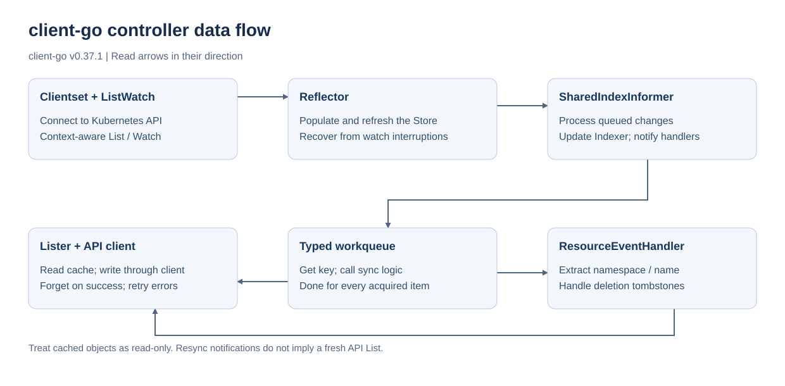

# client-go

Kubernetes の Go client ライブラリ。この教材は [go.mod](../../../go.mod) の **v0.37.1** を対象にする。

## Components

1. [clientset](clientset): 組み込みリソースへの型付き API client
1. [listerwatcher](listerwatcher): List の状態を起点に Watch で変更を受け取る
1. [reflector](reflector): リソースの変更を継続的に取得して Store に反映する
1. [deltafifo](deltafifo): 同じキーの変更をまとめて渡すキュー
1. [indexer](indexer): index を持つメモリ上の Store
1. [informer](informer): Reflector、Store、イベント通知をまとめる
1. [lister](lister): Informer の Indexer から型付きオブジェクトを読む
1. [workqueue](workqueue): Controller が処理するキーと再試行を管理する

Informer のキャッシュを更新するキューと、Reconcile するキーを入れる workqueue は役割が異なる。キャッシュ由来のオブジェクトは共有されるため、変更前に `DeepCopy()` する。

## Run

コマンドはリポジトリルートで実行する。

```sh
go test ./contents/kubernetes-operator/client-go/...
go run ./contents/kubernetes-operator/client-go/indexer
go run ./contents/kubernetes-operator/client-go/lister
go run ./contents/kubernetes-operator/client-go/deltafifo
```

上記はクラスタ不要。clientset / listerwatcher / informer の例は有効な kubeconfig と対象リソースへの権限が必要。これらの例の接続先は `-kubeconfig /path/to/config` で指定でき、デフォルトは `~/.kube/config`。継続監視は Ctrl+C で停止する。

参照: [client-go v0.37.1](https://pkg.go.dev/k8s.io/client-go@v0.37.1)、[Kubernetes との互換性](https://github.com/kubernetes/client-go/tree/v0.37.1#compatibility-matrix)。

## 図



SVG には diagrams.net / draw.io の編集データを埋め込んでいる。再生成の定義は [generate_operator_diagrams.py](../../../scripts/generate_operator_diagrams.py) にあり、図を変更するときはこの定義を更新する。リポジトリルートで再生成・同期確認できる。

```sh
python3 scripts/generate_operator_diagrams.py
python3 scripts/generate_operator_diagrams.py --check
```
