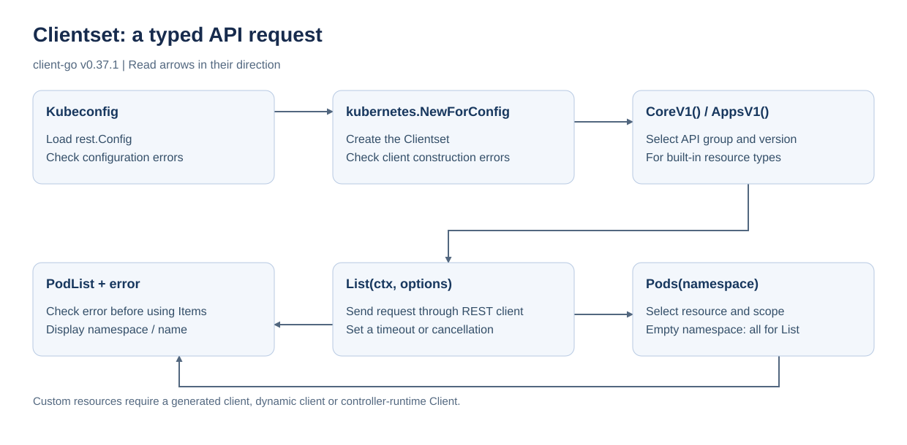
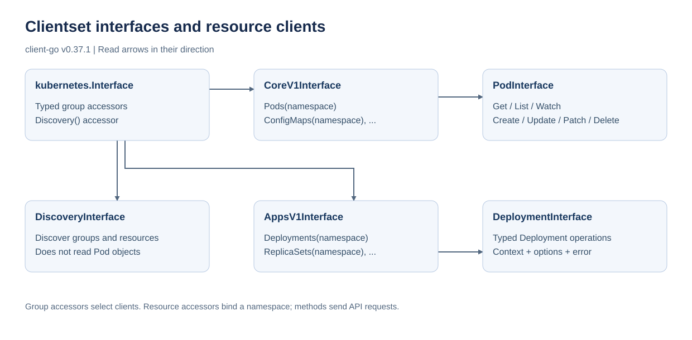

# clientset
## Overview



## Usage

```go
deployments, err := clientset.AppsV1().Deployments("namespace").List(ctx, metav1.ListOptions{})
```

1. `clientset` has set of clients as the name indicates.
1. Get a specific client with `AppsV1()` for a group version.
1. Get `deployment` with `Deployments()` which has operation methods (e.g. `Get`, `Update`, `Patch`, `List`)

## Example

List Pods with client-go v0.37.1. Run commands from the repository root. The default kubeconfig is `~/.kube/config`; override it with `-kubeconfig /path/to/config`. Permission to list Pods across namespaces is required:

1. Get config

    ```go
    config, err := clientcmd.BuildConfigFromFlags("", *kubeconfig)
    if err != nil {
        log.Fatal(err)
    }
    ```

1. Init clientset with config

    ```go
    // NewForConfig creates a new Clientset for the given config.
    clientset, err := kubernetes.NewForConfig(config)
    if err != nil {
        log.Fatal(err)
    }
    ```

    Internally, call `xxxx.NewForConfigAndClient` to get a client for each group version.

1. Use the clientset to list Pods
    ```go
    ctx, cancel := context.WithTimeout(context.Background(), 30*time.Second)
    defer cancel()
    pods, err := clientset.CoreV1().Pods(metav1.NamespaceAll).List(ctx, metav1.ListOptions{})
    if err != nil {
        log.Fatal(err)
    }
    ```

```
go run ./contents/kubernetes-operator/client-go/clientset
[Pod 0] kube-system/coredns-f9fd979d6-5n4pw
[Pod 1] kube-system/coredns-f9fd979d6-cp5pl
[Pod 2] kube-system/etcd-docker-desktop
[Pod 3] kube-system/kube-apiserver-docker-desktop
[Pod 4] kube-system/kube-controller-manager-docker-desktop
[Pod 5] kube-system/kube-proxy-8qp9g
[Pod 6] kube-system/kube-scheduler-docker-desktop
[Pod 7] kube-system/storage-provisioner
[Pod 8] kube-system/vpnkit-controller
```

The printed namespace/name depends on your cluster. Installing a CRD does not add it to this Clientset: use generated clients, the dynamic client, or controller-runtime's Client for custom resources.

## Appendix


