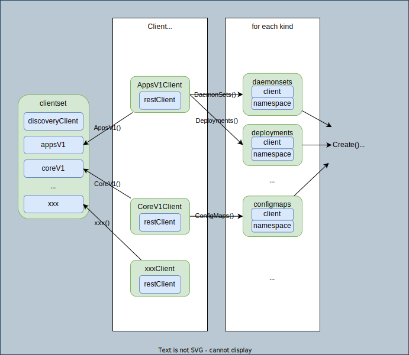
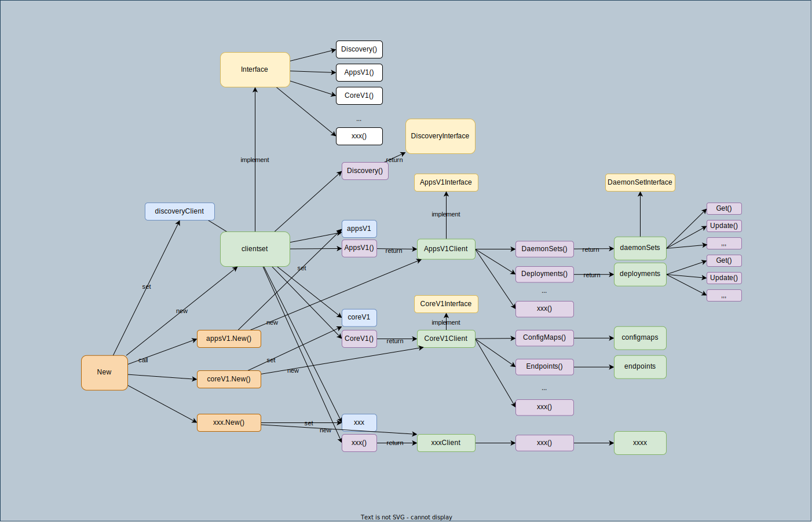

# clientset
## Overview




<details>



</details>

## Usage

```go
clientset.AppsV1().Deployments("namespace").List()
```

1. `clientset` has set of clients as the name indicates.
1. Get a specific client with `AppsV1()` for a group version.
1. Get `deployment` with `Deployments()` which has operation methods (e.g. `Get`, `Update`, `Patch`, `List`)

## Example

List Pods with client-go:

1. Get config

    ```go
    config, _ := clientcmd.BuildConfigFromFlags("", *kubeconfig)
    ```

1. Init clientset with config

    ```go
    // NewForConfig creates a new Clientset for the given config.
    clientset, _ := kubernetes.NewForConfig(config)
    ```

    Internally, call `xxxx.NewForConfigAndClient` to get a client for each group version.

1. Use the clientset to list Pods
    ```go
    pods, _ := clientset.CoreV1().Pods("").List(context.Background(), metav1.ListOptions{})
    ```

```
go run podlist.go
[Pod Name 0]coredns-f9fd979d6-5n4pw
[Pod Name 1]coredns-f9fd979d6-cp5pl
[Pod Name 2]etcd-docker-desktop
[Pod Name 3]kube-apiserver-docker-desktop
[Pod Name 4]kube-controller-manager-docker-desktop
[Pod Name 5]kube-proxy-8qp9g
[Pod Name 6]kube-scheduler-docker-desktop
[Pod Name 7]storage-provisioner
[Pod Name 8]vpnkit-controller
```
