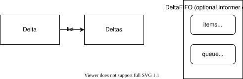

# DeltaFIFO

DeltaFIFO は同じオブジェクトのキーに対する変更を `Deltas`（`[]Delta`）にまとめる producer / consumer キュー。`Delta` は変更種別とオブジェクトを持つ。

- `Add` / `Update` / `Delete` は変更を蓄積する。
- `Replace` / `Resync` は初期状態の置き換えや既知のオブジェクトの再処理に使う。
- `Pop` は一つのキーに蓄積した Deltas を callback に渡す。
- 空のキューの `Pop` は待機する。`Close` で待機を解除する。

現在の callback は初期 List 由来かを示す引数も受け取る。

```go
func process(obj interface{}, isInInitialList bool) error {
    deltas, ok := obj.(cache.Deltas)
    if !ok {
        return errors.New("object is not Deltas")
    }
    return processDeltas(deltas)
}
```

## Run

```sh
go run ./contents/kubernetes-operator/client-go/deltafifo
```

クラスタは不要。[main.go](main.go) は同じ Pod に Add / Update / Delete を行い、一度の `Pop` で順に処理して終了する。出力は `OnUpdate or OnAdd` が二回、`OnDelete` が一回。

この例の `processDeltas` はログだけ出す。実際の Informer の処理は Indexer を更新し、Handler に通知する。`KnownObjects` に Indexer を渡すだけで自動的に更新されるわけではない。Informer が内部で選ぶキュー実装はバージョン・設定に依存する。

参照: [DeltaFIFO API](https://pkg.go.dev/k8s.io/client-go@v0.37.1/tools/cache#DeltaFIFO)、[PopProcessFunc](https://pkg.go.dev/k8s.io/client-go@v0.37.1/tools/cache#PopProcessFunc)、[Informer](../informer)。

## 図


