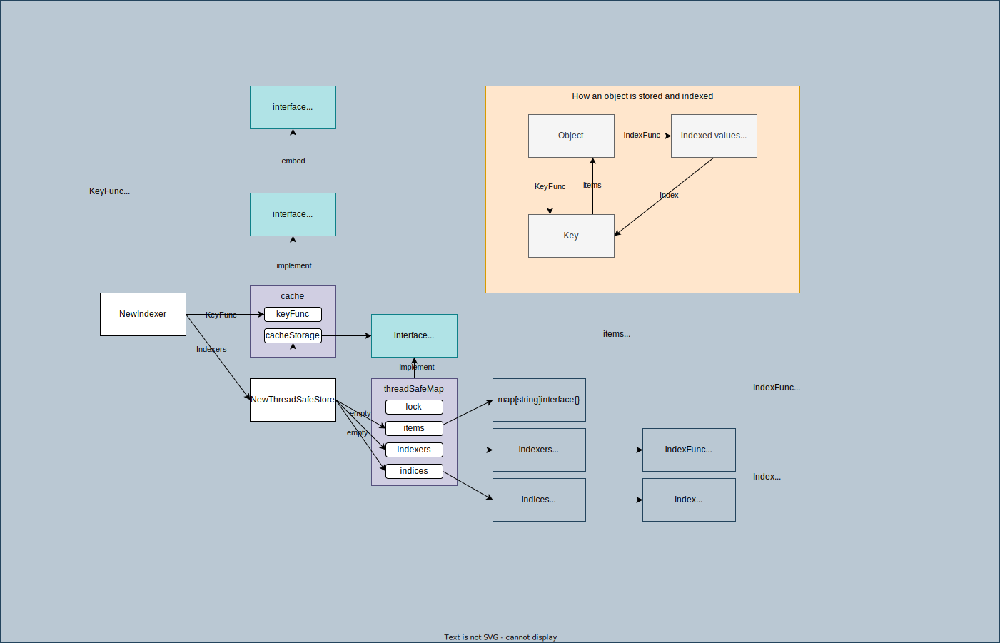

# [Indexer](https://pkg.go.dev/k8s.io/client-go/tools/cache#Indexer)

## Overview



The `Indexer` interface:

```go
type Indexer interface {
	Store
	Index(indexName string, obj interface{}) ([]interface{}, error)
	IndexKeys(indexName, indexedValue string) ([]string, error)
	ListIndexFuncValues(indexName string) []string
	ByIndex(indexName, indexedValue string) ([]interface{}, error)
	GetIndexers() Indexers
	AddIndexers(newIndexers Indexers) error
}
```

Indexer extends `Store` with multiple indices.

The `Store` interface:

```go
type Store interface {
	Add(obj interface{}) error
	Update(obj interface{}) error
	Delete(obj interface{}) error
	List() []interface{}
	ListKeys() []string
	Get(obj interface{}) (item interface{}, exists bool, err error)
	GetByKey(key string) (item interface{}, exists bool, err error)
	Replace([]interface{}, string) error
	Resync() error
}
```

Implementation:

```go
type cache struct {
	// cacheStorage bears the burden of thread safety for the cache
	cacheStorage ThreadSafeStore
	// keyFunc is used to make the key for objects stored in and retrieved from items, and
	// should be deterministic.
	keyFunc KeyFunc
}
```

[ThreadSafeStore](https://pkg.go.dev/k8s.io/client-go@v0.24.3/tools/cache#ThreadSafeStore)

```go
type ThreadSafeStore interface {
	Add(key string, obj interface{})
	Update(key string, obj interface{})
	Delete(key string)
	Get(key string) (item interface{}, exists bool)
	List() []interface{}
	ListKeys() []string
	Replace(map[string]interface{}, string)
	Index(indexName string, obj interface{}) ([]interface{}, error)
	IndexKeys(indexName, indexKey string) ([]string, error)
	ListIndexFuncValues(name string) []string
	ByIndex(indexName, indexKey string) ([]interface{}, error)
	GetIndexers() Indexers
	AddIndexers(newIndexers Indexers) error
	Resync() error
}
```

Implementation
```go
type threadSafeMap struct {
	lock  sync.RWMutex
	items map[string]interface{}
	indexers Indexers // indexers maps a name to an IndexFunc
	indices Indices // indices maps a name to an Index
}
```

NewIndexer:

```go
func NewIndexer(keyFunc KeyFunc, indexers Indexers) Indexer {
	return &cache{
		cacheStorage: NewThreadSafeStore(indexers, Indices{}),
		keyFunc:      keyFunc,
	}
}
```

## Usage

1. Create a indexer with `KeyFunc` and `Indexers`.

    ```go
	indexer := cache.NewIndexer(
		cache.MetaNamespaceKeyFunc, // Use <namespace>/<name> as a key if <namespace> exists, otherwise <name>
		cache.Indexers{cache.NamespaceIndex: cache.MetaNamespaceIndexFunc}, // default index function that indexes based on an object's namespace
	)
    ```

    Arguments:
    1. `KeyFunc`: KeyFunc knows how to make **a key from an object**.

        ```go
        type KeyFunc func(obj interface{}) (string, error)
        ```

        Example KeyFunc: [cache.MetaNamespaceKeyFunc](https://pkg.go.dev/k8s.io/client-go/tools/cache#MetaNamespaceKeyFunc) (e.g. object: Deployment with name `test` in `default` namespace -> key: `default/test`)

    1. `Indexers`: Indexers maps a name to an IndexFunc.

        We can have multiple indexes in a store (indexer). e.g. index by namespace, index by label, etc.

        ```go
        type Indexers map[string]IndexFunc
        ```

    Dependencies:
    1. `IndexFunc`: IndexFunc knows how to compute **the set of indexed values for an object**. This function determines which value to use for indexing.

        ```go
        type IndexFunc func(obj interface{}) ([]string, error)
        ```

        Example: [cache.MetaNamespaceIndexFunc](https://pkg.go.dev/k8s.io/client-go/tools/cache#MetaNamespaceIndexFunc) (e.g. object: Deployment with name `test` in `default` namespace -> set of indexed values: `[]string{"default"}`)

1. Set an object to the indexer.

    Indexer store the object with indexes based on the configured IndexFunc for each indexer.

    ```go
    err := indexer.Add(&appsv1.Deployment{...})
    ```

1. Get objects from the indexer.

    ```go
    // List indexer
	objs := indexer.List()
	fmt.Printf("indexer.List got %d objects\n", len(objs))
    ```

    ```go
	// Get object by key
	obj, exists, err := indexer.GetByKey("default/test")
    ```
