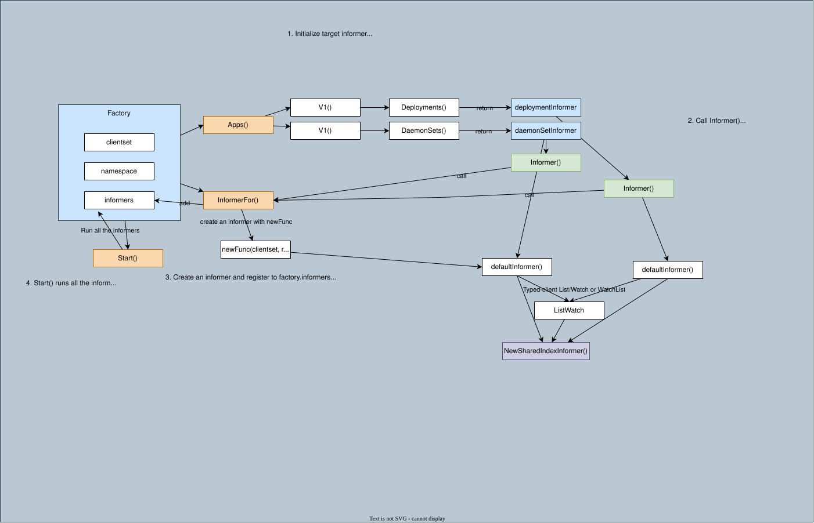
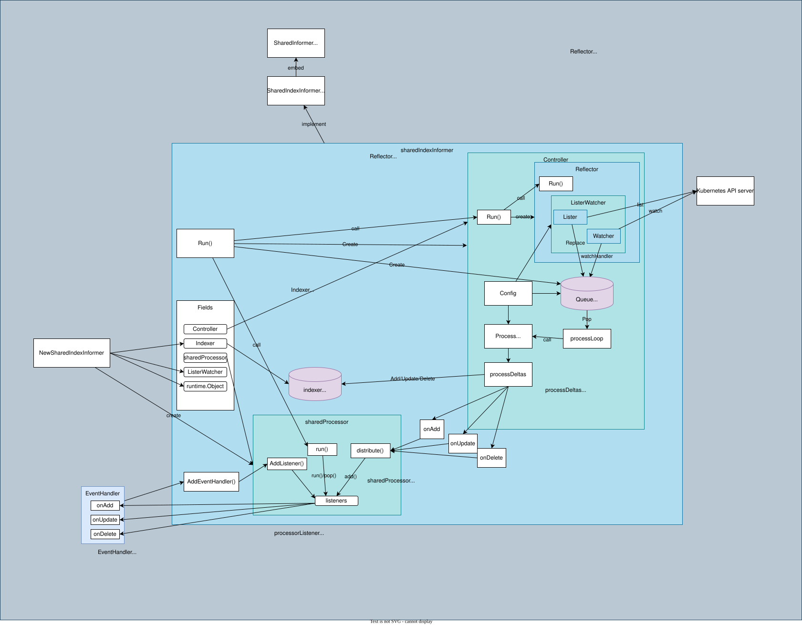

# Informer

Informer はリソースを監視し、ローカルの Indexer を更新してイベントを Handler に配信する。SharedInformerFactory を使うと同じ型の Informer を共有できる。

## Lifecycle

```go
factory := informers.NewSharedInformerFactory(clientset, 30*time.Second)
pods := factory.Core().V1().Pods()
_, err := pods.Informer().AddEventHandler(cache.ResourceEventHandlerFuncs{
    AddFunc: handleAdd, UpdateFunc: handleUpdate, DeleteFunc: handleDelete,
})
```

`pods.Informer()` で実体を作成して Factory に登録する。`AddEventHandler` は登録ハンドルとエラーを返す。エラーを確認してから開始する。

```go
factory.Start(ctx.Done())
if !cache.WaitForCacheSync(ctx.Done(), pods.Informer().HasSynced) {
    return
}
```

context のキャンセルで停止し、`factory.Shutdown()` で goroutine の終了を待つ。同期前に Lister を使うと初期データが揃っていない場合がある。Informer の `HasSynced` は個々の Handler がすべての通知を処理済みであることまでは保証しない。必要なら登録ハンドルの `HasSynced` を使う。

## キャッシュと通知

- Reflector が API を監視し、キュー経由で Indexer に変更が反映される。
- イベント Handler と Lister が受け取るオブジェクトは read-only。変更する場合は `DeepCopy()` する。
- Delete の通知はオブジェクトそのものではなく `DeletedFinalStateUnknown`（tombstone）の場合がある。キーの取得には `DeletionHandlingMetaNamespaceKeyFunc` を使う。
- 30 秒の resync はキャッシュ中のオブジェクトの Update 通知を再配信するための設定。30 秒ごとに API 全体を再 List する意味ではない。
- Handler 内では重い処理を避け、[workqueue](../workqueue) にキーを送って別ワーカーで処理する。

## Run

全 namespace の Pod を list/watch できる kubeconfig を用意する。

```sh
go run ./contents/kubernetes-operator/client-go/informer
```

別ターミナル:

```sh
kubectl run nginx --image=nginx -n default
kubectl annotate pod nginx example=value -n default
kubectl delete pod nginx -n default
```

Add / Update / Delete が namespace/name とともに出力される。サンプルの `handleAdd` が変更するのはコピーだけで、API や共有キャッシュのラベルは変わらない。以前の例のような mutation detector の panic は期待しない。

```sh
KUBE_CACHE_MUTATION_DETECTOR=true go run ./contents/kubernetes-operator/client-go/informer
```

Ctrl+C で停止する。

参照: [informer.go](informer.go)、[SharedInformer API](https://pkg.go.dev/k8s.io/client-go@v0.37.1/tools/cache#SharedInformer)、[Factory](https://github.com/kubernetes/client-go/blob/v0.37.1/informers/factory.go)、[内部実装](https://github.com/kubernetes/client-go/blob/v0.37.1/tools/cache/shared_informer.go)。図は v0.37.1 の処理の流れを示す。内部フィールドの詳細はリンク先を確認する。

## 図




