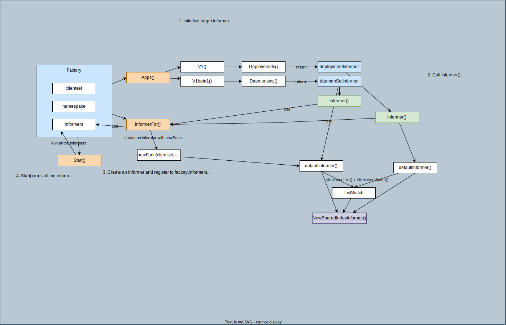

# informer

## Overview

### Factory & Informers


### Single Informer


***Informer*** monitors the changes of target resource. An informer is created for each of the target resources if you need to handle multiple resources (e.g. podInformer, deploymentInformer).

## types

### Interface [SharedInformerFactory](https://github.com/kubernetes/client-go/blob/v0.25.0/informers/factory.go#L187)

```go
type SharedInformerFactory interface {
	internalinterfaces.SharedInformerFactory
	ForResource(resource schema.GroupVersionResource) (GenericInformer, error)
	WaitForCacheSync(stopCh <-chan struct{}) map[reflect.Type]bool

	Admissionregistration() admissionregistration.Interface
	Internal() apiserverinternal.Interface
	Apps() apps.Interface
	Autoscaling() autoscaling.Interface
	Batch() batch.Interface
	Certificates() certificates.Interface
	Coordination() coordination.Interface
	Core() core.Interface
	Discovery() discovery.Interface
	Events() events.Interface
	Extensions() extensions.Interface
	Flowcontrol() flowcontrol.Interface
	Networking() networking.Interface
	Node() node.Interface
	Policy() policy.Interface
	Rbac() rbac.Interface
	Scheduling() scheduling.Interface
	Storage() storage.Interface
}
```

### Implementation [sharedInformerFactory](https://github.com/kubernetes/client-go/blob/v0.25.0/informers/factory.go#L55)


```go
type sharedInformerFactory struct {
	client           kubernetes.Interface
	namespace        string
	tweakListOptions internalinterfaces.TweakListOptionsFunc
	lock             sync.Mutex
	defaultResync    time.Duration
	customResync     map[reflect.Type]time.Duration

	informers map[reflect.Type]cache.SharedIndexInformer
	// startedInformers is used for tracking which informers have been started.
	// This allows Start() to be called multiple times safely.
	startedInformers map[reflect.Type]bool
}
```

Fields:
1. `client`: clientset to interact with API server
1. `namespace`: you can specify a namespace or all namespaces ([v1.NamespaceAll](https://github.com/kubernetes/client-go/blob/v0.25.0/informers/factory.go#L112)) by default
1. `informers`: store created informers to start them when `factory.Start` is called.

Methods: Get group's interface (e.g. `Apps()`) which returns version interface, and eventually you can get the corresponding informer.

How a new informer is created with a Factory:
1. Create a factory.
    ```go
    kubeInformerFactory := kubeinformers.NewSharedInformerFactory(kubeClient, time.Second*30)
    ```
1. Create a new informer for a target resource. (e.g. `Deployment`)
    ```go
    deploymentInformer := kubeInformerFactory.Apps().V1().Deployments()
    ```

    1. [kubeInformerFactory.Apps()](https://github.com/kubernetes/client-go/blob/v0.25.1/informers/factory.go#L220) returns `apps.New(f, f.namespace, f.tweakListOptions)`
        1. [apps.New(f, f.namespace, f.tweakListOptions)](https://github.com/kubernetes/client-go/blob/v0.25.0/informers/apps/interface.go#L45) returns `&group{factory: f, namespace: namespace, tweakListOptions: tweakListOptions}`
        1. `kubeInformerFactory.Apps()` is `&group`.
    1. `kubeInformerFactory.Apps().V1()` is `group.V1()` and [group.V1()](https://github.com/kubernetes/client-go/blob/v0.25.0/informers/apps/interface.go#L50) returns `v1.New(g.factory, g.namespace, g.tweakListOptions)`
        1. [v1.New](https://github.com/kubernetes/client-go/blob/v0.25.0/informers/apps/v1/interface.go#L46) returns `&version{factory: f, namespace: namespace, tweakListOptions: tweakListOptions}`
        1. `kubeInformerFactory.Apps().V1()` is `&version`.
    1. `kubeInformerFactory.Apps().V1().Deployments()` is `&version` and [version.Deployments()](https://github.com/kubernetes/client-go/blob/v0.25.0/informers/apps/v1/interface.go#L61) returns `&deploymentInformer{factory: v.factory, namespace: v.namespace, tweakListOptions: v.tweakListOptions}`.
        1. [deploymentInformer](https://github.com/kubernetes/client-go/blob/v0.25.0/informers/apps/v1/deployment.go#L42)

    Note that there's nothing happening but just creating `deploymentInformer` at this moment.
1. Pass the informer to a controller.
    Example:
    ```go
    NewController(
        deploymentInformer,
        ...
    )
    ```

    1. Inside the controller, call `deploymentInformer.Informer().AddEventHandler(..)` e.g. [sample-controller/blob/v0.0.6/controller.go#L102](https://github.com/nakamasato/sample-controller/blob/v0.0.6/controller.go#L102)
    1. [deploymentInformer.Informer()](https://github.com/kubernetes/client-go/blob/v0.25.0/informers/apps/v1/deployment.go#L84) returns `f.factory.InformerFor(&appsv1.Deployment{}, f.defaultInformer)`
    1. [factory.InformerFor](https://github.com/kubernetes/client-go/blob/v0.25.1/informers/factory.go#L164) create **a new informer** and **register** it to `factory.informers` <- **This is the moment the new informer is created!!**
        ```go
	    informer = newFunc(f.client, resyncPeriod)
	    f.informers[informerType] = informer
        ```
        `newFunc = defaultInformer` in this example. (`defaultInformer` is defined each informer)
        e.g. [deploymentInformer.defaultInformer](https://github.com/kubernetes/client-go/blob/v0.25.0/informers/apps/v1/deployment.go#L80)
        ```go
        func NewFilteredDeploymentInformer(client kubernetes.Interface, namespace string, resyncPeriod time.Duration, indexers cache.Indexers, tweakListOptions internalinterfaces.TweakListOptionsFunc) cache.SharedIndexInformer {
            return cache.NewSharedIndexInformer(
                &cache.ListWatch{
                    ListFunc: func(options metav1.ListOptions) (runtime.Object, error) {
                        if tweakListOptions != nil {
                            tweakListOptions(&options)
                        }
                        return client.AppsV1().Deployments(namespace).List(context.TODO(), options)
                    },
                    WatchFunc: func(options metav1.ListOptions) (watch.Interface, error) {
                        if tweakListOptions != nil {
                            tweakListOptions(&options)
                        }
                        return client.AppsV1().Deployments(namespace).Watch(context.TODO(), options)
                    },
                },
                &appsv1.Deployment{},
                resyncPeriod,
                indexers,
            )
        }
        ```

1. Start factory.
    ```go
    kubeInformerFactory.Start(stopCh)
    ```
    1. [factory.Start()](https://github.com/kubernetes/client-go/blob/v0.25.1/informers/factory.go#L128) run all the informers in the factory by `informer.Run(stopCh)`

1. [informer.Run](https://github.com/kubernetes/client-go/blob/v0.25.0/tools/cache/shared_informer.go#L397): you can reference below
### Interface SharedInformer

- Interface:
    SharedInformer
    ```go
    type SharedInformer interface {
        AddEventHandler(handler ResourceEventHandler)
        AddEventHandlerWithResyncPeriod(handler ResourceEventHandler, resyncPeriod time.Duration)
        GetStore() Store
        GetController() Controller
        Run(stopCh <-chan struct{})
        HasSynced() bool
        LastSyncResourceVersion() string
        SetWatchErrorHandler(handler WatchErrorHandler) error
        SetTransform(handler TransformFunc) error
    }
    ```
    SharedIndexInformer
    ```go
    type SharedIndexInformer interface {
        SharedInformer
        // AddIndexers add indexers to the informer before it starts.
        AddIndexers(indexers Indexers) error
        GetIndexer() Indexer
    }
    ```

### Implementation sharedIndexInformer
```go
type sharedIndexInformer struct {
    indexer    Indexer
    controller Controller
    processor             *sharedProcessor
    cacheMutationDetector MutationDetector
    listerWatcher ListerWatcher
    objectType runtime.Object
    resyncCheckPeriod time.Duration
    defaultEventHandlerResyncPeriod time.Duration
    clock clock.Clock
    started, stopped bool
    startedLock      sync.Mutex
    blockDeltas sync.Mutex
    watchErrorHandler WatchErrorHandler
    transform TransformFunc
}
```
Components:
- [Indexer](../indexer)
- controller: explained below
- sharedProcessor: explained below
- [LiserWatcher](../listerwatcher/)


[sharedIndexInformer.Run](https://github.com/kubernetes/client-go/blob/v0.25.0/tools/cache/shared_informer.go#L397-L444):
1. Create DeltaFifo by [NewDeltaFIFOWithOptions](https://github.com/kubernetes/client-go/blob/v0.25.0/tools/cache/delta_fifo.go#L218)
1. Create Controller with [New](https://github.com/kubernetes/client-go/blob/v0.25.0/tools/cache/controller.go#L117)
1. Run [s.cacheMutationDetector.Run](https://github.com/kubernetes/client-go/blob/v0.25.0/tools/cache/mutation_detector.go#L49)
1. Run `s.processor.run` <- start all listeners. listeners are added via `AddEventHandler`. (usually with `cache.ResourceEventHandlerFuncs{AddFunc: xx, UpdateFunc: xx, DeleteFunc: xx}`)
1. Run [s.controller.Run](https://github.com/kubernetes/client-go/blob/v0.25.0/tools/cache/controller.go#L128) <- refer the controller section
        1. Create a new Reflector and call [r.Run](https://github.com/kubernetes/client-go/blob/v0.25.0/tools/cache/reflector.go#L220) (ListAndWatch is called inside)

NewSharedInformer:
1. [NewSharedInformer](https://pkg.go.dev/k8s.io/client-go@v0.25.0/tools/cache#NewSharedInformer): call NewSharedIndexInformer with `Indexers{}`.
    ```go
    NewSharedIndexInformer(lw, exampleObject, defaultEventHandlerResyncPeriod, Indexers{})
    ```
1. [NewSharedIndexInformer](https://pkg.go.dev/k8s.io/client-go@v0.25.0/tools/cache#NewSharedIndexInformer)
    ```go
    func NewSharedIndexInformer(lw ListerWatcher, exampleObject runtime.Object, defaultEventHandlerResyncPeriod time.Duration, indexers Indexers) SharedIndexInformer {
        realClock := &clock.RealClock{}
        sharedIndexInformer := &sharedIndexInformer{
            processor:                       &sharedProcessor{clock: realClock},
            indexer:                         NewIndexer(DeletionHandlingMetaNamespaceKeyFunc, indexers),
            listerWatcher:                   lw,
            objectType:                      exampleObject,
            resyncCheckPeriod:               defaultEventHandlerResyncPeriod,
            defaultEventHandlerResyncPeriod: defaultEventHandlerResyncPeriod,
            cacheMutationDetector:           NewCacheMutationDetector(fmt.Sprintf("%T", exampleObject)),
            clock:                           realClock,
        }
        return sharedIndexInformer
    }
    ```

#### [sharedProcessor](https://github.com/kubernetes/client-go/blob/v0.25.0/tools/cache/shared_informer.go#L619)

Role: hold a collection of listeners and distribute a notification object to those listeners.

```go
type sharedProcessor struct {
    listenersStarted bool
    listenersLock    sync.RWMutex
    listeners        []*processorListener
    syncingListeners []*processorListener
    clock            clock.Clock
    wg               wait.Group
}
```

1. `Listeners` are added for ResourceEventHandler via AddEventHandler
1. `distribute()` calls `listener.add` to propagate new events to each listener. `distribute()` is called by `informer.OnAdd`, `informer.OnUpdate`,  and `informer.OnDelete`
1. `run()` calls `listener.run` and `listener.pop` for all listeners.
`handler.OnAdd`, `handler.OnUpdate`, `handler.OnDelete` based on the notification type.

#### [Controller](https://github.com/kubernetes/client-go/blob/v0.25.0/tools/cache/controller.go#L99)

Role: Run a reflector and enqueue item to Queue from ListerWatcher and process item from the queue with processfunc.

Interface:

```go
// Controller is a low-level controller that is parameterized by a
// Config and used in sharedIndexInformer.
type Controller interface {
    // Run does two things.  One is to construct and run a Reflector
    // to pump objects/notifications from the Config's ListerWatcher
    // to the Config's Queue and possibly invoke the occasional Resync
    // on that Queue.  The other is to repeatedly Pop from the Queue
    // and process with the Config's ProcessFunc.  Both of these
    // continue until `stopCh` is closed.
    Run(stopCh <-chan struct{})

    // HasSynced delegates to the Config's Queue
    HasSynced() bool

    // LastSyncResourceVersion delegates to the Reflector when there
    // is one, otherwise returns the empty string
    LastSyncResourceVersion() string
}
```

Implementation:
```go
type controller struct {
    config         Config
    reflector      *Reflector
    reflectorMutex sync.RWMutex
    clock          clock.Clock
}
```

1. Most things are passed by `Config` (ListerWatcher, ObjectType, Queue (FifoDeltaQueue))

[Run](https://github.com/kubernetes/client-go/blob/v0.25.0/tools/cache/controller.go#L128):
1. Create a Reflector with [NewReflector(lw ListerWatcher, expectedType interface{}, store Store, resyncPeriod time.Duration)](https://github.com/kubernetes/client-go/blob/v0.25.0/tools/cache/reflector.go#L168)
1. Run `reflector.Run` (details -> ref [reflector](../reflector))
    1. `ListAndWatch`
    1. `watchHandler`:
        1. event.Added -> store.Add
        1. event.Modified -> store.Update
        1. event.Deleted -> store.Delete (store = Queue)
1. Run [processLoop](https://github.com/kubernetes/client-go/blob/v0.25.0/tools/cache/controller.go#L182) every second.
    1. Pop item from the Queue and process it repeatedly. (Actual process is given by `Config.Process`, controller is just a container to execute `Process`)
        - `Config.Process`: [HandleDeltas](https://github.com/kubernetes/client-go/blob/master/tools/cache/shared_informer.go#L566)
        `HandleDeltas` calls [processDeltas(s, s.indexer, s.transform, deltas)](https://github.com/kubernetes/client-go/blob/v0.25.0/tools/cache/controller.go#L410)
            - `handler`: sharedIndexInformer
            - `clientState`: s.indexer
        - Keep indexer up-to-date by calling `indexer.Update()`, `indexer.Add()`, `indexer.Delete()`.
        - Distribute notification and add object to cacheMutationDetector by calling `sharedIndexInformer.OnUpdate()`, `sharedIndexInformer.OnAdd()`, `sharedIndexInformer.OnDelete()`

#### [MutationDetector](https://github.com/kubernetes/client-go/blob/v0.25.0/tools/cache/mutation_detector.go#L40)

Role: Check if a cached object is mutated. Call failurefunc or panic if mutated.

1. By default, mutation detector is **not enabled**. (You can skip this components)
    ```go
    var mutationDetectionEnabled = false

    func init() {
        mutationDetectionEnabled, _ = strconv.ParseBool(os.Getenv("KUBE_CACHE_MUTATION_DETECTOR"))
    }
    ```
1. Run periodically calls [CompareObjects](https://github.com/kubernetes/client-go/blob/v0.25.0/tools/cache/mutation_detector.go#L133).
1. CompareObjects compares `cached` and `copied` of `cacheObj` in `d.cachedObjs` and `d.retainedCachedObjs`.
    ```go
    type cacheObj struct {
        cached interface{}
        copied interface{}
    }
    ```
1. If any object is altered, call `failureFunc`. (if created with [NewCacheMutationDetector](https://github.com/kubernetes/client-go/blob/v0.25.0/tools/cache/mutation_detector.go#L49), it doesn't have failureFunc, the program goes `panic`)
1. [AddObject](https://github.com/kubernetes/client-go/blob/v0.25.0/tools/cache/mutation_detector.go#L120) adds an object to `d.addedObjs`.
1. Test: you can enable mutation detector and you'll get error `panic: cache *v1.Pod modified`.
    ```
    KUBE_CACHE_MUTATION_DETECTOR=true go run informer.go
    ```
## Example

1. Initialize clientset with `.kube/config`
1. Create an informer **factory** with the following line.
    ```go
    informerFactory := informers.NewSharedInformerFactory(kubeClient, time.Second*30)
    ```
    The second argument specifies ***ResyncPeriod***, which defines the interval of resync (*The resync operation consists of delivering to the handler an update notification for every object in the informer's local cache*). For more detail, please read [NewSharedInformer](https://pkg.go.dev/k8s.io/client-go@v0.25.0/tools/cache#NewSharedInformer)
1. Create an informer for Pods, which watches Pod's changes.
    ```go
    podInformer := informerFactory.Core().V1().Pods()
    ```

    factory -> group -> version -> kind

    ```go
    type PodInformer interface {
        Informer() cache.SharedIndexInformer
        Lister() v1.PodLister
    }
    ```

    1. `Informer()` returns `SharedIndexInformer`
        1. call `f.factory.InformerFor(&corev1.Pod{}, f.defaultInformer)`
        1. create new informer with [NewFilteredPodInformer](https://github.com/kubernetes/client-go/blob/v0.25.0/informers/core/v1/pod.go#L58) if not exist
        1. return the informer
    1. `Lister()` returns PodLister
        1. call `v1.NewPodLister(f.Informer().GetIndexer())`
        1. NewPodLister returns podLister with the given indexer.
            ```go
            type podLister struct {
                indexer cache.Indexer
            }
            ```

1. Add event handlers (`AddFunc`, `UpdateFunc`, and `DeleteFunc`) to the pod informer.
    ```go
    podInformer.Informer().AddEventHandler(
		cache.ResourceEventHandlerFuncs{
			AddFunc:    handleAdd,
			UpdateFunc: handleUpdate,
			DeleteFunc: handleDelete,
		},
	)
    ```

    `handleAdd`, `handleUpdate`, and `handleDelete` define custom logic for each event. In this example, just print `"handleXXX is called"`
1. Create a stop channel and start the factory.
    ```go
    ch := make(chan struct{}) // stop channel
	informerFactory.Start(ch)
    ```
1. Wait until the cache is synced.
    ```go
    cacheSynced := podInformer.Informer().HasSynced
	if ok := cache.WaitForCacheSync(ch, cacheSynced); !ok {
		log.Printf("cache is not synced")
	}
	log.Println("cache is synced")
    ```
1. Run `run` function every 10 seconds
    ```go
    go wait.Until(run, time.Second*10, ch)
	<-ch
    ```

## Run and check
1. Run
    ```
    go run informer.go
    ```

1. All Pods are synced in the cache.

    ```
    2021/12/21 09:05:08 handleAdd is called for Pod (key: local-path-storage/local-path-provisioner-547f784dff-lhwfk)
    2021/12/21 09:05:08 handleAdd is called for Pod (key: kube-system/kube-scheduler-kind-control-plane)
    2021/12/21 09:05:08 handleAdd is called for Pod (key: kube-system/etcd-kind-control-plane)
    2021/12/21 09:05:08 handleAdd is called for Pod (key: kube-system/kube-apiserver-kind-control-plane)
    2021/12/21 09:05:08 handleAdd is called for Pod (key: kube-system/kindnet-nzc7p)
    2021/12/21 09:05:08 handleAdd is called for Pod (key: kube-system/coredns-558bd4d5db-b4wjg)
    2021/12/21 09:05:08 handleAdd is called for Pod (key: kube-system/kube-controller-manager-kind-control-plane)
    2021/12/21 09:05:08 handleAdd is called for Pod (key: kube-system/kube-proxy-vrcbc)
    2021/12/21 09:05:08 handleAdd is called for Pod (key: kube-system/coredns-558bd4d5db-8q78s)
    2021/12/21 09:05:08 handleAdd is called for Pod (key: default/foo-sample-688594b488-782kw)
    2021/12/21 09:05:08 cache is synced
    2021/12/21 09:05:08 run
    ```
1. Create a `Pod` with name `nginx`.
    ```
    kubectl run nginx --image=nginx
    ```
1. Handlers are called by the events of the created `Pod`.
    ```
    2021/12/21 09:05:18 run
    2021/12/21 09:05:20 handleAdd is called for Pod (key: default/nginx)
    2021/12/21 09:05:20 handleUpdate is called for Pod (key: default/nginx)
    2021/12/21 09:05:20 handleUpdate is called for Pod (key: default/nginx)
    ```
1. Delete the `Pod`
    ```
    kubectl delete po nginx
    ```
1. Handlers are called by the events of the Pod deletion.
    ```
    2021/12/21 09:05:29 handleUpdate is called for Pod (key: default/nginx)
    2021/12/21 09:05:30 handleUpdate is called for Pod (key: default/nginx)
    2021/12/21 09:05:31 handleUpdate is called for Pod (key: default/nginx)
    2021/12/21 09:05:31 handleUpdate is called for Pod (key: default/nginx)
    2021/12/21 09:05:31 handlDelete is called for Pod (key: default/nginx)
    ```
1. `run` function is called every 10 seconds.
    ```
    2021/12/21 09:26:08 run
    2021/12/21 09:26:18 run
    2021/12/21 09:26:28 run
    ```
1. The cached is resynced every 30 seconds.

    ```
    2021/12/21 09:27:08 handleUpdate is called for Pod (key: local-path-storage/local-path-provisioner-547f784dff-lhwfk)
    2021/12/21 09:27:08 handleUpdate is called for Pod (key: kube-system/kube-apiserver-kind-control-plane)
    2021/12/21 09:27:08 handleUpdate is called for Pod (key: kube-system/coredns-558bd4d5db-b4wjg)
    2021/12/21 09:27:08 handleUpdate is called for Pod (key: kube-system/kube-controller-manager-kind-control-plane)
    2021/12/21 09:27:08 handleUpdate is called for Pod (key: kube-system/coredns-558bd4d5db-8q78s)
    2021/12/21 09:27:08 handleUpdate is called for Pod (key: default/foo-sample-688594b488-782kw)
    2021/12/21 09:27:08 handleUpdate is called for Pod (key: kube-system/kube-scheduler-kind-control-plane)
    2021/12/21 09:27:08 handleUpdate is called for Pod (key: kube-system/etcd-kind-control-plane)
    2021/12/21 09:27:08 handleUpdate is called for Pod (key: kube-system/kindnet-nzc7p)
    2021/12/21 09:27:08 handleUpdate is called for Pod (key: kube-system/kube-proxy-vrcbc)
    ```

# reference
- https://adevjoe.com/post/client-go-informer/
- https://www.huweihuang.com/kubernetes-notes/code-analysis/kube-controller-manager/sharedIndexInformer.html
- https://yangxikun.com/kubernetes/2020/03/05/informer-lister.html
