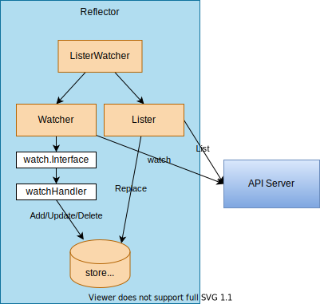

# [Reflector](https://github.com/kubernetes/client-go/blob/v0.25.0/tools/cache/reflector.go)

## Overview



***Reflector*** watches a specified resource and causes all changes to be reflected in the given store.

```go
// Reflector watches a specified resource and causes all changes to be reflected in the given store.
type Reflector struct {
	name string
	expectedTypeName string
	expectedType reflect.Type
	expectedGVK *schema.GroupVersionKind
	store Store
	listerWatcher ListerWatcher
	backoffManager wait.BackoffManager
	initConnBackoffManager wait.BackoffManager
	resyncPeriod time.Duration
	ShouldResync func() bool
	clock clock.Clock
	paginatedResult bool
	lastSyncResourceVersion string
	isLastSyncResourceVersionUnavailable bool
	lastSyncResourceVersionMutex sync.RWMutex
	WatchListPageSize int64
	watchErrorHandler WatchErrorHandler
}
```

1. `store`: DeltaFIFO can be used for store.
1. `reflector.ListAndWatch` function is called in `Run`. ([tools/cache/reflector.go#L223](https://github.com/kubernetes/client-go/blob/v0.25.0/tools/cache/reflector.go#L223))

	```go
	// Run repeatedly uses the reflector's ListAndWatch to fetch all the
	// objects and subsequent deltas.
	// Run will exit when stopCh is closed.
	func (r *Reflector) Run(stopCh <-chan struct{}) {
		klog.V(3).Infof("Starting reflector %s (%s) from %s", r.expectedTypeName, r.resyncPeriod, r.name)
		wait.BackoffUntil(func() {
			if err := r.ListAndWatch(stopCh); err != nil {
				r.watchErrorHandler(r, err)
			}
		}, r.backoffManager, true, stopCh)
		klog.V(3).Infof("Stopping reflector %s (%s) from %s", r.expectedTypeName, r.resyncPeriod, r.name)
	}
	```

	[wait.BackoffUntil](https://pkg.go.dev/k8s.io/apimachinery/pkg/util/wait#BackoffUntil): BackoffUntil loops until stop channel is closed, run f every duration given by BackoffManager. If sliding is true, the period is computed after f runs. If it is false then period includes the runtime for f.


1. `r.ListAndWatch` function calls
    1. Call `list` func ([reflector.go#357](https://github.com/kubernetes/client-go/blob/v0.25.0/tools/cache/reflector.go#L357))
		1. Get resourceVersion (*[v1.meta/ListMeta](https://kubernetes.io/docs/reference/generated/kubernetes-api/v1.25/#listmeta-v1-meta) - The metadata.resourceVersion of a resource collection (the response to a list) identifies the resource version at which the collection was constructed.) from [api concept](https://kubernetes.io/docs/reference/using-api/api-concepts/)*)
		1. Get all items and call [syncWith(items, resourceVersion)](https://github.com/kubernetes/client-go/blob/v0.25.0/tools/cache/reflector.go#L454)
		1. [syncWith](https://github.com/kubernetes/client-go/blob/v0.25.0/tools/cache/reflector.go#L464) replaces the store's items with the given items.
			```go
			r.store.Replace(found, resourceVersion)
			```
	1. In a for loop, call `r.store.Resync()` periodically if resync is necessary.
    1. In a for loop, call listerwatcher.Watch
		```go
		w, err := listerwatcher.Watch()
		```
    1. Call the **watchHandler**
		```go
		watchHandler(start, w, r.store, r.expectedType, r.expectedGVK, r.name, r.expectedTypeName, r.setLastSyncResourceVersion, r.clock, resyncerrc, stopCh)
		```
		-> `store.Add`, `store.Update`, `store.Delete`

## Usage
