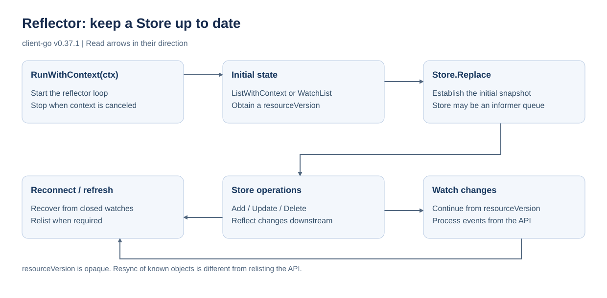

# [Reflector](https://github.com/kubernetes/client-go/blob/v0.37.1/tools/cache/reflector.go)

## Overview



***Reflector*** watches a specified resource and causes all changes to be reflected in the given store.

```go
type Reflector struct {
    logger klog.Logger
    name string
    typeDescription string
    expectedType reflect.Type
    expectedGVK *schema.GroupVersionKind
    store ReflectorStore
    listerWatcher ListerWatcherWithContext
    resyncPeriod time.Duration
    delayHandler wait.DelayFunc
    minWatchTimeout time.Duration
    maxWatchTimeout time.Duration
    clock clock.Clock
    paginatedResult bool
    lastSyncResourceVersion string
    isLastSyncResourceVersionUnavailable bool
    lastSyncResourceVersionMutex sync.RWMutex
    watchErrorHandler WatchErrorHandlerWithContext
    WatchListPageSize int64
    ShouldResync func() bool
    MaxInternalErrorRetryDuration time.Duration
    useWatchList bool
}
```

1. `store`: DeltaFIFO can be used for store.
1. `reflector.ListAndWatchWithContext` is called from `RunWithContext`. ([tools/cache/reflector.go#L223](https://github.com/kubernetes/client-go/blob/v0.37.1/tools/cache/reflector.go))

    ```go
    func (r *Reflector) RunWithContext(ctx context.Context) {
        logger := klog.FromContext(ctx)
        logger.V(3).Info("Starting reflector", "type", r.typeDescription, "resyncPeriod", r.resyncPeriod, "reflector", r.name)
        _ = r.delayHandler.Until(ctx, true, true, func(ctx context.Context) (bool, error) {
            if err := r.ListAndWatchWithContext(ctx); err != nil {
                r.watchErrorHandler(ctx, r, err)
            }
            return false, nil
        })
        logger.V(3).Info("Stopping reflector", "type", r.typeDescription, "resyncPeriod", r.resyncPeriod, "reflector", r.name)
    }
    ```

    The delay handler retries ListAndWatchWithContext until context cancellation, invoking the configured watch error handler on failures.


1. `r.ListAndWatchWithContext` chooses an initialization path. When WatchList is enabled and supported, `watchList` collects initial events into a temporary Store, waits for the initial-events-end bookmark, and replaces the destination Store. Otherwise, it falls back to the regular List path below. The returned watch can continue without reopening it.
1. The regular List + Watch path:
    1. Call `list` func ([reflector.go#357](https://github.com/kubernetes/client-go/blob/v0.37.1/tools/cache/reflector.go))
        1. Get resourceVersion (*[v1.meta/ListMeta](https://pkg.go.dev/k8s.io/apimachinery@v0.37.1/pkg/apis/meta/v1#ListMeta) - The metadata.resourceVersion of a resource collection (the response to a list) identifies the resource version at which the collection was constructed.) from [api concept](https://kubernetes.io/docs/reference/using-api/api-concepts/)*)
        1. Get all items and call [syncWith(items, resourceVersion)](https://github.com/kubernetes/client-go/blob/v0.37.1/tools/cache/reflector.go)
        1. [syncWith](https://github.com/kubernetes/client-go/blob/v0.37.1/tools/cache/reflector.go) replaces the store's items with the given items.
            ```go
            r.store.Replace(found, resourceVersion)
            ```
    1. In a for loop, call `r.store.Resync()` periodically if resync is necessary.
    1. In a for loop, call listerwatcher.Watch
        ```go
        w, err := r.listerWatcher.WatchWithContext(ctx, metav1.ListOptions{
            ResourceVersion: r.LastSyncResourceVersion(),
        })
        ```
    1. Call **handleWatch** / **handleAnyWatch**
        ```go
        // watch() handles reconnection; handleWatch processes the event stream.
        // Added / Modified / Deleted update the Store and its resourceVersion.
        // Bookmark events advance the version without changing an object.
        ```
        -> `store.Add`, `store.Update`, `store.Delete`

## Usage

A shared informer's low-level controller constructs its Reflector from `Config.ListerWatcher`, `ObjectType`, `Queue`, and resync settings, then runs the Reflector alongside its processing loop. This separates API transport/retry from applying changes and delivering notifications.

To inspect the mechanism without an informer, use an Indexer directly as the Store:

```go
store := cache.NewIndexer(cache.MetaNamespaceKeyFunc, cache.Indexers{})
lw := cache.NewListWatchFromClient(clientset.CoreV1().RESTClient(), "pods", "default", fields.Everything())
r := cache.NewReflector(lw, &corev1.Pod{}, store, 0)
go r.RunWithContext(ctx)
// store contains the observed objects; cancel ctx to stop the Reflector.
```

The standalone Reflector does not provide informer event handlers. Use a shared informer when you need handlers, a typed Lister, and cache synchronization. Treat resourceVersion as opaque. Resync reprocesses known objects; relisting refreshes them from the API. See the [ListerWatcher walkthrough](../listerwatcher) for request construction and [Informer internals](../informer) for the consumer side.
