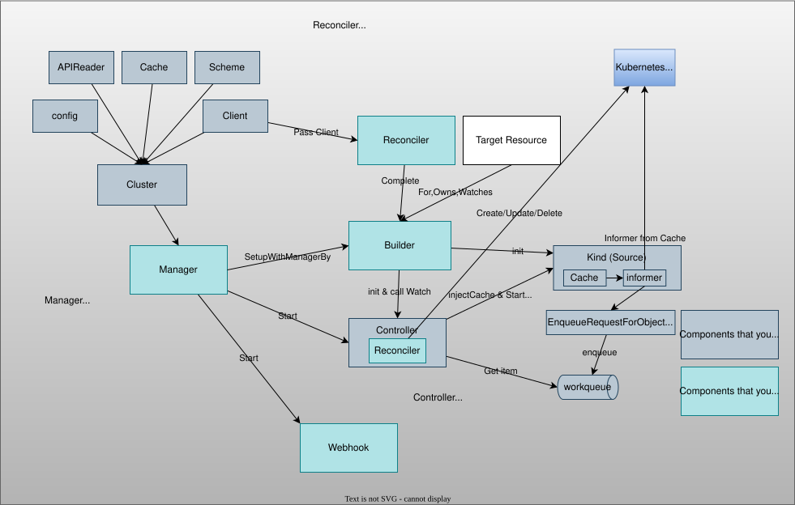

# [controller-runtime](https://pkg.go.dev/sigs.k8s.io/controller-runtime)

[controller-runtime](https://pkg.go.dev/sigs.k8s.io/controller-runtime) is a subproject of kubebuilder which provides a lot of useful tools that help develop Kubernetes Operator.

Version: [v0.25.1](https://pkg.go.dev/sigs.k8s.io/controller-runtime@v0.25.1), with client-go v0.37.1, as pinned in [go.mod](../../../go.mod).

## Overview



1. Create a **Manager**. Internally, [Cluster](cluster/) constructs the shared Cache, Client, Scheme, RESTMapper, and uncached APIReader.
1. Create **Reconcilers** with explicit dependencies such as `Client: mgr.GetClient()`; see [Reconciler](reconciler/).
1. Configure each controller with [Builder](builder/): For chooses the reconciled type, Owns maps child events to owners, and Watches supplies custom event mappings.
1. Builder.doController constructs a **Controller** and registers it with Manager.Add. Controllers require leadership by default; those opting out run in Others.
1. Builder.doWatch constructs **Kind sources** using Cache, handler, and predicates, then calls Controller.Watch to register them.
1. Start Manager. It starts HTTP servers, webhooks, caches, non-leader work, warmup work, and leader-gated controllers in the appropriate order.
1. Kind.Start obtains an informer from Cache and registers the handler. Controller waits for source synchronization before running workers.
1. Informer events pass predicates, handlers enqueue keys, and Controller workers call Reconcile. Reconcile reads current state through Client and writes desired changes to the API server.

The component pages and diagrams retain construction details, interfaces, usage examples, and call relationships for the pinned version.

For more details, you can check the [architecture in book.kubebuilder.io](https://book.kubebuilder.io/architecture.html):


List of components:

1. [Manager](https://pkg.go.dev/sigs.k8s.io/controller-runtime/pkg/manager): Package manager is required to create Controllers and provides shared dependencies such as clients, caches, schemes, etc.
1. [Controller](https://pkg.go.dev/sigs.k8s.io/controller-runtime/pkg/controller): Package controller provides types and functions for building Controllers. Managed controllers start through Manager.Start; unmanaged constructors require the caller to manage lifecycle.
    1. Event
    1. Builder
    1. Source
    1. Handler
    1. Predicate
1. [Client](https://pkg.go.dev/sigs.k8s.io/controller-runtime/pkg/client): Package client contains functionality for interacting with Kubernetes API servers.
    1. [cache-backed client](https://github.com/kubernetes-sigs/controller-runtime/blob/v0.25.1/pkg/client/client.go): Get/List use the configured cache unless bypassed; writes use the API server. This replaces the older delegatingClient implementation.

1. [Cache](https://pkg.go.dev/sigs.k8s.io/controller-runtime/pkg/cache)
    1. client.Reader: Cache acts as a client to objects stored in the cache.
    1. Informers: Cache loads informers and adds field indices.
1. [Scheme](https://pkg.go.dev/sigs.k8s.io/controller-runtime/pkg/scheme): Wraps apimachinery/Scheme.
1. [Webhook](https://pkg.go.dev/sigs.k8s.io/controller-runtime/pkg/webhook)
1. [Envtest](https://pkg.go.dev/sigs.k8s.io/controller-runtime/pkg/envtest)

## Components

1. [manager](manager)
1. [reconciler](reconciler)
1. [log](log)
1. [controller](controller)
1. [cluster](cluster)
    1. [client](client)
    1. [cache](cache)
1. [inject](inject)
1. [source](source)
1. [builder](builder)
1. [handler](handler)

## Examples

1. [example-controller](example-controller)
1. [envtest](https://pkg.go.dev/sigs.k8s.io/controller-runtime@v0.25.1/pkg/envtest): integration tests with a local API server and etcd; not configured by these examples.

## Validation

Run from the repository root:

```sh
go test ./contents/kubernetes-operator/...
golangci-lint run
```

CI runs the Go tests with coverage and golangci-lint when Go source, go.mod/go.sum, lint configuration, or the Go workflow changes. Packages marked `[no test files]` are compiled but have no dedicated behavioral tests. Regression tests cover informer object ownership/tombstones, ReplicaSet reconciliation, and webhook mutation. Cluster-dependent walkthroughs require a kubeconfig and the described RBAC/CRDs; unit tests do not validate live watch delivery or leader election.

## Memo

1. The default logger uses epoch timestamps unless configured otherwise.
1. Sources, handlers, and predicates receive their dependencies explicitly. For example, construct a `Kind` source with `source.Kind(cache, object, handler)`; no dependency injection is required.
1. Metrics and webhook servers use dedicated options and server interfaces. See [Manager](manager/) and [Webhook](webhook/) for the current configuration paths.
