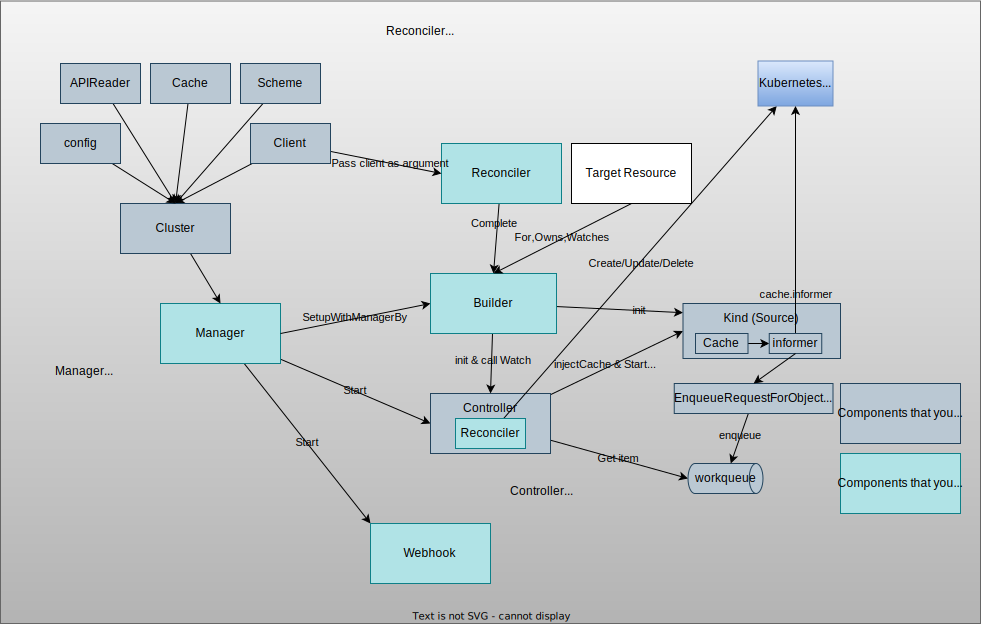

# [controller-runtime](https://pkg.go.dev/sigs.k8s.io/controller-runtime)

[controller-runtime](https://pkg.go.dev/sigs.k8s.io/controller-runtime) is a subproject of kubebuilder which provides a lot of useful tools that help develop Kubernetes Operator.

Version: [v0.13.0](https://pkg.go.dev/sigs.k8s.io/controller-runtime@v0.13.0)

## Overview

1. Create a **Manager**.
    1. **Cluster**, which has `Cache`, `Client`, `Scheme`, etc, is created internally. Read [cluster](cluster/README.md) for more details.
1. Create one or multiple **Reconciler**s. For more details, read [reconciler](reconciler/README.md).
1. Build the `Reconciler`(s) with the `Manager` using `Builder`.
    1. Internally, `builder.doWatch` and `builder.doController` are called.
    1. [bldr.doController](https://github.com/kubernetes-sigs/controller-runtime/blob/v0.13.0/pkg/builder/controller.go#L279) calls [newController](https://github.com/kubernetes-sigs/controller-runtime/blob/v0.13.0/pkg/controller/controller.go#L88) to create a new **Controller** and add it to `manager.runnables.Others` by `Manager.Add(Runnable)`. ([controller](controller/README.md#how-controller-is-used))
        1. Inject dependencies to Reconciler and Controller. e.g. Cache.
    1. [bldr.doWatch](https://github.com/kubernetes-sigs/controller-runtime/blob/v0.13.0/pkg/builder/controller.go#L220) creates [Kind (Source)](source/README.md#how-source-is-used) and call [controller.Watch](https://github.com/kubernetes-sigs/controller-runtime/blob/v0.13.0/pkg/internal/controller/controller.go#L125) for `For`, `Owns`, and `Watches`.
        1. [controller.Watch](https://github.com/kubernetes-sigs/controller-runtime/blob/v0.13.0/pkg/internal/controller/controller.go#L125) calls `source.Start()`, which gets informer from the injected cache and add the event handler.
1. Start the `Manager`, which trigger to start all the `mgr.runnables` (`Caches`, `Webhooks`, `Others`) in the `Manager`.
    1. `Informer.Run` is called in `cm.runnables.Caches.Start(cm.internalCtx)`

For more details, you can check the [architecture in book.kubebuilder.io](https://book.kubebuilder.io/architecture.html):

List of components:

1. [Manager](https://pkg.go.dev/sigs.k8s.io/controller-runtime/pkg/manager): Package manager is required to create Controllers and provides shared dependencies such as clients, caches, schemes, etc.
1. [Controller](https://pkg.go.dev/sigs.k8s.io/controller-runtime/pkg/controller): Package controller provides types and functions for building Controllers. The Controller **MUST** be started by calling Manager.Start.
    1. Event
    1. Builder
    1. Source
    1. Handler
    1. Predicate
1. [Client](https://pkg.go.dev/sigs.k8s.io/controller-runtime/pkg/client): Package client contains functionality for interacting with Kubernetes API servers.
    1. [delegatingClient](https://github.com/kubernetes-sigs/controller-runtime/blob/v0.13.0/pkg/client/split.go#L69): The default client type whose Get and List get object from [cache.CacheReader](https://github.com/kubernetes-sigs/controller-runtime/blob/v0.13.0/pkg/cache/internal/cache_reader.go#L40), which reduces the API requests to API server.
1. [Cache](https://pkg.go.dev/sigs.k8s.io/controller-runtime/pkg/cache)
    1. client.Reader: Cache acts as a client to objects stored in the cache.
    1. Informers: Cache loads informers and adds field indices.
1. [Scheme](https://pkg.go.dev/sigs.k8s.io/controller-runtime/pkg/scheme): Wraps apimachinery/Scheme.
1. [Webhook](https://pkg.go.dev/sigs.k8s.io/controller-runtime/pkg/webhook)
1. [Envtest](https://pkg.go.dev/sigs.k8s.io/controller-runtime/pkg/envtest)

## Components

1. [manager](manager)
1. [reconciler](reconciler)
1. [log](log)
1. [controller](controller)
1. [cluster](cluster)
    1. [client](client)
    1. [cache](cache)
1. [inject](inject)
1. [source](source)
1. [builder](builder)
1. [handler](handler)

## Examples
1. [example-controller](example-controller)
1. envtest

## Memo
- [v0.11.0](https://github.com/kubernetes-sigs/controller-runtime/releases/tag/v0.11.0): Allow Specification of the Log Timestamp Format. -> Default EpochTimeEncoder
