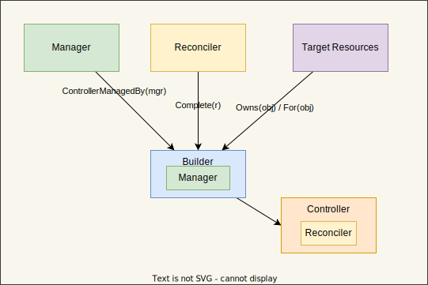
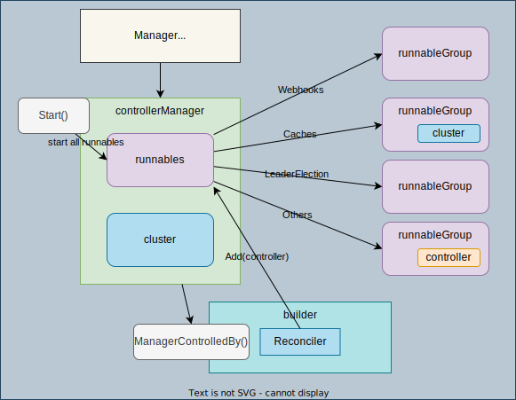
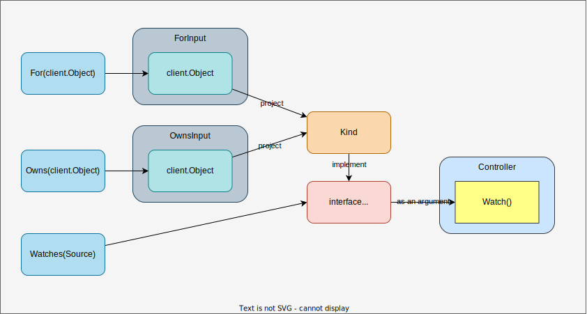
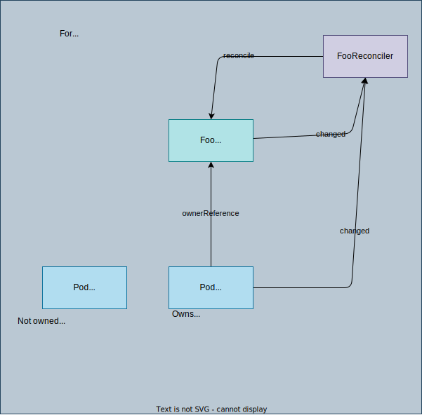

# builder

## Overview



The main role of Builder is:

1. Create a Controller from the given Reconciler
1. Configure target resources for the controller
1. Register the controller to the Manager

About how the registered controllers are triggered, you can study in [Manager](../manager/). The controller registered to the manager by Builder will be in **runnables.Others** in Manager object, which will be started by `Manager.Start()`.




## Types

### [Builder](https://github.com/kubernetes-sigs/controller-runtime/blob/v0.13.0/pkg/builder/controller.go#L54)

```go
// Builder builds a Controller.
type Builder struct {
	forInput         ForInput
	ownsInput        []OwnsInput
	watchesInput     []WatchesInput
	mgr              manager.Manager
	globalPredicates []predicate.Predicate
	ctrl             controller.Controller
	ctrlOptions      controller.Options
	name             string
}
```

## `ControllerManagedBy`: Initialize Builder with a Manager

Initialize a Builder with the specified manager.

```go
func ControllerManagedBy(m manager.Manager) *Builder {
 return &Builder{mgr: m}
}
```

## [For](https://github.com/kubernetes-sigs/controller-runtime/blob/v0.13.0/pkg/builder/controller.go#L82), [Owns](https://github.com/kubernetes-sigs/controller-runtime/blob/v0.13.0/pkg/builder/controller.go#L106), and [Watches](https://github.com/kubernetes-sigs/controller-runtime/blob/v0.13.0/pkg/builder/controller.go#L127): Define what object to watch



1. `For(object client.Object, opts ...ForOption) *Builder`: only one resource can be configured. Same as
    ```go
    Watches(&source.Kind{Type: apiType}, &handler.EnqueueRequestForObject{})
    ```
3. `Owns(object client.Object, opts ...OwnsOption) *Builder`: Owns defines types of Objects being *generated* by the ControllerManagedBy, and configures the ControllerManagedBy to respond to create / delete / update events by **reconciling the owner object**. Same as the following code:
    ```go
    Watches(object, handler.EnqueueRequestForOwner([...], ownerType, OnlyControllerOwner()))
    ```
    [EnqueueRequestForOwner](https://github.com/coderanger/controller-runtime/blob/1da1a4b89b30a7019d694b9485b594862867fe10/pkg/handler/enqueue_owner.go#L46): Extract owner object from ownerReferences and enqueue it to the queue.
3. `Watches(src source.Source, eventhandler handler.EventHandler, opts ...WatchesOption) *Builder`: Watches exposes the lower-level ControllerManagedBy Watches functions through the builder. Consider using Owns or For instead of Watches directly.


Example:

```go
err = builder.
  ControllerManagedBy(mgr).  // Create the ControllerManagedBy
  For(&alpha1v1.Foo{}). // Foo is the Application API
  Owns(&corev1.Pod{}).       // Foo owns Pods created by it
  Complete(&FooReconciler{})
```



## `Complete`: Receive reconciler and build a controller

Receive `reconcile.Reconciler` and call `Build`:

```go
// Complete builds the Application Controller.
func (blder *Builder) Complete(r reconcile.Reconciler) error {
	_, err := blder.Build(r)
	return err
}
```

## `Build`: Create a controller and return the controller.

```go
func (blder *Builder) Build(r reconcile.Reconciler) (controller.Controller, error) {
    ...
	// Set the ControllerManagedBy
	if err := blder.doController(r); err != nil {
		return nil, err
	}

	// Set the Watch
	if err := blder.doWatch(); err != nil {
		return nil, err
	}
    return blder.ctrl, nil
}
```

1. [bldr.doController](https://github.com/kubernetes-sigs/controller-runtime/blob/v0.13.0/pkg/builder/controller.go#L191) to register the controler to the buidler
    1. Create a new controller.
        ```go
        blder.ctrl, err = newController(controllerName, blder.mgr, ctrlOptions)
        ```
    1. the controller is added to `manager.runnables.Others` by `Manager.Add(Runnable)` in `newController`. ([controller](../controller/README.md#how-controller-is-used))
1. [bldr.doWatch](https://github.com/kubernetes-sigs/controller-runtime/blob/v0.13.0/pkg/builder/controller.go#L196) to start watching the target resources configured by `For`, `Owns`, and `Watches`.
    1. The actual implementation of `Watch` function is in the [controller](../controller)

## Convert `client.Object` to `Source`

1. [Controller.Watch](https://github.com/kubernetes-sigs/controller-runtime/blob/v0.13.0/pkg/controller/controller.go#L76) needs `Source` as the first argument.
    ```go
    Watch(src source.Source, eventhandler handler.EventHandler, predicates ...predicate.Predicate) error
    ```
1. `client.Object` is set in `ForInput`, `OwnsInput`, and `WatchesInput` for `For`, `Owns`, and `Watches` respectively.
1. Before calling `Controller.Watch`, the `client.Object` needs to be [project](https://github.com/kubernetes-sigs/controller-runtime/blob/v0.13.0/pkg/builder/controller.go#L203-L218)ed into [Source](https://github.com/kubernetes-sigs/controller-runtime/blob/v0.13.0/pkg/source/source.go#L57-L61) based on `objectProjection`:
    1. `projectAsNormal`: Use the object as it is. (**In most cases**)
    1. `projectAsMetadata`: Extract only metadata.

    ```go
	typeForSrc, err := blder.project(blder.forInput.object, blder.forInput.objectProjection)
	if err != nil {
		return err
	}
	src := &source.Kind{Type: typeForSrc}
    ```

    [Kind](https://github.com/kubernetes-sigs/controller-runtime/blob/v0.13.0/pkg/source/source.go#L91-L102) implements the [Source](https://github.com/kubernetes-sigs/controller-runtime/blob/v0.13.0/pkg/source/source.go#L57-L61) interface.

    ```go
    type Kind struct {
        // Type is the type of object to watch.  e.g. &v1.Pod{}
        Type client.Object

        // cache used to watch APIs
        cache cache.Cache

        // started may contain an error if one was encountered during startup. If its closed and does not
        // contain an error, startup and syncing finished.
        started     chan error
        startCancel func()
    }
    ```
