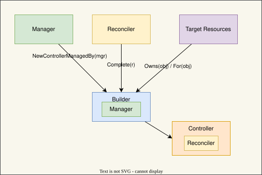
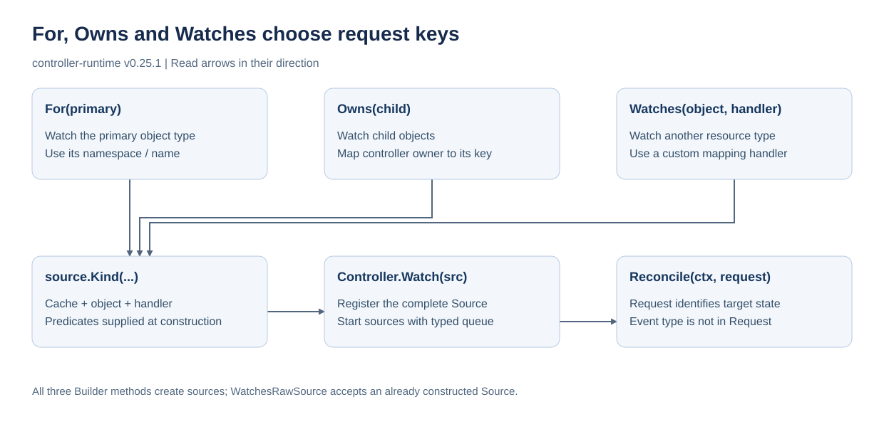
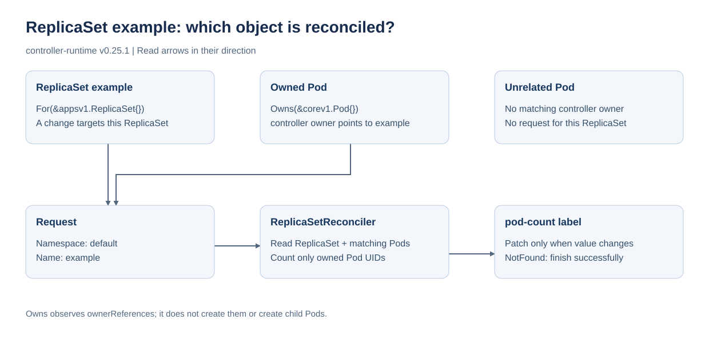
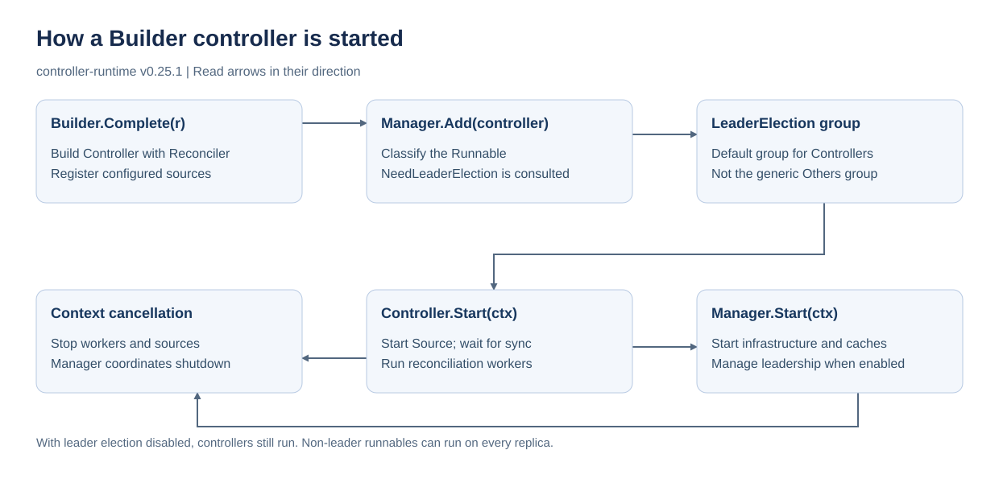

# Builder

Builder は Reconciler、監視対象、Handler をまとめて Controller を構築し、Manager に登録する。

```go
err := ctrl.NewControllerManagedBy(mgr).
    For(&appsv1.ReplicaSet{}).
    Owns(&corev1.Pod{}).
    Complete(&ReplicaSetReconciler{Client: mgr.GetClient()})
```

- `For(object)` は調整対象の型を指定する。そのオブジェクトの namespace/name を enqueue する。
- `Owns(object)` は子のイベントから ownerReferences の controller owner を調べ、親のキーを enqueue する。親子関係の作成自体は行わない。
- `Watches(object, eventHandler)` は任意の型のイベントを Handler で処理対象へ対応付ける。
- `WatchesRawSource(source)` は独自 Source や typed Source を登録する。
- `Complete(reconciler)` は構築エラーを返す。Controller も必要なら `Build(reconciler)` を使う。

通常の Builder は `reconcile.Request` を使う。独自の comparable な request 型を使う場合は `builder.TypedControllerManagedBy[Request](mgr)` と対応する TypedReconciler を使う。

旧 `Watches(&source.Kind{Type: ...}, handler)` は使わない。`source.Kind` は関数になり、cache・object・handler を受け取る。詳細は [Source](../source)。

参照: [Builder API](https://pkg.go.dev/sigs.k8s.io/controller-runtime@v0.25.1/pkg/builder)、[実装](https://github.com/kubernetes-sigs/controller-runtime/blob/v0.25.1/pkg/builder/controller.go)、[実行例](../example-controller)。

## 図








