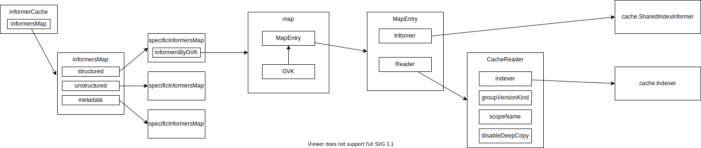
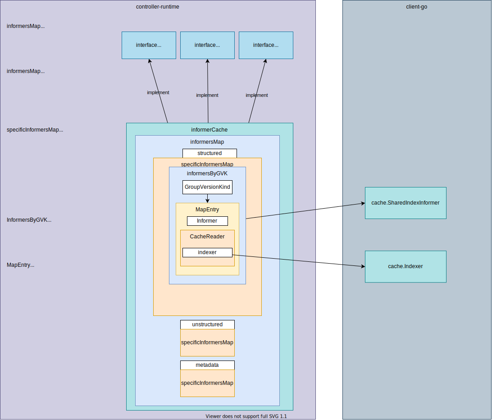

# [cache](https://pkg.go.dev/sigs.k8s.io/controller-runtime/pkg/cache)





1. So-called "Cache" in stored in [cluster](../cluster/README.md) is **[informerCache](https://github.com/kubernetes-sigs/controller-runtime/blob/v0.13.0/pkg/cache/informer_cache.go#L49)**.
1. **[informerCache](https://github.com/kubernetes-sigs/controller-runtime/blob/v0.13.0/pkg/cache/informer_cache.go#L49)** implements [Cache](https://github.com/kubernetes-sigs/controller-runtime/blob/v0.13.0/pkg/cache/cache.go#L41), [Informers](https://github.com/kubernetes-sigs/controller-runtime/blob/v0.13.0/pkg/cache/cache.go#L52), and [client.Reader](https://github.com/kubernetes-sigs/controller-runtime/blob/v0.13.0/pkg/client/interfaces.go#L48) interfaces.
1. **informerCache** has a **specificInformersMap** for structured, unstructured, and metadata.
    1. What is structured, unstructured. and metadata? ref: [Unstructured](https://github.com/kubernetes/apimachinery/blob/master/pkg/apis/meta/v1/unstructured/unstructured.go#L31), [Caching unstrctured objects using controller-runtime](https://ymmt2005.hatenablog.com/entry/2021/07/25/Caching_Unstructured_Objects_using_controller-runtime)
1. **specificInformersMap** has several fields but the most important field is **informersByGVK**.
1. **informersByGVK**, as the variable name indicates, is a map from GroupVersionKind to **MapEntry**
1. **MapEntry** is a pair of `cache.SharedIndexInformer` and `CacheReader`
1. [NewSharedIndexInformer](https://github.com/kubernetes/client-go/blob/v0.25.0/tools/cache/shared_informer.go#L225) requires `lw ListerWatcher, exampleObject runtime.Object, defaultEventHandlerResyncPeriod time.Duration, indexers Indexers`. Those functions use `k8s.io/client-go/metadata`, `k8s.io/client-go/dynamic`, and `k8s.io/client-go/rest` to get `ListFunc` and `WatchFunc` that are necessary to generate [cache.ListWatch]
    1. In controller-runtime, `ListerWatcher` is created by `createListWatcher` which is passed to `newSpecificInformersMap`. Specifically, [createStructuredListWatch](https://github.com/kubernetes-sigs/controller-runtime/blob/v0.13.0/pkg/cache/internal/informers_map.go#L268), [createUnstructuredListWatch](https://github.com/kubernetes-sigs/controller-runtime/blob/v0.13.0/pkg/cache/internal/informers_map.go#L311), [createMetadataListWatch](https://github.com/kubernetes-sigs/controller-runtime/blob/v0.13.0/pkg/cache/internal/informers_map.go#L355)
    1. In controller-runtime, `Indexers` is generated as follows:
        ```go
        cache.Indexers{
            cache.NamespaceIndex: cache.MetaNamespaceIndexFunc,
        }
        ```


## Types

### [Cache interface](https://github.com/kubernetes-sigs/controller-runtime/blob/v0.13.0/pkg/cache/cache.go#L41)

```go
// Cache knows how to load Kubernetes objects, fetch informers to request
// to receive events for Kubernetes objects (at a low-level),
// and add indices to fields on the objects stored in the cache.
type Cache interface {
	// Cache acts as a client to objects stored in the cache.
	client.Reader

	// Cache loads informers and adds field indices.
	Informers
}
```

### [Informers interface](https://github.com/kubernetes-sigs/controller-runtime/blob/v0.13.0/pkg/cache/cache.go#L52)

```go
// Informers knows how to create or fetch informers for different
// group-version-kinds, and add indices to those informers.  It's safe to call
// GetInformer from multiple threads.
type Informers interface {
	// GetInformer fetches or constructs an informer for the given object that corresponds to a single
	// API kind and resource.
	GetInformer(ctx context.Context, obj client.Object) (Informer, error)

	// GetInformerForKind is similar to GetInformer, except that it takes a group-version-kind, instead
	// of the underlying object.
	GetInformerForKind(ctx context.Context, gvk schema.GroupVersionKind) (Informer, error)

	// Start runs all the informers known to this cache until the context is closed.
	// It blocks.
	Start(ctx context.Context) error

	// WaitForCacheSync waits for all the caches to sync.  Returns false if it could not sync a cache.
	WaitForCacheSync(ctx context.Context) bool

	// Informers knows how to add indices to the caches (informers) that it manages.
	client.FieldIndexer
}
```

### Informer interface

```go
// Informer - informer allows you interact with the underlying informer.
type Informer interface {
	// AddEventHandler adds an event handler to the shared informer using the shared informer's resync
	// period.  Events to a single handler are delivered sequentially, but there is no coordination
	// between different handlers.
	AddEventHandler(handler toolscache.ResourceEventHandler)
	// AddEventHandlerWithResyncPeriod adds an event handler to the shared informer using the
	// specified resync period.  Events to a single handler are delivered sequentially, but there is
	// no coordination between different handlers.
	AddEventHandlerWithResyncPeriod(handler toolscache.ResourceEventHandler, resyncPeriod time.Duration)
	// AddIndexers adds more indexers to this store.  If you call this after you already have data
	// in the store, the results are undefined.
	AddIndexers(indexers toolscache.Indexers) error
	// HasSynced return true if the informers underlying store has synced.
	HasSynced() bool
}
```

### [informerCache](https://github.com/kubernetes-sigs/controller-runtime/blob/v0.13.0/pkg/cache/informer_cache.go#L49)


## [New](https://github.com/kubernetes-sigs/controller-runtime/blob/v0.13.0/pkg/cache/cache.go#L148)

1. [Cache.New](https://github.com/kubernetes-sigs/controller-runtime/blob/v0.13.0/pkg/cache/cache.go#L148) initializes and returns informerCache.
    ```go
    im := internal.NewInformersMap(config, opts.Scheme, opts.Mapper, *opts.Resync, opts.Namespace, selectorsByGVK, disableDeepCopyByGVK, transformByGVK)
    return &informerCache{InformersMap: im}, nil
    ```
    1. `disableDeepCopyByGVK` is determined from `opts`:
        ```go
        disableDeepCopyByGVK, err := convertToDisableDeepCopyByGVK(opts.UnsafeDisableDeepCopyByObject, opts.Scheme)
        ```
    1. The returned value is the following type:
        ```go
        type DisableDeepCopyByGVK map[schema.GroupVersionKind]bool
        ```
    1. Default value is empty: `internal.DisableDeepCopyByGVK{}`
1. [informerCache](https://github.com/kubernetes-sigs/controller-runtime/blob/v0.13.0/pkg/cache/informer_cache.go#L49)
    ```go
    type informerCache struct {
        *internal.InformersMap
    }
    ```
1. [InformersMap](https://github.com/kubernetes-sigs/controller-runtime/blob/v0.13.0/pkg/cache/internal/deleg_map.go#L34)
    ```go
    type InformersMap struct {
        // we abstract over the details of structured/unstructured/metadata with the specificInformerMaps
        // TODO(directxman12): genericize this over different projections now that we have 3 different maps

        structured   *specificInformersMap
        unstructured *specificInformersMap
        metadata     *specificInformersMap

        // Scheme maps runtime.Objects to GroupVersionKinds
        Scheme *runtime.Scheme
    }
    ```

    Initialized with [NewInformersMap](https://github.com/kubernetes-sigs/controller-runtime/blob/v0.13.0/pkg/cache/internal/deleg_map.go#L48):
    ```go
    &InformersMap{
        structured:   newStructuredInformersMap(config, scheme, mapper, resync, namespace, selectors, disableDeepCopy, transformers),
        unstructured: newUnstructuredInformersMap(config, scheme, mapper, resync, namespace, selectors, disableDeepCopy, transformers),
        metadata:     newMetadataInformersMap(config, scheme, mapper, resync, namespace, selectors, disableDeepCopy, transformers),

        Scheme: scheme,
    }
    ```
1. [All newXXXInformersMap calls specificInformersMap](https://github.com/kubernetes-sigs/controller-runtime/blob/v0.13.0/pkg/cache/internal/deleg_map.go#L110-L126):
    ```go
    // newStructuredInformersMap creates a new InformersMap for structured objects.
    func newStructuredInformersMap(config *rest.Config, scheme *runtime.Scheme, mapper meta.RESTMapper, resync time.Duration,
        namespace string, selectors SelectorsByGVK, disableDeepCopy DisableDeepCopyByGVK, transformers TransformFuncByObject) *specificInformersMap {
        return newSpecificInformersMap(config, scheme, mapper, resync, namespace, selectors, disableDeepCopy, transformers, createStructuredListWatch)
    }

    // newUnstructuredInformersMap creates a new InformersMap for unstructured objects.
    func newUnstructuredInformersMap(config *rest.Config, scheme *runtime.Scheme, mapper meta.RESTMapper, resync time.Duration,
        namespace string, selectors SelectorsByGVK, disableDeepCopy DisableDeepCopyByGVK, transformers TransformFuncByObject) *specificInformersMap {
        return newSpecificInformersMap(config, scheme, mapper, resync, namespace, selectors, disableDeepCopy, transformers, createUnstructuredListWatch)
    }

    // newMetadataInformersMap creates a new InformersMap for metadata-only objects.
    func newMetadataInformersMap(config *rest.Config, scheme *runtime.Scheme, mapper meta.RESTMapper, resync time.Duration,
        namespace string, selectors SelectorsByGVK, disableDeepCopy DisableDeepCopyByGVK, transformers TransformFuncByObject) *specificInformersMap {
        return newSpecificInformersMap(config, scheme, mapper, resync, namespace, selectors, disableDeepCopy, transformers, createMetadataListWatch)
    }
    ```
1. [specificInformersMap](https://github.com/kubernetes-sigs/controller-runtime/blob/v0.13.0/pkg/cache/internal/informers_map.go#L89)
    Initialized with [newSpecificInformersMap](https://github.com/kubernetes-sigs/controller-runtime/blob/v0.13.0/pkg/cache/internal/informers_map.go#L50)
    ```go
    ip := &specificInformersMap{
        config:            config,
        Scheme:            scheme,
        mapper:            mapper,
        informersByGVK:    make(map[schema.GroupVersionKind]*MapEntry),
        codecs:            serializer.NewCodecFactory(scheme),
        paramCodec:        runtime.NewParameterCodec(scheme),
        resync:            resync,
        startWait:         make(chan struct{}),
        createListWatcher: createListWatcher,
        namespace:         namespace,
        selectors:         selectors.forGVK,
        disableDeepCopy:   disableDeepCopy,
        transformers:      transformers,
    }
    ```

1. [MapEntry](https://github.com/kubernetes-sigs/controller-runtime/blob/v0.13.0/pkg/cache/internal/informers_map.go#L79)

    ```go
    // MapEntry contains the cached data for an Informer.
    type MapEntry struct {
        // Informer is the cached informer
        Informer cache.SharedIndexInformer

        // CacheReader wraps Informer and implements the CacheReader interface for a single type
        Reader CacheReader
    }
    ```
1. [CacheReader](https://github.com/kubernetes-sigs/controller-runtime/blob/v0.13.0/pkg/cache/internal/cache_reader.go#L40)
    ```go
    // CacheReader wraps a cache.Index to implement the client.CacheReader interface for a single type.
    type CacheReader struct {
        // indexer is the underlying indexer wrapped by this cache.
        indexer cache.Indexer

        // groupVersionKind is the group-version-kind of the resource.
        groupVersionKind schema.GroupVersionKind

        // scopeName is the scope of the resource (namespaced or cluster-scoped).
        scopeName apimeta.RESTScopeName

        // disableDeepCopy indicates not to deep copy objects during get or list objects.
        // Be very careful with this, when enabled you must DeepCopy any object before mutating it,
        // otherwise you will mutate the object in the cache.
        disableDeepCopy bool
    }
    ```
1. `MapEntry` and `CacheReader` is initialized in [addInformerToMap](https://github.com/kubernetes-sigs/controller-runtime/blob/v0.13.0/pkg/cache/internal/informers_map.go#L247):

    ```go
	i := &MapEntry{
		Informer: ni,
		Reader: CacheReader{
			indexer:          ni.GetIndexer(),
			groupVersionKind: gvk,
			scopeName:        rm.Scope.Name(),
			disableDeepCopy:  ip.disableDeepCopy.IsDisabled(gvk),
		},
	}
    ```

    `disableDeepCopy` is determined by [isDisabled()](https://github.com/kubernetes-sigs/controller-runtime/blob/v0.13.0/pkg/cache/internal/disabledeepcopy.go#L28) originally given from `opts.UnsafeDisableDeepCopyByObject`.

    ```go
    // IsDisabled returns whether a GroupVersionKind is disabled DeepCopy.
    func (disableByGVK DisableDeepCopyByGVK) IsDisabled(gvk schema.GroupVersionKind) bool {
        if d, ok := disableByGVK[gvk]; ok {
            return d
        } else if d, ok = disableByGVK[GroupVersionKindAll]; ok {
            return d
        }
        return false
    }
    ```
    As you can see, if it's empty (the default value), it returns `false`, which means **when cacheReader gets an obejct from the cache, it internally deepcopies the object**. You can modified the got object without deepcopying by yourself.

## How cache is used

1. Create cache.
1. Start cache.
1. Wait until cache is synced.
1. Get informer.
1. Wait until informer is synced.

## Example: Get nginx Pod

Use [ResourceEventHandlerFuncs](https://pkg.go.dev/k8s.io/client-go/tools/cache#ResourceEventHandlerFuncs) (Note that this is in client-go package! not in controller-runtime!)

The informer interface is confusing in that the arguments of the informer's methods are using another cache package in client-go.

**toolcache** here is https://pkg.go.dev/k8s.io/client-go@v0.25.0/tools/cache

```go
type Informer interface {
    // AddEventHandler adds an event handler to the shared informer using the shared informer's resync
    // period.  Events to a single handler are delivered sequentially, but there is no coordination
    // between different handlers.
    AddEventHandler(handler toolscache.ResourceEventHandler)
    // AddEventHandlerWithResyncPeriod adds an event handler to the shared informer using the
    // specified resync period.  Events to a single handler are delivered sequentially, but there is
    // no coordination between different handlers.
    AddEventHandlerWithResyncPeriod(handler toolscache.ResourceEventHandler, resyncPeriod time.Duration)
    // AddIndexers adds more indexers to this store.  If you call this after you already have data
    // in the store, the results are undefined.
    AddIndexers(indexers toolscache.Indexers) error
    // HasSynced return true if the informers underlying store has synced.
    HasSynced() bool
}
```

[ResourceEventHandler](https://pkg.go.dev/k8s.io/client-go/tools/cache#ResourceEventHandler):

```go
type ResourceEventHandler interface {
    OnAdd(obj interface{})
    OnUpdate(oldObj, newObj interface{})
    OnDelete(obj interface{})
}
```

1. Run nginx pod
    ```
    kubectl run nginx --image=nginx
    ```
1. Run
    ```
    go run main.go
    ```

    ```
    cache is started
    cache is synced
    &Pod{ObjectMeta:{nginx  default  36f44710-c965-4b02-8fb5-05b0948104fa 190616 0 2022-09-15 07:14:46 +0900 JST <nil> <nil> map[run:nginx] map[] [] [] [{kubectl-run Update v1 2022-09-15 07:14:46 +0900 JST FieldsV1 {"f:metadata":{"f:labels":{".":{},"f:run":{}}},"f:spec":{"f:containers":{"k:{\"name\":\"nginx\"}":{".":{},"f:image":{},"f:imagePullPolicy":{},"f:name":{},"f:resources":{},"f:terminationMessagePath":{},"f:terminationMessagePolicy":{}}},"f:dnsPolicy":{},"f:enableServiceLinks":{},"f:restartPolicy":{},"f:schedulerName":{},"f:securityContext":{},"f:terminationGracePeriodSeconds":{}}} } {kubelet Update v1 2022-09-15 07:14:46 +0900 JST FieldsV1 {"f:status":{"f:conditions":{"k:{\"type\":\"ContainersReady\"}":{".":{},"f:lastProbeTime":{},"f:lastTransitionTime":{},"f:message":{},"f:reason":{},"f:status":{},"f:type":{}},"k:{\"type\":\"Initialized\"}":{".":{},"f:lastProbeTime":{},"f:lastTransitionTime":{},"f:status":{},"f:type":{}},"k:{\"type\":\"Ready\"}":{".":{},"f:lastProbeTime":{},"f:lastTransitionTime":{},"f:message":{},"f:reason":{},"f:status":{},"f:type":{}}},"f:containerStatuses":{},"f:hostIP":{},"f:startTime":{}}} status}]},Spec:PodSpec{Volumes:[]Volume{Volume{Name:kube-api-access-h8flt,VolumeSource:VolumeSource{HostPath:nil,EmptyDir:nil,GCEPersistentDisk:nil,AWSElasticBlockStore:nil,GitRepo:nil,Secret:nil,NFS:nil,ISCSI:nil,Glusterfs:nil,PersistentVolumeClaim:nil,RBD:nil,FlexVolume:nil,Cinder:nil,CephFS:nil,Flocker:nil,DownwardAPI:nil,FC:nil,AzureFile:nil,ConfigMap:nil,VsphereVolume:nil,Quobyte:nil,AzureDisk:nil,PhotonPersistentDisk:nil,PortworxVolume:nil,ScaleIO:nil,Projected:&ProjectedVolumeSource{Sources:[]VolumeProjection{VolumeProjection{Secret:nil,DownwardAPI:nil,ConfigMap:nil,ServiceAccountToken:&ServiceAccountTokenProjection{Audience:,ExpirationSeconds:*3607,Path:token,},},VolumeProjection{Secret:nil,DownwardAPI:nil,ConfigMap:&ConfigMapProjection{LocalObjectReference:LocalObjectReference{Name:kube-root-ca.crt,},Items:[]KeyToPath{KeyToPath{Key:ca.crt,Path:ca.crt,Mode:nil,},},Optional:nil,},ServiceAccountToken:nil,},VolumeProjection{Secret:nil,DownwardAPI:&DownwardAPIProjection{Items:[]DownwardAPIVolumeFile{DownwardAPIVolumeFile{Path:namespace,FieldRef:&ObjectFieldSelector{APIVersion:v1,FieldPath:metadata.namespace,},ResourceFieldRef:nil,Mode:nil,},},},ConfigMap:nil,ServiceAccountToken:nil,},},DefaultMode:*420,},StorageOS:nil,CSI:nil,Ephemeral:nil,},},},Containers:[]Container{Container{Name:nginx,Image:nginx,Command:[],Args:[],WorkingDir:,Ports:[]ContainerPort{},Env:[]EnvVar{},Resources:ResourceRequirements{Limits:ResourceList{},Requests:ResourceList{},},VolumeMounts:[]VolumeMount{VolumeMount{Name:kube-api-access-h8flt,ReadOnly:true,MountPath:/var/run/secrets/kubernetes.io/serviceaccount,SubPath:,MountPropagation:nil,SubPathExpr:,},},LivenessProbe:nil,ReadinessProbe:nil,Lifecycle:nil,TerminationMessagePath:/dev/termination-log,ImagePullPolicy:Always,SecurityContext:nil,Stdin:false,StdinOnce:false,TTY:false,EnvFrom:[]EnvFromSource{},TerminationMessagePolicy:File,VolumeDevices:[]VolumeDevice{},StartupProbe:nil,},},RestartPolicy:Always,TerminationGracePeriodSeconds:*30,ActiveDeadlineSeconds:nil,DNSPolicy:ClusterFirst,NodeSelector:map[string]string{},ServiceAccountName:default,DeprecatedServiceAccount:default,NodeName:kind-control-plane,HostNetwork:false,HostPID:false,HostIPC:false,SecurityContext:&PodSecurityContext{SELinuxOptions:nil,RunAsUser:nil,RunAsNonRoot:nil,SupplementalGroups:[],FSGroup:nil,RunAsGroup:nil,Sysctls:[]Sysctl{},WindowsOptions:nil,FSGroupChangePolicy:nil,SeccompProfile:nil,},ImagePullSecrets:[]LocalObjectReference{},Hostname:,Subdomain:,Affinity:nil,SchedulerName:default-scheduler,InitContainers:[]Container{},AutomountServiceAccountToken:nil,Tolerations:[]Toleration{Toleration{Key:node.kubernetes.io/not-ready,Operator:Exists,Value:,Effect:NoExecute,TolerationSeconds:*300,},Toleration{Key:node.kubernetes.io/unreachable,Operator:Exists,Value:,Effect:NoExecute,TolerationSeconds:*300,},},HostAliases:[]HostAlias{},PriorityClassName:,Priority:*0,DNSConfig:nil,ShareProcessNamespace:nil,ReadinessGates:[]PodReadinessGate{},RuntimeClassName:nil,EnableServiceLinks:*true,PreemptionPolicy:*PreemptLowerPriority,Overhead:ResourceList{},TopologySpreadConstraints:[]TopologySpreadConstraint{},EphemeralContainers:[]EphemeralContainer{},SetHostnameAsFQDN:nil,OS:nil,HostUsers:nil,},Status:PodStatus{Phase:Pending,Conditions:[]PodCondition{PodCondition{Type:Initialized,Status:True,LastProbeTime:0001-01-01 00:00:00 +0000 UTC,LastTransitionTime:2022-09-15 07:14:46 +0900 JST,Reason:,Message:,},PodCondition{Type:Ready,Status:False,LastProbeTime:0001-01-01 00:00:00 +0000 UTC,LastTransitionTime:2022-09-15 07:14:46 +0900 JST,Reason:ContainersNotReady,Message:containers with unready status: [nginx],},PodCondition{Type:ContainersReady,Status:False,LastProbeTime:0001-01-01 00:00:00 +0000 UTC,LastTransitionTime:2022-09-15 07:14:46 +0900 JST,Reason:ContainersNotReady,Message:containers with unready status: [nginx],},PodCondition{Type:PodScheduled,Status:True,LastProbeTime:0001-01-01 00:00:00 +0000 UTC,LastTransitionTime:2022-09-15 07:14:46 +0900 JST,Reason:,Message:,},},Message:,Reason:,HostIP:172.18.0.2,PodIP:,StartTime:2022-09-15 07:14:46 +0900 JST,ContainerStatuses:[]ContainerStatus{ContainerStatus{Name:nginx,State:ContainerState{Waiting:&ContainerStateWaiting{Reason:ContainerCreating,Message:,},Running:nil,Terminated:nil,},LastTerminationState:ContainerState{Waiting:nil,Running:nil,Terminated:nil,},Ready:false,RestartCount:0,Image:nginx,ImageID:,ContainerID:,Started:*false,},},QOSClass:BestEffort,InitContainerStatuses:[]ContainerStatus{},NominatedNodeName:,PodIPs:[]PodIP{},EphemeralContainerStatuses:[]ContainerStatus{},},}
    ```
1. Create/Delete nginx pod. You'll see the object in the logs.
