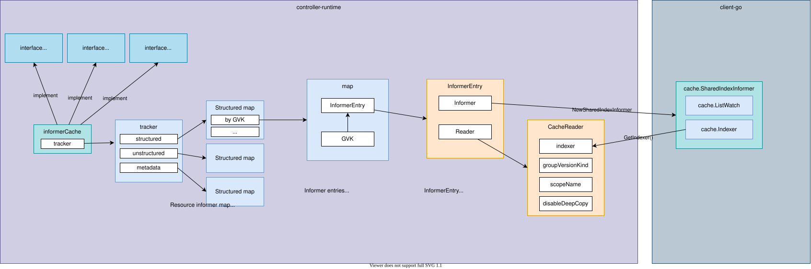
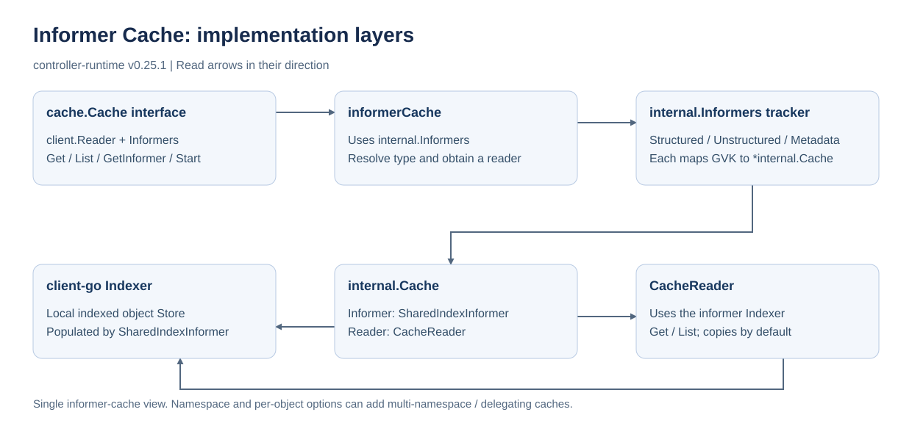

# [cache](https://github.com/kubernetes-sigs/controller-runtime/blob/v0.25.1/pkg/cache/cache.go)





These implementation notes and diagrams target controller-runtime v0.25.1, pinned in the repository's go.mod. Use the signatures and call paths below for this version.

The Cache stored in a Cluster combines a Reader with informer management. The basic implementation is `informerCache`; namespace and per-object options can wrap it in `multiNamespaceCache` and `delegatingByGVKCache`.

Internally, `internal.Informers` has a `tracker` with separate Structured, Unstructured, and Metadata maps keyed by GVK. Each entry pairs a client-go SharedIndexInformer with a CacheReader over the same Indexer.

Typed objects retain Go fields, unstructured objects retain arbitrary JSON fields, and metadata informers use PartialObjectMetadata. The separate maps keep their representations distinct even when the GVK matches.

## Types

### Cache interface

```go
type Cache interface {
    client.Reader

    Informers
}
```

### Informers interface

`cache.Informers` aliases the interface in `cache/cacheapi`. GetInformer creates an informer lazily if necessary; calls after startup normally wait for synchronization unless `BlockUntilSynced(false)` is specified.

```go
type Informers interface {
    GetInformer(ctx context.Context, obj Object, opts ...InformerGetOption) (Informer, error)

    GetInformerForKind(ctx context.Context, gvk schema.GroupVersionKind, opts ...InformerGetOption) (Informer, error)

    RemoveInformer(ctx context.Context, obj Object) error

    Start(ctx context.Context) error

    WaitForCacheSync(ctx context.Context) bool

    FieldIndexer
}
```

### Informer interface

Handler registration returns a registration handle and an error. Check the error, and keep the handle if you need to remove the handler later. The handle's HasSynced tracks delivery of the initial objects to that particular handler.

```go
type Informer interface {
    AddEventHandler(handler toolscache.ResourceEventHandler) (toolscache.ResourceEventHandlerRegistration, error)

    AddEventHandlerWithResyncPeriod(handler toolscache.ResourceEventHandler, resyncPeriod time.Duration) (toolscache.ResourceEventHandlerRegistration, error)

    AddEventHandlerWithOptions(handler toolscache.ResourceEventHandler, options toolscache.HandlerOptions) (toolscache.ResourceEventHandlerRegistration, error)

    RemoveEventHandler(handle toolscache.ResourceEventHandlerRegistration) error

    AddIndexers(indexers toolscache.Indexers) error

    HasSynced() bool

    HasSyncedChecker() toolscache.DoneChecker

    IsStopped() bool
}
```

### informerCache

```go
type informerCache struct {
    scheme *runtime.Scheme
    *internal.Informers
    readerFailOnMissingInformer bool
}
```

## New

1. `cache.New` defaults the HTTPClient, Scheme, Mapper, sync period, selectors, and transform/copy settings.
2. `newCache` creates `informerCache` instances with `internal.NewInformers`.
3. `DefaultNamespaces` selects a namespace-combining cache when configured; cluster-scoped objects still have a cluster-scoped cache.
4. `ByObject` adds a GVK dispatcher with object-specific selectors/namespaces and a default cache for other objects.
5. Informers are created on demand, rather than listing every registered Scheme type when New returns.

The internal map hierarchy is:

```go
type tracker struct {
    Structured   map[schema.GroupVersionKind]*Cache
    Unstructured map[schema.GroupVersionKind]*Cache
    Metadata     map[schema.GroupVersionKind]*Cache
}
```

```go
type Cache struct {
    Informer cache.SharedIndexInformer

    Reader CacheReader

    stop chan struct{}
}
```

`internal.NewInformers` initializes those maps and the start barrier alongside transport and watch options:

```go
func NewInformers(config *rest.Config, options *InformersOpts) *Informers {
    newInformer := cache.NewSharedIndexInformer
    if options.NewInformer != nil {
        newInformer = options.NewInformer
    }
    return &Informers{
        config:     config,
        httpClient: options.HTTPClient,
        scheme:     options.Scheme,
        mapper:     options.Mapper,
        tracker: tracker{
            Structured:   make(map[schema.GroupVersionKind]*Cache),
            Unstructured: make(map[schema.GroupVersionKind]*Cache),
            Metadata:     make(map[schema.GroupVersionKind]*Cache),
        },
        codecs:                serializer.NewCodecFactory(options.Scheme),
        paramCodec:            runtime.NewParameterCodec(options.Scheme),
        resync:                options.ResyncPeriod,
        startWait:             make(chan struct{}),
        namespace:             options.Namespace,
        selector:              options.Selector,
        transform:             options.Transform,
        unsafeDisableDeepCopy: options.UnsafeDisableDeepCopy,
        enableWatchBookmarks:  options.EnableWatchBookmarks,
        newInformer:           newInformer,
        watchErrorHandler:     options.WatchErrorHandler,
    }
}
```

When an informer is requested, `Get` / `addInformerToMap` hold the appropriate locks and reuse an existing entry. If none exists:

1. `makeListWatcher` selects typed REST, dynamic, or metadata List/Watch operations.
2. The wrapper applies namespace/label/field restrictions to both List and Watch, and enables bookmarks when configured.
3. `NewSharedIndexInformer` receives the ListWatch, example object, resync period, and namespace index (`cache.NamespaceIndex: cache.MetaNamespaceIndexFunc`).
4. Transform and watch-error handlers are configured before starting the informer.
5. A CacheReader is created over `sharedIndexInformer.GetIndexer()` with GVK, REST scope, and the unsafe deep-copy option.
6. The entry is stored in the representation-specific map, and started immediately if the cache has already started.

For the concrete construction code:

```go
func (ip *Informers) addInformerToMap(gvk schema.GroupVersionKind, obj runtime.Object) (*Cache, bool, error) {
    ip.mu.Lock()
    defer ip.mu.Unlock()

    if i, ok := ip.informersByType(obj)[gvk]; ok {
        return i, ip.started, nil
    }

    listWatcher, err := ip.makeListWatcher(gvk, obj)
    if err != nil {
        return nil, false, err
    }
    sharedIndexInformer := ip.newInformer(&cache.ListWatch{
        ListWithContextFunc: func(ctx context.Context, opts metav1.ListOptions) (runtime.Object, error) {
            ip.selector.ApplyToList(&opts)
            return listWatcher.ListWithContextFunc(ctx, opts)
        },
        WatchFuncWithContext: func(ctx context.Context, opts metav1.ListOptions) (watch.Interface, error) {
            opts.Watch = true // Watch needs to be set to true separately
            opts.AllowWatchBookmarks = ip.enableWatchBookmarks

            ip.selector.ApplyToList(&opts)
            return listWatcher.WatchFuncWithContext(ctx, opts)
        },
    }, obj, calculateResyncPeriod(ip.resync), cache.Indexers{
        cache.NamespaceIndex: cache.MetaNamespaceIndexFunc,
    })

    if ip.watchErrorHandler != nil {
        if err := sharedIndexInformer.SetWatchErrorHandlerWithContext(ip.watchErrorHandler); err != nil {
            return nil, false, err
        }
    }

    if err := sharedIndexInformer.SetTransform(ip.transform); err != nil {
        return nil, false, err
    }

    mapping, err := ip.mapper.RESTMapping(gvk.GroupKind(), gvk.Version)
    if err != nil {
        return nil, false, err
    }

    i := &Cache{
        Informer: sharedIndexInformer,
        Reader: CacheReader{
            indexer:          sharedIndexInformer.GetIndexer(),
            groupVersionKind: gvk,
            scopeName:        mapping.Scope.Name(),
            disableDeepCopy:  ip.unsafeDisableDeepCopy,
        },
        stop: make(chan struct{}),
    }
    ip.informersByType(obj)[gvk] = i

    if ip.started {
        ip.startInformerLocked(i)
    }
    return i, ip.started, nil
}
```

## How cache is used

1. Cluster creates Cache and uses it as the Client's Reader and FieldIndexer.
2. Builder creates a Kind source using `mgr.GetCache()`. The source requests an informer and attaches its event handler.
3. Manager starts caches before controllers process work. Kind's WaitForSync also ensures its handler sees the initial state.
4. Informer's Reflector maintains the Indexer from List/Watch events. Handlers enqueue reconciliation keys.
5. Reconciler Get/List calls read this Indexer through CacheReader. Writes go through Client to the API server.

`IndexField` adds an index used by matching-field queries; it does not add an API-server field selector. `ReaderFailOnMissingInformer` can reject unexpected reads rather than starting another watch. `SyncPeriod` generates local synthetic updates; it is not a polling interval that refreshes every object from the server. Leave deep-copy enabled unless you manage object ownership explicitly.

## Example: Get nginx Pod

Run from the repository root with a kubeconfig and Pod list/watch permission:

```sh
kubectl run nginx --image=nginx
go run ./contents/kubernetes-operator/controller-runtime/cache
```

The [sample](main.go) calls GetInformer and registers its ResourceEventHandlerFuncs before starting the cache in a goroutine. It waits for `WaitForCacheSync(ctx)`, then reads `default/nginx` from the cache. Its startup errors propagate to main, and Ctrl+C cancels the cache and waits for its goroutine.

The low-level client-go handler contract is:

```go
type ResourceEventHandler interface {
    OnAdd(obj interface{}, isInInitialList bool)
    OnUpdate(oldObj, newObj interface{})
    OnDelete(obj interface{})
}
```

Initial objects produce OnAdd. Later changes produce OnUpdate and OnDelete; deletion can arrive as a tombstone, so the sample uses `DeletionHandlingMetaNamespaceKeyFunc`. Expected messages include `cache is synced` and `cached Pod: default/nginx`; event order depends on cluster activity.

After stopping the process:

```sh
kubectl delete pod nginx
```
