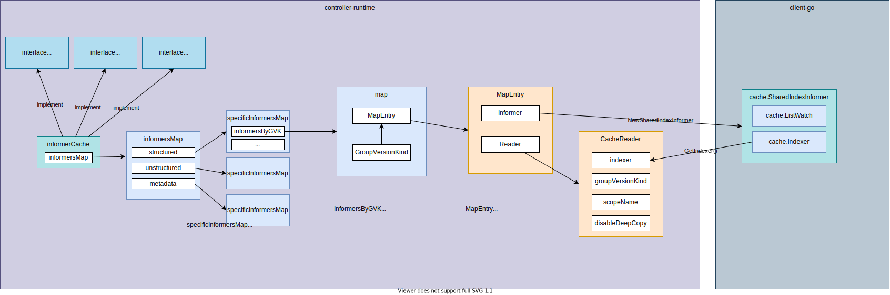

# [cache](https://pkg.go.dev/sigs.k8s.io/controller-runtime/pkg/cache)



1. So-called "Cache" in stored in [cluster](../cluster/README.md) is **[informerCache](https://github.com/kubernetes-sigs/controller-runtime/blob/v0.13.0/pkg/cache/informer_cache.go#L49)**.
1. **[informerCache](https://github.com/kubernetes-sigs/controller-runtime/blob/v0.13.0/pkg/cache/informer_cache.go#L49)** implements [Cache](https://github.com/kubernetes-sigs/controller-runtime/blob/v0.13.0/pkg/cache/cache.go#L41), [Informers](https://github.com/kubernetes-sigs/controller-runtime/blob/v0.13.0/pkg/cache/cache.go#L52), and [client.Reader](https://github.com/kubernetes-sigs/controller-runtime/blob/v0.13.0/pkg/client/interfaces.go#L48) interfaces.
1. **informerCache** has a **specificInformersMap** for structured, unstructured, and metadata.
    1. What is structured, unstructured. and metadata? ref: [Unstructured](https://github.com/kubernetes/apimachinery/blob/master/pkg/apis/meta/v1/unstructured/unstructured.go#L31), [Caching unstrctured objects using controller-runtime](https://ymmt2005.hatenablog.com/entry/2021/07/25/Caching_Unstructured_Objects_using_controller-runtime)
1. **specificInformersMap** has several fields but the most important field is **informersByGVK**.
1. **informersByGVK**, as the variable name indicates, is a map from GroupVersionKind to **MapEntry**
1. **MapEntry** is a pair of `cache.SharedIndexInformer` and `CacheReader`


## Types

### [Cache interface](https://github.com/kubernetes-sigs/controller-runtime/blob/v0.13.0/pkg/cache/cache.go#L41)

```go
// Cache knows how to load Kubernetes objects, fetch informers to request
// to receive events for Kubernetes objects (at a low-level),
// and add indices to fields on the objects stored in the cache.
type Cache interface {
	// Cache acts as a client to objects stored in the cache.
	client.Reader

	// Cache loads informers and adds field indices.
	Informers
}
```

### [Informers interface](https://github.com/kubernetes-sigs/controller-runtime/blob/v0.13.0/pkg/cache/cache.go#L52)

```go
// Informers knows how to create or fetch informers for different
// group-version-kinds, and add indices to those informers.  It's safe to call
// GetInformer from multiple threads.
type Informers interface {
	// GetInformer fetches or constructs an informer for the given object that corresponds to a single
	// API kind and resource.
	GetInformer(ctx context.Context, obj client.Object) (Informer, error)

	// GetInformerForKind is similar to GetInformer, except that it takes a group-version-kind, instead
	// of the underlying object.
	GetInformerForKind(ctx context.Context, gvk schema.GroupVersionKind) (Informer, error)

	// Start runs all the informers known to this cache until the context is closed.
	// It blocks.
	Start(ctx context.Context) error

	// WaitForCacheSync waits for all the caches to sync.  Returns false if it could not sync a cache.
	WaitForCacheSync(ctx context.Context) bool

	// Informers knows how to add indices to the caches (informers) that it manages.
	client.FieldIndexer
}
```

### Informer interface

```go
// Informer - informer allows you interact with the underlying informer.
type Informer interface {
	// AddEventHandler adds an event handler to the shared informer using the shared informer's resync
	// period.  Events to a single handler are delivered sequentially, but there is no coordination
	// between different handlers.
	AddEventHandler(handler toolscache.ResourceEventHandler)
	// AddEventHandlerWithResyncPeriod adds an event handler to the shared informer using the
	// specified resync period.  Events to a single handler are delivered sequentially, but there is
	// no coordination between different handlers.
	AddEventHandlerWithResyncPeriod(handler toolscache.ResourceEventHandler, resyncPeriod time.Duration)
	// AddIndexers adds more indexers to this store.  If you call this after you already have data
	// in the store, the results are undefined.
	AddIndexers(indexers toolscache.Indexers) error
	// HasSynced return true if the informers underlying store has synced.
	HasSynced() bool
}
```

### [informerCache](https://github.com/kubernetes-sigs/controller-runtime/blob/v0.13.0/pkg/cache/informer_cache.go#L49)


## [New](https://github.com/kubernetes-sigs/controller-runtime/blob/v0.13.0/pkg/cache/cache.go#L148)

1. [Cache.New](https://github.com/kubernetes-sigs/controller-runtime/blob/v0.13.0/pkg/cache/cache.go#L148) initializes and returns informerCache.
    ```go
    im := internal.NewInformersMap(config, opts.Scheme, opts.Mapper, *opts.Resync, opts.Namespace, selectorsByGVK, disableDeepCopyByGVK, transformByGVK)
    return &informerCache{InformersMap: im}, nil
    ```
    1. `disableDeepCopyByGVK` is determined from `opts`:
        ```go
        disableDeepCopyByGVK, err := convertToDisableDeepCopyByGVK(opts.UnsafeDisableDeepCopyByObject, opts.Scheme)
        ```
    1. The returned value is the following type:
        ```go
        type DisableDeepCopyByGVK map[schema.GroupVersionKind]bool
        ```
    1. Default value is empty: `internal.DisableDeepCopyByGVK{}`
1. [informerCache](https://github.com/kubernetes-sigs/controller-runtime/blob/v0.13.0/pkg/cache/informer_cache.go#L49)
    ```go
    type informerCache struct {
        *internal.InformersMap
    }
    ```
1. [InformersMap](https://github.com/kubernetes-sigs/controller-runtime/blob/v0.13.0/pkg/cache/internal/deleg_map.go#L34)
    ```go
    type InformersMap struct {
        // we abstract over the details of structured/unstructured/metadata with the specificInformerMaps
        // TODO(directxman12): genericize this over different projections now that we have 3 different maps

        structured   *specificInformersMap
        unstructured *specificInformersMap
        metadata     *specificInformersMap

        // Scheme maps runtime.Objects to GroupVersionKinds
        Scheme *runtime.Scheme
    }
    ```

    Initialized with [NewInformersMap](https://github.com/kubernetes-sigs/controller-runtime/blob/v0.13.0/pkg/cache/internal/deleg_map.go#L48):
    ```go
    &InformersMap{
        structured:   newStructuredInformersMap(config, scheme, mapper, resync, namespace, selectors, disableDeepCopy, transformers),
        unstructured: newUnstructuredInformersMap(config, scheme, mapper, resync, namespace, selectors, disableDeepCopy, transformers),
        metadata:     newMetadataInformersMap(config, scheme, mapper, resync, namespace, selectors, disableDeepCopy, transformers),

        Scheme: scheme,
    }
    ```
1. [All newXXXInformersMap calls specificInformersMap](https://github.com/kubernetes-sigs/controller-runtime/blob/v0.13.0/pkg/cache/internal/deleg_map.go#L110-L126):
    ```go
    // newStructuredInformersMap creates a new InformersMap for structured objects.
    func newStructuredInformersMap(config *rest.Config, scheme *runtime.Scheme, mapper meta.RESTMapper, resync time.Duration,
        namespace string, selectors SelectorsByGVK, disableDeepCopy DisableDeepCopyByGVK, transformers TransformFuncByObject) *specificInformersMap {
        return newSpecificInformersMap(config, scheme, mapper, resync, namespace, selectors, disableDeepCopy, transformers, createStructuredListWatch)
    }

    // newUnstructuredInformersMap creates a new InformersMap for unstructured objects.
    func newUnstructuredInformersMap(config *rest.Config, scheme *runtime.Scheme, mapper meta.RESTMapper, resync time.Duration,
        namespace string, selectors SelectorsByGVK, disableDeepCopy DisableDeepCopyByGVK, transformers TransformFuncByObject) *specificInformersMap {
        return newSpecificInformersMap(config, scheme, mapper, resync, namespace, selectors, disableDeepCopy, transformers, createUnstructuredListWatch)
    }

    // newMetadataInformersMap creates a new InformersMap for metadata-only objects.
    func newMetadataInformersMap(config *rest.Config, scheme *runtime.Scheme, mapper meta.RESTMapper, resync time.Duration,
        namespace string, selectors SelectorsByGVK, disableDeepCopy DisableDeepCopyByGVK, transformers TransformFuncByObject) *specificInformersMap {
        return newSpecificInformersMap(config, scheme, mapper, resync, namespace, selectors, disableDeepCopy, transformers, createMetadataListWatch)
    }
    ```
1. [specificInformersMap](https://github.com/kubernetes-sigs/controller-runtime/blob/v0.13.0/pkg/cache/internal/informers_map.go#L89)
    Initialized with [newSpecificInformersMap](https://github.com/kubernetes-sigs/controller-runtime/blob/v0.13.0/pkg/cache/internal/informers_map.go#L50)
    ```go
    ip := &specificInformersMap{
        config:            config,
        Scheme:            scheme,
        mapper:            mapper,
        informersByGVK:    make(map[schema.GroupVersionKind]*MapEntry),
        codecs:            serializer.NewCodecFactory(scheme),
        paramCodec:        runtime.NewParameterCodec(scheme),
        resync:            resync,
        startWait:         make(chan struct{}),
        createListWatcher: createListWatcher,
        namespace:         namespace,
        selectors:         selectors.forGVK,
        disableDeepCopy:   disableDeepCopy,
        transformers:      transformers,
    }
    ```

1. [MapEntry](https://github.com/kubernetes-sigs/controller-runtime/blob/v0.13.0/pkg/cache/internal/informers_map.go#L79)

    ```go
    // MapEntry contains the cached data for an Informer.
    type MapEntry struct {
        // Informer is the cached informer
        Informer cache.SharedIndexInformer

        // CacheReader wraps Informer and implements the CacheReader interface for a single type
        Reader CacheReader
    }
    ```
1. [CacheReader](https://github.com/kubernetes-sigs/controller-runtime/blob/v0.13.0/pkg/cache/internal/cache_reader.go#L40)
    ```go
    // CacheReader wraps a cache.Index to implement the client.CacheReader interface for a single type.
    type CacheReader struct {
        // indexer is the underlying indexer wrapped by this cache.
        indexer cache.Indexer

        // groupVersionKind is the group-version-kind of the resource.
        groupVersionKind schema.GroupVersionKind

        // scopeName is the scope of the resource (namespaced or cluster-scoped).
        scopeName apimeta.RESTScopeName

        // disableDeepCopy indicates not to deep copy objects during get or list objects.
        // Be very careful with this, when enabled you must DeepCopy any object before mutating it,
        // otherwise you will mutate the object in the cache.
        disableDeepCopy bool
    }
    ```
1. `MapEntry` and `CacheReader` is initialized in [addInformerToMap](https://github.com/kubernetes-sigs/controller-runtime/blob/v0.13.0/pkg/cache/internal/informers_map.go#L247):

    ```go
	i := &MapEntry{
		Informer: ni,
		Reader: CacheReader{
			indexer:          ni.GetIndexer(),
			groupVersionKind: gvk,
			scopeName:        rm.Scope.Name(),
			disableDeepCopy:  ip.disableDeepCopy.IsDisabled(gvk),
		},
	}
    ```

    `disableDeepCopy` is determined by [isDisabled()](https://github.com/kubernetes-sigs/controller-runtime/blob/v0.13.0/pkg/cache/internal/disabledeepcopy.go#L28) originally given from `opts.UnsafeDisableDeepCopyByObject`.

    ```go
    // IsDisabled returns whether a GroupVersionKind is disabled DeepCopy.
    func (disableByGVK DisableDeepCopyByGVK) IsDisabled(gvk schema.GroupVersionKind) bool {
        if d, ok := disableByGVK[gvk]; ok {
            return d
        } else if d, ok = disableByGVK[GroupVersionKindAll]; ok {
            return d
        }
        return false
    }
    ```
    As you can see, if it's empty (the default value), it returns `false`, which means **when cacheReader gets an obejct from the cache, it internally deepcopies the object**. You can modified the got object without deepcopying by yourself.
