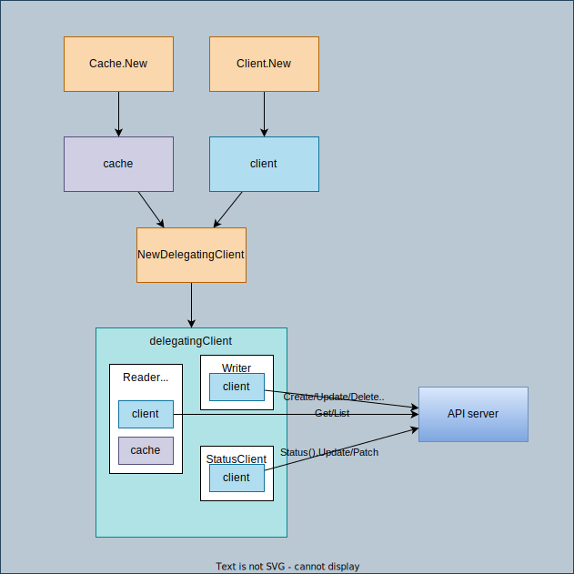

# [client](https://github.com/kubernetes-sigs/controller-runtime/tree/v0.12.3/pkg/client/client.go)



## [Client interface](https://github.com/kubernetes-sigs/controller-runtime/blob/v0.13.0/pkg/client/interfaces.go#L101)

```go
// Client knows how to perform CRUD operations on Kubernetes objects.
type Client interface {
	Reader
	Writer
	StatusClient

	// Scheme returns the scheme this client is using.
	Scheme() *runtime.Scheme
	// RESTMapper returns the rest this client is using.
	RESTMapper() meta.RESTMapper
}
```

```go
// Reader knows how to read and list Kubernetes objects.
type Reader interface {
	Get(ctx context.Context, key ObjectKey, obj Object) error
	List(ctx context.Context, list ObjectList, opts ...ListOption) error
}
```

```go
// Writer knows how to create, delete, and update Kubernetes objects.
type Writer interface {
	Create(ctx context.Context, obj Object, opts ...CreateOption) error
	Delete(ctx context.Context, obj Object, opts ...DeleteOption) error
	Update(ctx context.Context, obj Object, opts ...UpdateOption) error
	Patch(ctx context.Context, obj Object, patch Patch, opts ...PatchOption) error
	DeleteAllOf(ctx context.Context, obj Object, opts ...DeleteAllOfOption) error
}
```

```go
// StatusClient knows how to create a client which can update status subresource
// for kubernetes objects.
type StatusClient interface {
	Status() StatusWriter
}

// StatusWriter knows how to update status subresource of a Kubernetes object.
type StatusWriter interface {
	Update(ctx context.Context, obj Object, opts ...UpdateOption) error
	Patch(ctx context.Context, obj Object, patch Patch, opts ...PatchOption) error
}
```

## [delegatingClient](https://github.com/kubernetes-sigs/controller-runtime/blob/v0.13.0/pkg/client/split.go#L69)

```go
type delegatingClient struct {
	Reader
	Writer
	StatusClient

	scheme *runtime.Scheme
	mapper meta.RESTMapper
}
```

There's a function called [shouldBypassCache](https://github.com/kubernetes-sigs/controller-runtime/blob/v0.13.0/pkg/client/split.go#L102) to check if the target object is cached or not. If cached, call [cacheReader](), otherwise call [clientReader]()


## How `client` is used

1. When a **Manager** is created, a **Cluster** is created internally. (You can check more details in [cluster](../cluster/README.md))
1. When creating a **cluster**, **client** is also created. If `Options.NewClient` is not specified [DefaultNewClient](https://github.com/kubernetes-sigs/controller-runtime/blob/v0.13.0/pkg/cluster/cluster.go#L259) is used, which calls [NewDelegatingClient](https://github.com/kubernetes-sigs/controller-runtime/blob/v0.13.0/pkg/client/split.go#L44) to return a client.

	```go
	if options.NewClient == nil {
		options.NewClient = DefaultNewClient
	}
	```

	```go
	writeObj, err := options.NewClient(cache, config, clientOptions, options.ClientDisableCacheFor...)
	```

1. In [DefaultNewClient](https://github.com/kubernetes-sigs/controller-runtime/blob/v0.13.0/pkg/cluster/cluster.go#L259), new client is created first, and then delegatingClient is created.
	```go
	c, err := client.New(config, options)
	```

	```go
	client.NewDelegatingClient(client.NewDelegatingClientInput{
		CacheReader:     cache,
		Client:          c,
		UncachedObjects: uncachedObjects,
	})
	```

	As you can see, there's a struct for the input:
	```go
	// NewDelegatingClientInput encapsulates the input parameters to create a new delegating client.
	type NewDelegatingClientInput struct {
		CacheReader       Reader
		Client            Client
		UncachedObjects   []Object
		CacheUnstructured bool
	}
	```

1. `delegatingClient` is initialized in [NewDelegatingClient](https://github.com/kubernetes-sigs/controller-runtime/blob/v0.13.0/pkg/client/split.go#L44)

	Three roles:
	1. `Reader`: client + cache <- utilize the cache to reduce API requests (`Get` and `List`)
	1. `Writer`: client (`Create`, `Update`, `Delete`, etc)
	1. `StatusClient`: client (`Status().Update()` or `Status().Patch()`)

	```go
	&delegatingClient{
		scheme: in.Client.Scheme(),
		mapper: in.Client.RESTMapper(),
		Reader: &delegatingReader{
			CacheReader:       in.CacheReader,
			ClientReader:      in.Client,
			scheme:            in.Client.Scheme(),
			uncachedGVKs:      uncachedGVKs,
			cacheUnstructured: in.CacheUnstructured,
		},
		Writer:       in.Client,
		StatusClient: in.Client,
	}
	```

	[cacheReader](https://github.com/kubernetes-sigs/controller-runtime/blob/v0.13.0/pkg/cache/internal/cache_reader.go#L40):

	```go
	// CacheReader wraps a cache.Index to implement the client.CacheReader interface for a single type.
	type CacheReader struct {
		indexer cache.Indexer
		groupVersionKind schema.GroupVersionKind
		scopeName apimeta.RESTScopeName
		disableDeepCopy bool
	}
	```

## [New](https://github.com/kubernetes-sigs/controller-runtime/blob/v0.13.0/pkg/client/client.go#L75)

```go
func newClient(config *rest.Config, options Options) (*client, error) {
```

```go
c := &client{
    typedClient: typedClient{
        cache:      clientcache,
        paramCodec: runtime.NewParameterCodec(options.Scheme),
    },
    unstructuredClient: unstructuredClient{
        cache:      clientcache,
        paramCodec: noConversionParamCodec{},
    },
    metadataClient: metadataClient{
        client:     rawMetaClient,
        restMapper: options.Mapper,
    },
    scheme: options.Scheme,
    mapper: options.Mapper,
}
```
