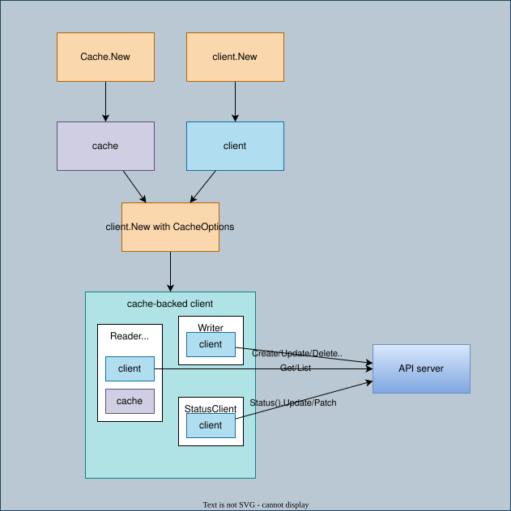

# [client](https://github.com/kubernetes-sigs/controller-runtime/blob/v0.25.1/pkg/client/client.go)



These implementation notes and the diagram target controller-runtime v0.25.1, pinned in the repository's go.mod. Use the signatures and call paths below for this version.

## Client interface

Client combines object reads, writes, status operations, and arbitrary subresources with Scheme/RESTMapper access. The concrete object can be typed, unstructured, or metadata-only.

```go
type Client interface {
    Reader
    Writer
    StatusClient
    SubResourceClientConstructor

    Scheme() *runtime.Scheme
    RESTMapper() meta.RESTMapper
    GroupVersionKindFor(obj runtime.Object) (schema.GroupVersionKind, error)
    IsObjectNamespaced(obj runtime.Object) (bool, error)
}
```

```go
type Reader interface {
    Get(ctx context.Context, key ObjectKey, obj Object, opts ...GetOption) error

    List(ctx context.Context, list ObjectList, opts ...ListOption) error
}
```

```go
type Writer interface {
    Apply(ctx context.Context, obj runtime.ApplyConfiguration, opts ...ApplyOption) error

    Create(ctx context.Context, obj Object, opts ...CreateOption) error

    Delete(ctx context.Context, obj Object, opts ...DeleteOption) error

    Update(ctx context.Context, obj Object, opts ...UpdateOption) error

    Patch(ctx context.Context, obj Object, patch Patch, opts ...PatchOption) error

    DeleteAllOf(ctx context.Context, obj Object, opts ...DeleteAllOfOption) error
}
```

```go
type StatusClient interface {
    Status() SubResourceWriter
}
```

`Status()` returns a `SubResourceWriter` (`StatusWriter` is an alias). Status updates target `/status`; they are separate from updating the parent resource.

```go
type SubResourceWriter interface {
    Create(ctx context.Context, obj Object, subResource Object, opts ...SubResourceCreateOption) error

    Update(ctx context.Context, obj Object, opts ...SubResourceUpdateOption) error

    Patch(ctx context.Context, obj Object, patch Patch, opts ...SubResourcePatchOption) error

    Apply(ctx context.Context, obj runtime.ApplyConfiguration, opts ...SubResourceApplyOption) error
}
```

## delegatingClient migration: cache-backed client

The old `delegatingClient`, `delegatingReader`, and `NewDelegatingClient` from `split.go` have been replaced by cache options on `client.New`. The read/write split is now implemented inside `client`:

```go
type client struct {
    typedClient        typedClient
    unstructuredClient unstructuredClient
    metadataClient     metadataClient
    scheme             *runtime.Scheme
    mapper             meta.RESTMapper

    cache             Reader
    uncachedGVKs      map[schema.GroupVersionKind]struct{}
    cacheUnstructured bool
}
```

`shouldBypassCache` selects the read path. No cache means direct reads. Types in `CacheOptions.DisableFor` bypass it. Unstructured objects bypass it unless `CacheOptions.Unstructured` is true. List routing resolves the corresponding item GVK before checking exclusions.

```go
func (c *client) shouldBypassCache(obj runtime.Object) (bool, error) {
    if c.cache == nil {
        return true, nil
    }

    gvk, err := c.GroupVersionKindFor(obj)
    if err != nil {
        return false, err
    }
    if meta.IsListType(obj) {
        gvk.Kind = strings.TrimSuffix(gvk.Kind, "List")
    }
    if _, isUncached := c.uncachedGVKs[gvk]; isUncached {
        return true, nil
    }
    if !c.cacheUnstructured {
        _, isUnstructured := obj.(runtime.Unstructured)
        return isUnstructured, nil
    }
    return false, nil
}
```

## How `client` is used

1. `manager.New` creates a [Cluster](../cluster/).
2. `cluster.New` creates a Cache, fills `client.Options`, and passes the cache as `CacheOptions.Reader` to `client.New`.
3. `mgr.GetClient()` returns that client. A reconciler receives it explicitly, for example `&Reconciler{Client: mgr.GetClient()}`.
4. `Get` / `List` delegate to the cache unless bypass rules apply. The cache's per-GVK `CacheReader` reads a client-go Indexer. It does not perform one HTTP request per Get.
5. `Create`, `Update`, `Patch`, `Delete`, and status operations use the API server directly. Informers observe these writes asynchronously.
6. `mgr.GetAPIReader()` is a separate Reader constructed without cache options. Use it when a particular read must bypass the informer cache.

The constructor options replacing `NewDelegatingClientInput` are:

```go
type CacheOptions struct {
    Reader Reader
    DisableFor []Object
    Unstructured bool

    EnableReadYourWritesConsistency *bool
}
```

The per-GVK reader keeps the Indexer, GVK, scope, and copy policy together:

```go
type CacheReader struct {
    indexer cache.Indexer

    groupVersionKind schema.GroupVersionKind

    scopeName apimeta.RESTScopeName

    disableDeepCopy bool
}
```

Cached reads can be stale after a successful write. Default cache reads deep-copy objects; enabling unsafe no-copy options makes the caller responsible for copying before mutations. `EnableReadYourWritesConsistency` is experimental and disabled by default in this version.

## New

The public constructor creates the internal client and applies optional wrappers:

```go
func New(config *rest.Config, options Options) (Client, error) {
    _, c, err := newClient(config, options)
    if err != nil {
        return nil, err
    }

    return wrapClient(c, options), nil
}
```

Internally, `newClient(config *rest.Config, options Options) (*client, Client, error)`:

1. Validates the config, copies it, and initializes HTTPClient, Scheme, and Mapper defaults.
2. Builds REST client resources and a metadata client.
3. Builds `typedClient` with `runtime.NewParameterCodec(options.Scheme)`, `unstructuredClient` with its no-conversion codec, and `metadataClient` with the RESTMapper.
4. Sets `cache`, the set of uncached GVKs, and the unstructured caching policy from `options.Cache`.
5. Returns the internal client plus the client used by wrappers. The public `New` applies DryRun, FieldOwner, and FieldValidation options through `wrapClient`.

A standalone `client.New(cfg, client.Options{Scheme: scheme})` has no informer cache. To build one outside a Manager, pass a started/synchronized cache as `CacheOptions.Reader` and manage its lifecycle yourself.

## Tips

- Use `client.MergeFrom(before)` for a JSON merge patch of only changed fields. Copy `before` before mutating the working object.
- `StrategicMergeFrom` depends on strategic merge support and is not generally available for custom resources.
- Ignore NotFound when reconciliation has nothing left to do. Return other errors for the controller's retry policy.
- Avoid writing when the desired value already matches; repeated writes generate more watch events.
- See the [ReplicaSet example](../example-controller/) and the original [Patch guide](https://zoetrope.github.io/kubebuilder-training/controller-runtime/client.html).
