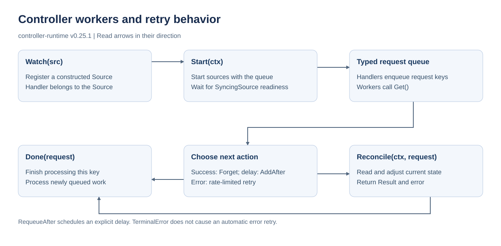

# [Controller](https://github.com/kubernetes-sigs/controller-runtime/blob/v0.25.1/pkg/controller/controller.go)

Controllers connect Sources, EventHandlers, Predicates, a workqueue, and a Reconciler. Sources receive changes; predicates decide which events to forward; handlers map accepted events to keys; workers reconcile those keys. Builder configures this wiring, while Manager controls its lifecycle.

These implementation notes and the diagram target controller-runtime v0.25.1, pinned in the repository's go.mod. Use the signatures and call paths below for this version.

## Controller interface

The standard Controller is a `TypedController[reconcile.Request]`. It embeds a Reconciler and accepts a source already configured with its handler and predicates.

```go
type TypedController[request comparable] interface {
    reconcile.TypedReconciler[request]

    Watch(src source.TypedSource[request]) error

    Start(ctx context.Context) error

    GetLogger() logr.Logger
}
```

## Controller type



The concrete type is in `pkg/internal/controller`. `Do` holds the user's Reconciler, `NewQueue` constructs the queue, `startWatches` stores sources, and `MaxConcurrentReconciles` determines worker count. Context and synchronization fields coordinate startup and shutdown.

```go
type Controller[request comparable] struct {
    Name string

    MaxConcurrentReconciles int

    Do reconcile.TypedReconciler[request]

    RateLimiter workqueue.TypedRateLimiter[request]

    NewQueue func(controllerName string, rateLimiter workqueue.TypedRateLimiter[request]) workqueue.TypedRateLimitingInterface[request]

    Queue priorityqueue.PriorityQueue[request]

    mu sync.Mutex

    Started bool

    ctx context.Context

    CacheSyncTimeout time.Duration

    startWatches []source.TypedSource[request]

    startedEventSourcesAndQueue bool

    didStartEventSourcesOnce sync.Once

    LogConstructor func(request *request) logr.Logger

    RecoverPanic *bool

    LeaderElected *bool

    EnableWarmup *bool

    ReconciliationTimeout time.Duration
}
```

## How Controller is used

1. Construct Manager and a Reconciler with explicit dependencies such as `mgr.GetClient()`.
2. Call `ctrl.NewControllerManagedBy(mgr).For(object).Complete(reconciler)` and check the error.
3. Builder.doController calls `controller.NewTyped`, which defaults controller options from the Manager, constructs an unmanaged controller, and registers it with `mgr.Add`.
4. The internal controller stores the Reconciler in `Do`. No `SetFields` injection occurs.
5. Builder.doWatch constructs a Kind source for each For/Owns/Watches entry, using the Manager cache, the appropriate handler, and predicates.
6. `Controller.Watch` registers those sources. Manager later starts the controller after cache readiness and, by default, leadership acquisition.

The registration path is:

```go
func NewTyped[request comparable](name string, mgr manager.Manager, options TypedOptions[request]) (TypedController[request], error) {
    options.DefaultFromConfig(mgr.GetControllerOptions())
    c, err := NewTypedUnmanaged(name, options)
    if err != nil {
        return nil, err
    }

    return c, mgr.Add(c)
}
```

`NewUnmanaged` / `NewTypedUnmanaged` are available when you explicitly manage lifecycle yourself. A controller created that way must have its dependencies and cache started, and its Start called by your program; it is not automatically registered with a Manager.

## `Watch` func

Builder calls Watch during Build. The handler and predicates are part of the Source, so Watch now takes just the source. It locks the controller, queues sources before source startup, and starts dynamically added sources if event sources have already started:

```go
func (c *Controller[request]) Watch(src source.TypedSource[request]) error {
    c.mu.Lock()
    defer c.mu.Unlock()

    if !c.startedEventSourcesAndQueue {
        c.startWatches = append(c.startWatches, src)
        return nil
    }

    c.LogConstructor(nil).Info("Starting EventSource", "source", src)
    return src.Start(c.ctx, c.Queue)
}
```

The older Watch signature injected fields into Source, Handler, and Predicates. See [inject](../inject/) for historical details and the explicit replacements.

## `Start` func

1. Reject a second Start and initialize metrics and controller context.
2. Create the queue and start registered event sources unless warmup already did so.
3. Wait for SyncingSources with CacheSyncTimeout before starting workers. Source errors or sync timeouts stop startup.
4. Run MaxConcurrentReconciles workers. Each repeatedly calls processNextWorkItem.
5. A worker gets a key, defers Done, and invokes reconcileHandler, which adds logging context and calls the user's Reconcile through `Do`.
6. On context cancellation, shut down the queue, unblock waiting workers, and wait for their exit.

The worker implementation shows the Get/Done pairing:

```go
func (c *Controller[request]) processNextWorkItem(ctx context.Context) bool {
    obj, priority, shutdown := c.Queue.GetWithPriority()
    if shutdown {
        return false
    }

    defer c.Queue.Done(obj)

    ctrlmetrics.ActiveWorkers.WithLabelValues(c.Name).Add(1)
    defer ctrlmetrics.ActiveWorkers.WithLabelValues(c.Name).Add(-1)

    c.reconcileHandler(ctx, obj, priority)
    return true
}
```

The reconcile result determines scheduling:

| Return | Queue action |
| --- | --- |
| Non-terminal error | Rate-limited retry; result timing is ignored |
| `reconcile.TerminalError(err)` | Log/count the error without automatic retry |
| `Result{RequeueAfter: d}`, nil | Forget retry history and enqueue after d |
| `Result{Requeue: true}`, nil | Rate-limited retry; Requeue is deprecated |
| Empty result, nil | Forget retry history; wait for a future event |

Priority-aware queue options preserve or update priority through retries. Multiple changes can collapse into one queued key; a Reconciler must read current state and be idempotent rather than assume one call per event. Errors, timing, and queue depth are reported through controller metrics.
