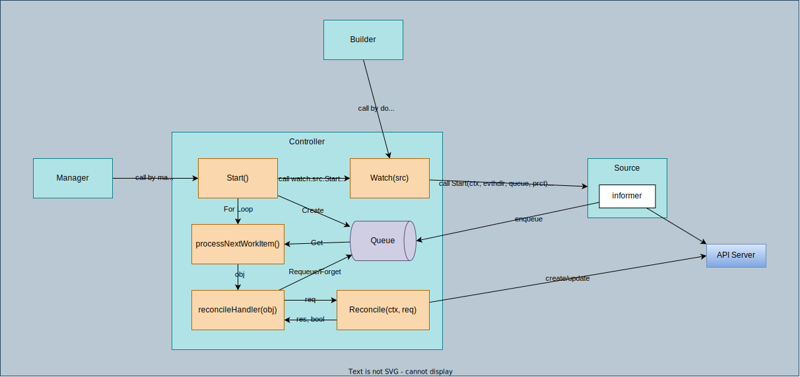

# [Controller](https://pkg.go.dev/sigs.k8s.io/controller-runtime/pkg/controller)

Controllers ([pkg/controller](https://pkg.go.dev/sigs.k8s.io/controller-runtime/pkg/controller)) use events ([pkg/event](https://pkg.go.dev/sigs.k8s.io/controller-runtime/pkg/event)) to eventually trigger reconcile requests. They may be constructed manually, but are often constructed with a Builder ([pkg/builder](https://pkg.go.dev/sigs.k8s.io/controller-runtime/pkg/builder)), which eases the wiring of event sources ([pkg/source](https://pkg.go.dev/sigs.k8s.io/controller-runtime/pkg/source)), like Kubernetes API object changes, to event handlers ([pkg/handler](https://pkg.go.dev/sigs.k8s.io/controller-runtime/pkg/handler)), like "enqueue a reconcile request for the object owner". Predicates ([pkg/predicate](https://pkg.go.dev/sigs.k8s.io/controller-runtime/pkg/predicate)) can be used to filter which events actually trigger reconciles. There are pre-written utilities for the common cases, and interfaces and helpers for advanced cases.

## [Controller interface](https://github.com/kubernetes-sigs/controller-runtime/blob/v0.13.0/pkg/controller/controller.go#L66-L84)

Controller embeds reconcile.Reconciler.

```go
type Controller interface {
	// Reconciler is called to reconcile an object by Namespace/Name
	reconcile.Reconciler

	// Watch takes events provided by a Source and uses the EventHandler to
	// enqueue reconcile.Requests in response to the events.
	//
	// Watch may be provided one or more Predicates to filter events before
	// they are given to the EventHandler.  Events will be passed to the
	// EventHandler if all provided Predicates evaluate to true.
	Watch(src source.Source, eventhandler handler.EventHandler, predicates ...predicate.Predicate) error

	// Start starts the controller.  Start blocks until the context is closed or a
	// controller has an error starting.
	Start(ctx context.Context) error

	// GetLogger returns this controller logger prefilled with basic information.
	GetLogger() logr.Logger
}
```

## [Controller type](https://github.com/kubernetes-sigs/controller-runtime/blob/v0.13.0/pkg/internal/controller/controller.go#L42-L95)



```go
type Controller struct {
	Name string
	MaxConcurrentReconciles int
	Do reconcile.Reconciler
	MakeQueue func() workqueue.RateLimitingInterface
	Queue workqueue.RateLimitingInterface
	SetFields func(i interface{}) error
	mu sync.Mutex
	Started bool
	ctx context.Context
	CacheSyncTimeout time.Duration
	startWatches []watchDescription
	LogConstructor func(request *reconcile.Request) logr.Logger
	RecoverPanic bool
}
```

1. `Do`: reconcile.Reconciler

## How Controller is used

Interestingly, `New` requires **Manager** and when a controller is created, the controller is added to the manager. A Controller **must** be run by a **Manager**. A controller is added to [controllerManager](../manager) via builder, more specifically `NewControllerManagedBy`. For more details, you can also check [manager](../manager/).

```go
// New returns a new Controller registered with the Manager.  The Manager will ensure that shared Caches have
// been synced before the Controller is Started.
func New(name string, mgr manager.Manager, options Options) (Controller, error) {
	c, err := NewUnmanaged(name, mgr, options)
	if err != nil {
		return nil, err
	}

	// Add the controller as a Manager components
	return c, mgr.Add(c)
}
```

1. `Manager` and `Reconciler` need to be prepared.
1. Call `NewControllerManagedBy(mgr)` and `Complete(r)` with the manager and reconciler.
1. `Builer.build` calls `bldr.doController` to create a controller with `Controller.New`.
	1. `Manager.SetFields` is passed to `ctrl.SetFields`
	1. `workqueue.NewNamedRateLimitingQueue` is set to `ctrl.MakeQueue`
	1. `Reconciler` is set to `ctrl.Do`
	1. The created controller is set to `bldr.ctrl`
1. `Builder.build` also calls `bldr.doWatch`
	1. `Kind` is created for `For` and `Owns`.
	1. `EventHandler` is created.
	1. Call `bldr.ctrl.Watch(src, hdlr, allPredicates...)`
1. `controller.Watch`
	1. Inject the cache to the `src` with `SetFields` (given by the Manager).
	1. Inject (sth) to the `eventHandler` and `Predicates` with `SetFields` (not checked what's injected).
	1. If the controller hasn't started yet, store the watches locally (`startWatches`) and return.
	1. If the controller has started, calls `src.Start`
1. `controller.Start` is called by the `Manager` when `Manager.Start` is called.
	1. Controller can be started only once.
	1. Create a `Queue` with `MakeQueue` func which is specified in `New`.
	1. For the stored watches (`startWatches`), call `watch.src.Start` to start src to monitor API server and enqueue modified objects.
	1. Convert `Kind` to `syncingSource` and call `syncingSource.WaitForSync`. This waits until the cache is synced in `src.Start` by checking [ks.started](https://github.com/kubernetes-sigs/controller-runtime/blob/v0.13.0/pkg/source/source.go#L123-L163) channel.
	1. Clean up the `startWatches` after the caches of all the watches are in-sync.
	1. Call `processNextWorkItem` with `MaxConcurrentReconciles` go routines.
## `Watch` func

1. Where is `Watch` called?
    1. `Watch` is called in [bldr.doWatch](https://github.com/kubernetes-sigs/controller-runtime/blob/v0.13.0/pkg/builder/controller.go#L196) in [builder](../builder) for `For`, `Owns`, and `Watches` configured with a controller builder.
1. `Watch` calls `SetFields` for `Source`, `EventHandler`, and `Predicate`s.
    ```go
	if err := c.SetFields(src); err != nil {
		return err
	}
	if err := c.SetFields(evthdler); err != nil {
		return err
	}
	for _, pr := range prct {
		if err := c.SetFields(pr); err != nil {
			return err
		}
	}
    ```
    1. `SetFields` is one of the Controller's field `SetFields func(i interface{}) error`, which is set when initializing in [NewUnmanaged](https://github.com/kubernetes-sigs/controller-runtime/blob/v0.13.0/pkg/controller/controller.go#L100) from `mgr.SetFields`.
	1. For more details, you can check [inject](../inject/) and [manager](../manager/)

## `Start` func

1. calls `processNextWorkItem` until it returns `false` [here](https://github.com/kubernetes-sigs/controller-runtime/blob/v0.13.0/pkg/internal/controller/controller.go#L234-L235).

Where is `Start` called?
1. Called from [manager](../manager/).
