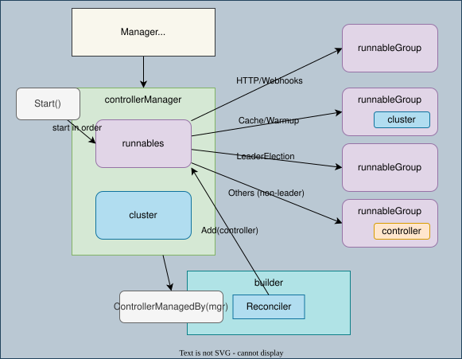

# Manager

Manager は Cluster の機能を持ち、Controller、Cache、Webhook、追加の Runnable の起動・停止を管理する。

```go
mgr, err := ctrl.NewManager(ctrl.GetConfigOrDie(), ctrl.Options{})
if err != nil {
    return err
}
if err := ctrl.NewControllerManagedBy(mgr).
    For(&corev1.Pod{}).
    Complete(podReconciler); err != nil {
    return err
}
return mgr.Start(ctrl.SetupSignalHandler())
```

`Complete`、`mgr.Add`、`Start` のエラーを処理する。Reconciler の依存は `mgr.GetClient()` などから明示的に渡す。

## Lifecycle

`Runnable` は `Start(context.Context) error` を実装する。長時間動く処理は context のキャンセルで終了する。

v0.25.1 の Manager は HTTP サーバー、Webhook、Cache、その他の Runnable、warmup の処理を開始し、リーダー選出が必要な処理も管理する。Controller は通常リーダー選出側に分類されるため、「すべて `runnables.Others` に追加される」という旧説明は当てはまらない。Cache の同期と Source の同期を経て Reconcile が動く。

Metrics の設定は `ctrl.Options{Metrics: metricsserver.Options{BindAddress: ":8080"}}` のように指定する。旧 `MetricsBindAddress` は使わない。

## Run

リポジトリルートで実行する。Pod と Deployment の list/watch 権限が必要。

```sh
go run ./contents/kubernetes-operator/controller-runtime/manager
```

[main.go](main.go) は二つの Controller と RunnableFunc を登録する。Ctrl+C で停止する。

参照: [Manager API](https://pkg.go.dev/sigs.k8s.io/controller-runtime@v0.25.1/pkg/manager)、[起動処理](https://github.com/kubernetes-sigs/controller-runtime/blob/v0.25.1/pkg/manager/internal.go)、[Runnable の分類](https://github.com/kubernetes-sigs/controller-runtime/blob/v0.25.1/pkg/manager/runnable_group.go)。

## 図


