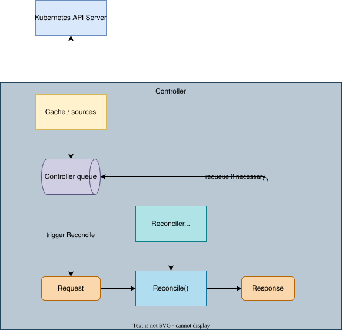

# [Reconciler](https://pkg.go.dev/sigs.k8s.io/controller-runtime/pkg/reconcile)



Controller logic is implemented in terms of Reconcilers ([pkg/reconcile](https://pkg.go.dev/sigs.k8s.io/controller-runtime/pkg/reconcile)). A Reconciler implements a function which takes a reconcile Request containing the name and namespace of the object to reconcile, reconciles the object, and returns a Result or an error indicating whether to requeue for a second round of processing.

As you can see in the diagram above, a Reconciler is part of a Controller. A Controller has a function to watch changes of the target resources, put reconciliation keys into the queue, and call **Reconcile** function with an queue item, and requeue the item if necessary.


## Types

### [Reconciler Interface](https://github.com/kubernetes-sigs/controller-runtime/blob/v0.25.1/pkg/reconcile/reconcile.go)

```go
type Reconciler = TypedReconciler[Request]

type TypedReconciler[request comparable] interface {
    Reconcile(context.Context, request) (Result, error)
}
```

### Request

```go
type Request struct {
    // NamespacedName is the name and namespace of the object to reconcile.
    types.NamespacedName
}
```

### Result

```go
type Result struct {
    Requeue bool

    RequeueAfter time.Duration

    Priority *int
}
```
## Implement

You can use either implementation of the `Reconciler` interface:
1. a reconciler struct with `Reconcile` function.
1. a `reconcile.Func`, which implements Reconciler interface:
    ```go
    type Func func(context.Context, Request) (Result, error)
    ```

([Controller](https://github.com/kubernetes-sigs/controller-runtime/blob/v0.25.1/pkg/internal/controller/controller.go) also implements Reconciler interface. The reconciler passed to `builder` is used inside the controller's `Reconcile` function.)
## How reconciler is used
Reconciler is passed to Controller [builder](../builder) when initializing controller (you can also check it in [Manager](../manager/)):

```go
if err := ctrl.NewControllerManagedBy(mgr).
    For(&corev1.Pod{}).
    Complete(podReconciler); err != nil {
    return err
}
```

`Reconcile` must be exported with this exact signature. The [standalone sample](main.go) has a compile-time `reconcile.Reconciler` assertion and runs without a cluster:

```sh
go run ./contents/kubernetes-operator/controller-runtime/reconciler
```

## Results, retries, and current state

A Request contains a key, not the original event or previous object. Read current state on every call. Ignore NotFound if no cleanup remains; return other errors so the controller can retry. Reconciliation must tolerate duplicate calls and partial previous progress.

An error normally schedules a rate-limited retry and overrides RequeueAfter. TerminalError suppresses that automatic retry. With a nil error, RequeueAfter schedules a delayed call; an empty Result waits for a future event. Requeue is deprecated; prefer RequeueAfter for intentional scheduling. Priority optionally controls the priority of subsequent queued work.

For a concrete read/list/patch implementation and no-op behavior, see the [ReplicaSet reconciler](../example-controller/). The [Controller](../controller/#start-func) owns queue processing, retry bookkeeping, and worker concurrency.
