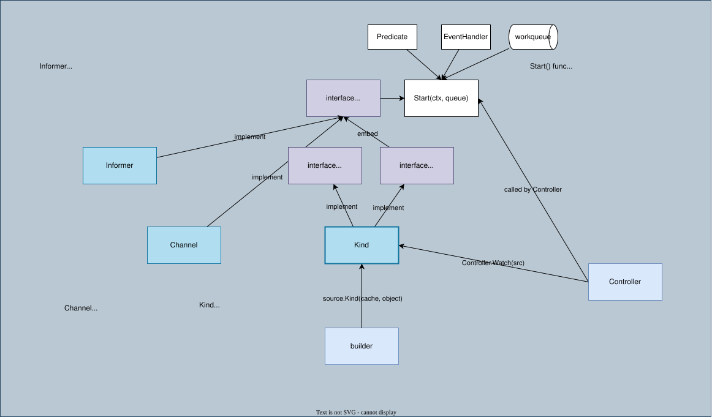
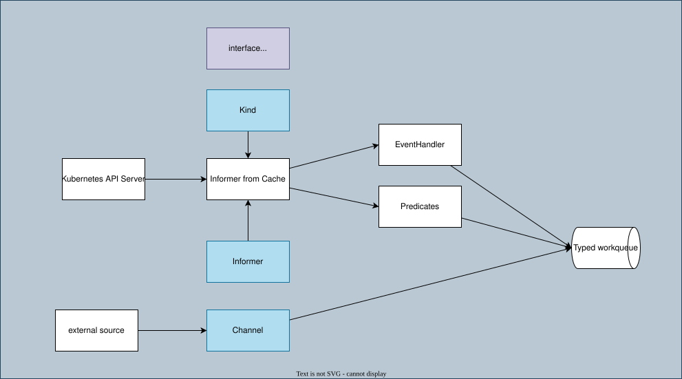

# Source

Component structure:


Dataflow:


These implementation notes and diagrams target controller-runtime v0.25.1, pinned in the repository's go.mod. Use the signatures and call paths below for this version.

## Source interface

`Source` is an alias for `TypedSource[reconcile.Request]`; custom comparable queue keys use TypedSource directly. A source now stores its handler and predicates at construction, and Start receives only context and queue.

```go
type TypedSource[request comparable] interface {
    Start(context.Context, workqueue.TypedRateLimitingInterface[request]) error
}
```

```go
type TypedSyncingSource[request comparable] interface {
    TypedSource[request]
    WaitForSync(ctx context.Context) error
}
```

## Implementations

### Kind: events from Kubernetes objects

Kind is a constructor, not the old exported struct literal. It receives the cache, object type, handler, and optional predicates explicitly:

```go
func Kind[object client.Object](
    cache cache.Cache,
    obj object,
    handler handler.TypedEventHandler[object, reconcile.Request],
    predicates ...predicate.TypedPredicate[object],
) SyncingSource {
    return TypedKind(cache, obj, handler, predicates...)
}
```

```go
type Kind[object client.Object, request comparable] struct {
    Type object

    Cache cache.Cache

    Handler handler.TypedEventHandler[object, request]

    Predicates []predicate.TypedPredicate[object]

    startedErr  chan error
    startCancel func()
}
```

For example:

```go
src := source.Kind(mgr.GetCache(), &corev1.Pod{},
    &handler.TypedEnqueueRequestForObject[*corev1.Pod]{})
if err := controller.Watch(src); err != nil {
    return err
}
```

Use `source.TypedKind` with a typed handler when the queue holds custom keys. The old InjectCache and NewKindWithCache paths were removed; dependency wiring happens here.

### Channel: external events

Channel accepts a Go channel of TypedGenericEvent values and a handler. Your code must connect the external producer (such as a timer or HTTP callback) to that channel; Channel does not establish external connections itself. Buffer-size and predicate options configure delivery.

```go
func Channel[object any](
    source <-chan event.TypedGenericEvent[object],
    handler handler.TypedEventHandler[object, reconcile.Request],
    opts ...ChannelOpt[object, reconcile.Request],
) Source {
    return TypedChannel[object, reconcile.Request](source, handler, opts...)
}
```

### Informer: an already selected informer

Informer receives a cache.Informer directly, together with a handler and predicates:

```go
type TypedInformer[object any, request comparable] struct {
    Informer   cache.Informer
    Handler    handler.TypedEventHandler[object, request]
    Predicates []predicate.TypedPredicate[object]
}
```

Kind obtains its informer from a Cache and implements WaitForSync. Informer uses the supplied informer and does not implement SyncingSource, so its caller must arrange startup/synchronization. Kind waits for both the cache and its handler's initial-list delivery.

## How `Source` is used

1. Builder.doWatch projects each For/Owns/Watches object to normal or metadata-only form.
2. For uses EnqueueRequestForObject; Owns uses EnqueueRequestForOwner; Watches uses the caller's handler. Builder combines global and per-watch predicates.
3. It calls `source.TypedKind(mgr.GetCache(), object, handler, predicates...)`, then `controller.Watch(src)`.
4. Watch stores sources until controller source startup. Manager starts the shared cache before controller workers.
5. Kind.Start starts asynchronous setup: get the informer for Type, wrap the event handler with the queue/predicates, and register it with AddEventHandler.
6. Startup waits for cache sync and the registration handle's HasSynced. WaitForSync returns any startup error or context timeout.
7. Informer notifications pass through predicates and the handler, which adds queue keys. The controller workers invoke Reconcile for those keys.

The actual Kind startup code illustrates error propagation and the synchronization boundary:

```go
func (ks *Kind[object, request]) Start(ctx context.Context, queue workqueue.TypedRateLimitingInterface[request]) error {
    if isNil(ks.Type) {
        return fmt.Errorf("must create Kind with a non-nil object")
    }
    if isNil(ks.Cache) {
        return fmt.Errorf("must create Kind with a non-nil cache")
    }
    if isNil(ks.Handler) {
        return errors.New("must create Kind with non-nil handler")
    }

    ctx, ks.startCancel = context.WithCancel(ctx)
    ks.startedErr = make(chan error, 1) // Buffer chan to not leak goroutines if WaitForSync isn't called
    go func() {
        var (
            i       cache.Informer
            lastErr error
        )

        if err := wait.PollUntilContextCancel(ctx, 10*time.Second, true, func(ctx context.Context) (bool, error) {
            i, lastErr = ks.Cache.GetInformer(ctx, ks.Type)
            if lastErr != nil {
                kindMatchErr := &meta.NoKindMatchError{}
                switch {
                case errors.As(lastErr, &kindMatchErr):
                    logKind.Error(lastErr, "if kind is a CRD, it should be installed before calling Start",
                        "kind", kindMatchErr.GroupKind)
                case runtime.IsNotRegisteredError(lastErr):
                    logKind.Error(lastErr, "kind must be registered to the Scheme")
                default:
                    logKind.Error(lastErr, "failed to get informer from cache")
                }
                return false, nil // Retry.
            }
            return true, nil
        }); err != nil {
            if lastErr != nil {
                ks.startedErr <- fmt.Errorf("failed to get informer from cache: %w", lastErr)
                return
            }
            ks.startedErr <- err
            return
        }

        handlerRegistration, err := i.AddEventHandlerWithOptions(NewEventHandler(ctx, queue, ks.Handler, ks.Predicates), toolscache.HandlerOptions{
            Logger: &logKind,
        })
        if err != nil {
            ks.startedErr <- err
            return
        }
        if !ks.Cache.WaitForCacheSync(ctx) {
            ks.startedErr <- errors.New("cache did not sync")
            close(ks.startedErr)
            return
        }
        if !toolscache.WaitForCacheSync(ctx.Done(), handlerRegistration.HasSynced) {
            ks.startedErr <- errors.New("handler did not sync")
        }
        close(ks.startedErr)
    }()

    return nil
}
```

## Example Usage: Debugging your controller

The [standalone sample](main.go) watches Pods and MySQLUsers without a Manager. It owns Cache and queue lifecycle explicitly.

1. Register client-go and MySQLUser API types in the Scheme. Scheme registration describes types locally; install the CRD separately on the cluster.
2. Call `cache.New(cfg, cache.Options{Scheme: scheme})`. It creates the HTTP client and RESTMapper. Do not call Get with an empty object's namespace/name just to start an informer.
3. Start the cache with a signal-derived context and retain its error result.
4. Create a typed rate-limiting queue and handlers. Include Kind, Namespace, and Name in the key so different resources do not collide. This debugging sample also keeps Event for display.
5. Build a TypedKind for each resource with that cache and handler, then call Start(ctx, queue).
6. Call WaitForSync with a 30-second timeout. Missing CRDs or list/watch permissions produce a startup failure instead of leaving a worker blocked indefinitely.
7. Consume queue.Get results, call Forget after successful handling, and always pair Get with Done. Canceling the context calls ShutDown to unblock Get, stops the cache, and joins its goroutine.

The sample's typed queue item is:

```go
type WorkQueueItem struct {
    Event     string
    Kind      string
    Namespace string
    Name      string
}
```

The registration pattern is:

```go
kindPod := source.TypedKind[client.Object](objectCache, &corev1.Pod{}, eventHandler)
if err := kindPod.Start(ctx, queue); err != nil {
    return err
}
if err := kindPod.WaitForSync(syncCtx); err != nil {
    return err
}
```

Run from the repository root on a development cluster:

```sh
kubectl apply -f https://raw.githubusercontent.com/nakamasato/mysql-operator/main/config/crd/bases/mysql.nakamasato.com_mysqlusers.yaml
go run ./contents/kubernetes-operator/controller-runtime/source
```

Initial objects log CreateFunc calls, followed by `kind is ready` and `got item` messages containing Event, Kind, Namespace, and Name. In another terminal, generate both custom-resource and Pod events:

```sh
kubectl apply -f https://raw.githubusercontent.com/nakamasato/mysql-operator/main/config/samples/mysql_v1alpha1_mysqluser.yaml
kubectl run nginx --image=nginx
kubectl annotate pod nginx source-demo=updated
kubectl delete pod nginx
```

The first command produces a MySQLUser Create event; the Pod commands produce Create, Update, and Delete events. Watch delivery may combine changes, so exact event counts and ordering are not guaranteed. Ctrl+C stops the sample. Remove the sample MySQLUser afterward if it was created only for this exercise.
