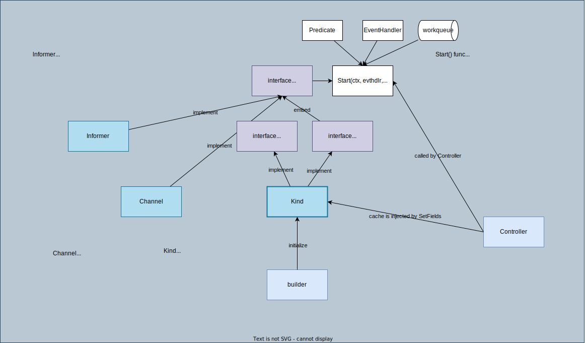

# Source

Component structure:


Dataflow:


## [Source](https://github.com/kubernetes-sigs/controller-runtime/blob/v0.13.0/pkg/source/source.go#L57-L68) interface

```go
type Source interface {
	// Start is internal and should be called only by the Controller to register an EventHandler with the Informer
	// to enqueue reconcile.Requests.
	Start(context.Context, handler.EventHandler, workqueue.RateLimitingInterface, ...predicate.Predicate) error
}

// SyncingSource is a source that needs syncing prior to being usable. The controller
// will call its WaitForSync prior to starting workers.
type SyncingSource interface {
	Source
	WaitForSync(ctx context.Context) error
}
```

## Implementation: [kindWithCache](https://github.com/kubernetes-sigs/controller-runtime/blob/v0.13.0/pkg/source/source.go#L77-L79), [Kind](https://github.com/kubernetes-sigs/controller-runtime/blob/v0.13.0/pkg/source/source.go#L91-L102), [Channel](https://github.com/kubernetes-sigs/controller-runtime/blob/v0.13.0/pkg/source/source.go#L207-L226), [Informer](https://github.com/kubernetes-sigs/controller-runtime/blob/v0.13.0/pkg/source/source.go#L338-L341)

1. [kindWithCache](https://github.com/kubernetes-sigs/controller-runtime/blob/v0.13.0/pkg/source/source.go#L77-L79): Just a wrapper of `Kind` without `InjectCache`. NewKindWithCache creates a Source without `InjectCache`, so that it is **assured that the given cache is used and not overwritten**.
    ```go
    type kindWithCache struct {
    	kind Kind
    }
    ```
    `Kind` has `InjectCache` while `kindWithCache` doesn't.
1. [Kind](https://github.com/kubernetes-sigs/controller-runtime/blob/v0.13.0/pkg/source/source.go#L91-L102): Kind is used to provide a source of **events originating inside the cluster** from Watches (e.g. Pod Create).
    ```go
    type Kind struct {
        Type client.Object
        cache cache.Cache
        started     chan error
        startCancel func()
    }
    ```
    1. `Kind` has `InjectCache` while `kindWithCache` doesn't.
    1. This is used by default if you build a controller with [builder](../builder/README.md#-convert-client.Object-to-source).
        ```go
        src := &source.Kind{Type: typeForSrc}
        ```
    1. The cache is injected in [controller.Watch](https://github.com/kubernetes-sigs/controller-runtime/blob/v0.13.0/pkg/internal/controller/controller.go#L129-L130) by [inject](../inject) feature.
        ```go
        // Inject Cache into arguments
        if err := c.SetFields(src); err != nil {
            return err
        }
        ```
1. [Channel](https://github.com/kubernetes-sigs/controller-runtime/blob/v0.13.0/pkg/source/source.go#L207-L226): Channel is used to provide a source of **events originating outside the cluster** (e.g. GitHub Webhook callback).  **Channel requires the user to wire the external source** (eh.g. http handler) to write GenericEvents to the underlying channel.
1. [Informer](https://github.com/kubernetes-sigs/controller-runtime/blob/v0.13.0/pkg/source/source.go#L338-L341): Informer is used to provide a source of **events originating inside the cluster** from Watches (e.g. Pod Create).
    ```go
    type Informer struct {
        // Informer is the controller-runtime Informer
        Informer cache.Informer
    }
    ```

What's the difference between `Informer` and `Kind`?
1. `Kind` gets informer from `cache.Cache`.
1. `Informer` needs to be initialized with `cache.Informer` directly.
1. `Kind` calls `WaitForCacheSync` after adding eventhandler by `AddEventHandler` while `Informer` doesn't.


## How `Source` is used

1. `Source` is initialized in `builder.doWatch` for each of `For`, `Owns`, and `Watches`:
    1. [For](https://github.com/kubernetes-sigs/controller-runtime/blob/v0.13.0/pkg/builder/controller.go#L222-L225):
        ```go
        // Reconcile type
        typeForSrc, err := blder.project(blder.forInput.object, blder.forInput.objectProjection)
        if err != nil {
            return err
        }
        src := &source.Kind{Type: typeForSrc}
        ```
    1. [Owns](https://github.com/kubernetes-sigs/controller-runtime/blob/v0.13.0/pkg/builder/controller.go#L235-L239):
        ```go
        typeForSrc, err := blder.project(own.object, own.objectProjection)
		if err != nil {
			return err
		}
		src := &source.Kind{Type: typeForSrc}
        ```
    1. [Watches](https://github.com/kubernetes-sigs/controller-runtime/blob/v0.13.0/pkg/builder/controller.go#L257-L263):
        ```go
        // If the source of this watch is of type *source.Kind, project it.
		if srckind, ok := w.src.(*source.Kind); ok {
			typeForSrc, err := blder.project(srckind.Type, w.objectProjection)
			if err != nil {
				return err
			}
			srckind.Type = typeForSrc
		}
        ```
1. The initialized source is passed to `controller.Watch` in [builder.doWatch](https://github.com/kubernetes-sigs/controller-runtime/blob/v0.13.0/pkg/builder/controller.go#L246) if the controller is initialized by [builder](https://github.com/kubernetes-sigs/controller-runtime/blob/v0.13.0/pkg/builder/controller.go#L54)

    ```go
    if err := blder.ctrl.Watch(w.src, w.eventhandler, allPredicates...); err != nil {
        return err
    }
    ```
1. In [controller.Watch](https://github.com/kubernetes-sigs/controller-runtime/blob/v0.13.0/pkg/internal/controller/controller.go#L151)
    1. `Cache` is injected from controller.
        ```go
        // Inject Cache into arguments
        if err := c.SetFields(src); err != nil {
            return err
        }
        ```
    1. `source.Start` is called with `EventHandler` and `Queue`
        ```go
        return src.Start(c.ctx, evthdler, c.Queue, prct...)
        ```
1. [Source.Start](https://github.com/kubernetes-sigs/controller-runtime/blob/v0.13.0/pkg/source/source.go#L108)
    1. Get `informer` from the injected `cache`.
        ```go
        i, lastErr = ks.cache.GetInformer(ctx, ks.Type)
        ```
    1. Add the event handler with `AddEventHandler`
        ```go
        i.AddEventHandler(internal.EventHandler{Queue: queue, EventHandler: handler, Predicates: prct})
        ```
1. informer is started by `manager.Start()`.
    ```go
    manager.runnables.Cache.Start()
    ```
    1. cache is initialized in [cluster](../cluster/README.md#set-fields) when a [Manager](../manager/README.md#1-initialize-a-controllermanagerhttpsgithubcomkubernetes-sigscontroller-runtimeblobv0123pkgmanagerinternalgol66-with-newmanager) is created.
