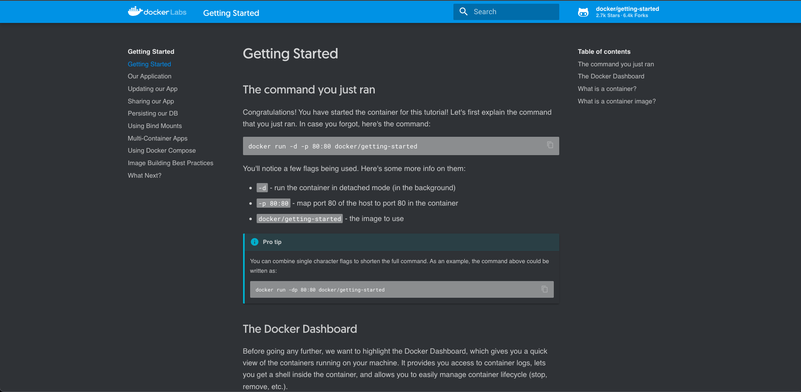

# Docker Desktop

Load Balancer in Kubernetes in Docker Desktop (ref: https://www.docker.com/blog/how-kubernetes-works-under-the-hood-with-docker-desktop/)

```
ubectl apply -f - <<EOF
apiVersion: v1
kind: Service
metadata:
  name: tutorial
spec:
  ports:
  - name: 80-tcp
    port: 80
    protocol: TCP
    targetPort: 80
  selector:
    com.docker.project: tutorial
  type: LoadBalancer
status:
  loadBalancer: {}

---
apiVersion: apps/v1
kind: Deployment
metadata:
  labels:
    com.docker.project: tutorial
  name: tutorial
spec:
  replicas: 1
  selector:
    matchLabels:
      com.docker.project: tutorial
  strategy:
    type: Recreate
  template:
    metadata:
      labels:
        com.docker.project: tutorial
    spec:
      containers:
      - image: docker/getting-started
        name: tutorial
        ports:
        - containerPort: 80
          protocol: TCP
        resources: {}
      restartPolicy: Always
status: {}
EOF
```

```
kubectl get svc tutorial
NAME       TYPE           CLUSTER-IP       EXTERNAL-IP   PORT(S)        AGE
tutorial   LoadBalancer   10.105.129.171   localhost     80:32088/TCP   2m
```

http://localhost/tutorial/



```
kubectl delete svc tutorial
kubectl delete deploy tutorial
```
