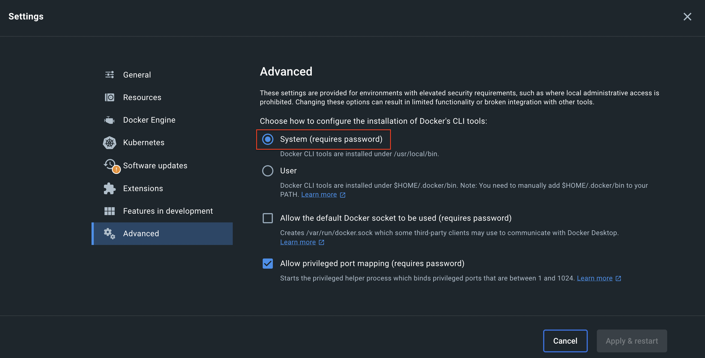

# [kind](https://kind.sigs.k8s.io/)

## Description

kind is a tool for running local Kubernetes clusters using Docker container “nodes”.

## Prerequisite

- go (1.16+)
- Docker

## Quick Start

```
kind create cluster
```

## [Installation](https://kind.sigs.k8s.io/docs/user/quick-start/#installation)

On Mac:

```
brew install kind
```

```
kind version
kind v0.20.0 go1.20.5 darwin/amd64
```

## Configure a cluster

```
kind create cluster --config <kind-config>.yaml
```

### Example 1: enable alpha feature https://kind.sigs.k8s.io/docs/user/configuration/#feature-gates (https://kubernetes.io/docs/reference/command-line-tools-reference/feature-gates/)

```
kind create cluster --config cluster-with-alpha-feature.yaml
Creating cluster "kind" ...
 ✓ Ensuring node image (kindest/node:v1.20.2) 🖼
 ✓ Preparing nodes 📦
 ✓ Writing configuration 📜
 ✓ Starting control-plane 🕹️
 ✓ Installing CNI 🔌
 ✓ Installing StorageClass 💾
Set kubectl context to "kind-kind"
You can now use your cluster with:

kubectl cluster-info --context kind-kind

Have a nice day! 👋
```

### Example2: Port Mapping on MacOS

kind - follow [the guide for setting up MetalLB](https://kind.sigs.k8s.io/docs/user/loadbalancer/) to get LoadBalancer type services to work.

```
kind create cluster --config cluster-with-port-mapping.yaml
```

```
kind create cluster --config=kind-config.yaml
Creating cluster "kind" ...
 ✓ Ensuring node image (kindest/node:v1.27.3) 🖼
 ✗ Preparing nodes 📦
Deleted nodes: ["kind-control-plane"]
ERROR: failed to create cluster: command "docker run --name kind-control-plane --hostname kind-control-plane --label io.x-k8s.kind.role=control-plane --privileged --security-opt seccomp=unconfined --security-opt apparmor=unconfined --tmpfs /tmp --tmpfs /run --volume /var --volume /lib/modules:/lib/modules:ro -e KIND_EXPERIMENTAL_CONTAINERD_SNAPSHOTTER --detach --tty --label io.x-k8s.kind.cluster=kind --net kind --restart=on-failure:1 --init=false --cgroupns=private --publish=127.0.0.1:80:80/TCP --publish=127.0.0.1:443:443/TCP --publish=127.0.0.1:64460:6443/TCP -e KUBECONFIG=/etc/kubernetes/admin.conf kindest/node:v1.27.3@sha256:3966ac761ae0136263ffdb6cfd4db23ef8a83cba8a463690e98317add2c9ba72" failed with error: exit status 125
Command Output: 652292163c0d7eab803a99ab16a89f1c2a32061f484cad28829883f164d036b8
docker: Error response from daemon: Ports are not available: exposing port TCP 127.0.0.1:443 -> 0.0.0.0:0: not allowed as current user.
You can enable privileged port mapping from Docker -> Settings... -> Advanced -> Enable privileged port mapping.
```

If you encounter the above error, you can change the Docker's CLI tools:



Ref:
1. https://sumito.jp/2023/06/23/error-response-from-daemon-ports-are-not-available-exposing-port-tcp-127-0-0-180-0-0-0-00-not-allowed-as-current-user-you-can-enable-privileged-port-mapping-from-docker-settings-adva/
1. https://kind.sigs.k8s.io/docs/user/configuration/#extra-port-mappings

## Why kind?

- kind supports multi-node (including HA) clusters
- kind supports building Kubernetes release builds from source
    support for make / bash / docker, or bazel, in addition to pre-published builds
- kind supports Linux, macOS and Windows
- kind is a CNCF certified conformant Kubernetes installer
