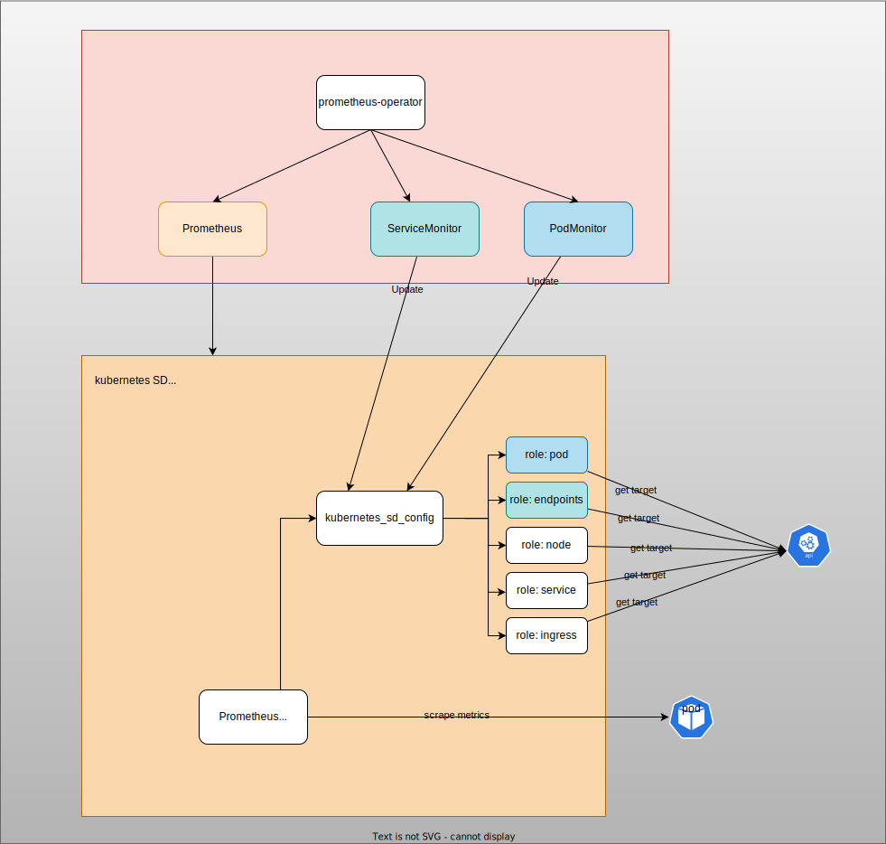
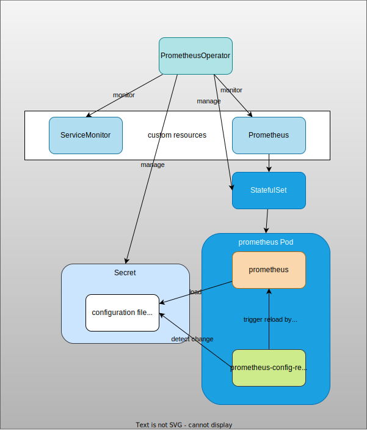

# Prometheus Operator
## Overview

How Prometheus Operator interacts with Prometheus:


About [Prometheus](../prometheus)
## Basic Usage

### 1. Deploy Prometheus Operator and Prometheus

1. Create namespace.

    ```
    kubectl create ns monitoring
    ```

1. Install Prometheus operator in `default` namespace.

    ```
    kubectl create -f https://raw.githubusercontent.com/prometheus-operator/prometheus-operator/master/bundle.yaml
    ```

    <details><summary>This command creates the following resources:</summary>

    1. 8 CRDs:
        1. `AlertmanagerConfig`
        1. `Alertmanager`
        1. `PodMonitor`
        1. `Probe`
        1. `Prometheus`
        1. `PrometheusRule`
        1. `ServiceMonitor`
        1. `ThanosRuler`
    1. `ClusterRoleBinding` & `ClusterRole`: `prometheus-operator`
    1. `Deployment`: `prometheus-operator`
    1. `ServiceAccount`: `prometheus-operator`
    1. `Service`: `prometheus-operator`

    </details>

1. Deploy Prometheus in `monitoring` namespace.

    The resources to deploy:
    1. `Prometheus`
    1. rbac: `ClusterRole`, `ClusterRoleBinding`, and `ServiceAccount`
    1. `Service` for Prometheus Pods.
    1. `ServiceMonitor` for Prometheus itself.

    ```
    kubectl apply -k .
    ```

### 2. Monitor an application with `ServiceMonitor`

Deploy example application with `ServiceMonitor`.

```
kubectl apply -f example-app-with-service-monitor
```

```
kubectl port-forward -n monitoring svc/prometheus-operated 9090:9090
```

Open http://localhost:9090/targets:


We can see `serviceMonitor/default/example-app-with-service-monitor/0` in `scrape_configs`

**ServiceMonitor**

```yaml
spec:
  selector:
    matchLabels:
      app: example-app-with-service-monitor
  endpoints:
  - port: web
```

**Prometheus scrape_config**

The above `ServiceMonitor` is converted into a job `serviceMonitor/default/example-app-with-service-monitor/0` in scrape_config

- `relabel_configs`: relabel based on the available Kubernetes metadata for [endpoints](https://prometheus.io/docs/prometheus/latest/configuration/configuration/#endpoints)

    ```yaml
    relabel_configs:
      - source_labels: [__meta_kubernetes_service_label_app, __meta_kubernetes_service_labelpresent_app]
        separator: ;
        regex: (example-app-with-service-monitor);true
        replacement: $1
        action: keep
      - source_labels: [__meta_kubernetes_endpoint_port_name]
        separator: ;
        regex: web
        replacement: $1
        action: keep
    ...
    ```

- `kubernetes_sd_configs`: Kubernetes service discovery config. ServiceMonitor uses `endpoints` role.

    ```yaml
    kubernetes_sd_configs:
    - role: endpoints
        kubeconfig_file: ""
        follow_redirects: true
        namespaces:
        names:
        - default
    ```

You can check the whole config by the following command:

```
kubectl get secret prometheus-prometheus -n monitoring -o yaml | yq '.data["prometheus.yaml.gz"]' | base64 -d | gunzip | yq '.scrape_configs[] | select(.job_name == "serviceMonitor/default/example-app-with-service-monitor/0")'
```

<details><summary>scrape_configs</summary>

```yaml
job_name: serviceMonitor/default/example-app-with-service-monitor/0
honor_labels: false
kubernetes_sd_configs:
  - role: endpoints
    namespaces:
      names:
        - default
relabel_configs:
  - source_labels:
      - job
    target_label: __tmp_prometheus_job_name
  - action: keep
    source_labels:
      - __meta_kubernetes_service_label_app
      - __meta_kubernetes_service_labelpresent_app
    regex: (example-app-with-service-monitor);true
  - action: keep
    source_labels:
      - __meta_kubernetes_endpoint_port_name
    regex: web
  - source_labels:
      - __meta_kubernetes_endpoint_address_target_kind
      - __meta_kubernetes_endpoint_address_target_name
    separator: ;
    regex: Node;(.*)
    replacement: ${1}
    target_label: node
  - source_labels:
      - __meta_kubernetes_endpoint_address_target_kind
      - __meta_kubernetes_endpoint_address_target_name
    separator: ;
    regex: Pod;(.*)
    replacement: ${1}
    target_label: pod
  - source_labels:
      - __meta_kubernetes_namespace
    target_label: namespace
  - source_labels:
      - __meta_kubernetes_service_name
    target_label: service
  - source_labels:
      - __meta_kubernetes_pod_name
    target_label: pod
  - source_labels:
      - __meta_kubernetes_pod_container_name
    target_label: container
  - source_labels:
      - __meta_kubernetes_service_name
    target_label: job
    replacement: ${1}
  - target_label: endpoint
    replacement: web
  - source_labels:
      - __address__
    target_label: __tmp_hash
    modulus: 1
    action: hashmod
  - source_labels:
      - __tmp_hash
    regex: $(SHARD)
    action: keep
metric_relabel_configs: []
```

</details>


### 3. Monitor an application with `PodMonitor`

Deploy example application with `PodMonitor`.

```
kubectl apply -f example-app-with-pod-monitor
```


We can see `podMonitor/default/example-app-with-pod-monitor/0` in `scrape_configs`

- `relabel_configs`: relabel based on the available Kubernetes metadata for [pod](https://prometheus.io/docs/prometheus/latest/configuration/configuration/#pod)
- `kubernetes_sd_configs`: Kubernetes service discovery config. ServiceMonitor uses `endpoints` role.

    ```yaml
    kubernetes_sd_configs:
    - role: pod
        kubeconfig_file: ""
        follow_redirects: true
        namespaces:
        names:
        - default
    ```

You can check the whole config by the following command:

```
kubectl get secret prometheus-prometheus -n monitoring -o yaml | yq '.data["prometheus.yaml.gz"]' | base64 -d | gunzip | yq '.scrape_configs[] | select(.job_name == "podMonitor/default/example-app-with-pod-monitor/0")'
```

<details><summary>scrape_configs</summary>

```yaml
job_name: podMonitor/default/example-app-with-pod-monitor/0
honor_labels: false
kubernetes_sd_configs:
  - role: pod
    namespaces:
      names:
        - default
relabel_configs:
  - source_labels:
      - job
    target_label: __tmp_prometheus_job_name
  - action: keep
    source_labels:
      - __meta_kubernetes_pod_label_app
      - __meta_kubernetes_pod_labelpresent_app
    regex: (example-app-with-pod-monitor);true
  - action: keep
    source_labels:
      - __meta_kubernetes_pod_container_port_name
    regex: web
  - source_labels:
      - __meta_kubernetes_namespace
    target_label: namespace
  - source_labels:
      - __meta_kubernetes_pod_container_name
    target_label: container
  - source_labels:
      - __meta_kubernetes_pod_name
    target_label: pod
  - target_label: job
    replacement: default/example-app-with-pod-monitor
  - target_label: endpoint
    replacement: web
  - source_labels:
      - __address__
    target_label: __tmp_hash
    modulus: 1
    action: hashmod
  - source_labels:
      - __tmp_hash
    regex: $(SHARD)
    action: keep
metric_relabel_configs: []
```

</details>

### 4. Clean up

```
kubectl delete -f example-app-with-pod-monitor
kubectl delete -f example-app-with-service-monitor
kubectl delete -k .
kubectl delete -f https://raw.githubusercontent.com/prometheus-operator/prometheus-operator/master/bundle.yaml
kubectl delete ns monitoring
```
## Important Configurations

[PrometheusSpec](https://github.com/prometheus-operator/prometheus-operator/blob/master/Documentation/api.md#prometheusspec)

- `serviceMonitorNamespaceSelector`: Namespace's labels to match for ServiceMonitor discovery. If nil, only check own namespace. e.g. `serviceMonitorNamespaceSelector: {}` if you want to monitor all namespaces.
- `podMonitorNamespaceSelector`: Namespace's labels to match for PodMonitor discovery. If nil, only check own namespace. e.g. `podMonitorNamespaceSelector: {}` if you want to monitor all namespaces.


## Operator Implementation

1. How to create Prometheus server:
    - `StatefulSet` for Prometheus is created in [prometheus/statefulset.go](https://github.com/prometheus-operator/prometheus-operator/blob/023feeca9d01be2fb114e0a6b7ffa67a5928de08/pkg/prometheus/statefulset.go#L919-L950) with `prometheus` and `prometheus-config-reloader` containers.
1. How to reflect `ServiceMonitor` and `PodMonitor` to scrape_config in Prometheus configuration:
    1. [Operator.createOrUpdateConfigurationSecret]() calls in `cg.Generate` in [operator.go](https://github.com/prometheus-operator/prometheus-operator/blob/24473006a5fe923e08c980f97afc15c1d4b674b7/pkg/prometheus/operator.go#L1622-L1632)
        ```go
        conf, err := cg.Generate(
            p,
            smons,
            pmons,
            bmons,
            store,
            additionalScrapeConfigs,
            additionalAlertRelabelConfigs,
            additionalAlertManagerConfigs,
            ruleConfigMapNames,
        )
        ```
    1. `Generate` calls in [promcfg.go](https://github.com/prometheus-operator/prometheus-operator/blob/24473006a5fe923e08c980f97afc15c1d4b674b7/pkg/prometheus/promcfg.go)
        - `generatePodMonitorConfig`
        - `generateServiceMonitorConfig`
        - `generateProbeConfig`
        - `generateAlertmanagerConfig`
    1. All `generateXXXXConfig` call `generateK8SSDConfig` with different role in [promcfg.go](https://github.com/prometheus-operator/prometheus-operator/blob/24473006a5fe923e08c980f97afc15c1d4b674b7/pkg/prometheus/promcfg.go)
    - Generate kubernetes_sd_config: [generateK8SSDConfig](https://github.com/prometheus-operator/prometheus-operator/blob/24473006a5fe923e08c980f97afc15c1d4b674b7/pkg/prometheus/promcfg.go#L1437-L1494)
    1. `conf` is returned in `createOrUpdateConfigurationSecret` in `operator.go`.
    1. `conf` is compressed.
    1. Initialize `Secret` and set the compressed configData as `s.Data[configFilename] = buf.Bytes()`.
    1. Create or update the `Secret`.

    

## History

1. 2016-11-09 [v0.0.1](https://github.com/prometheus-operator/prometheus-operator/tree/v0.0.1): `Prometheus`, `AlertManager` and `ServiceMonitor`
1. 2017-05-09 [v0.1.0](https://github.com/prometheus-operator/prometheus-operator/tree/v0.9.0): Added `Alertmanager` in [PR#28](https://github.com/prometheus-operator/prometheus-operator/pull/28)
1. 2018-06-05 [v0.20.0](https://github.com/prometheus-operator/prometheus-operator/releases/tag/v0.20.0): Added `PrometheusRule` in [PR#1333](https://github.com/prometheus-operator/prometheus-operator/pull/1333)
1. 2019-06-20 [v0.31.0](https://github.com/prometheus-operator/prometheus-operator/releases/tag/v0.31.0): Added `PodMonitor` in [PR#2566](https://github.com/prometheus-operator/prometheus-operator/pull/2566) related to [Issue#38](https://github.com/prometheus-operator/prometheus-operator/issues/38)
1. 2020-02-10 [v0.36.0](https://github.com/prometheus-operator/prometheus-operator/releases/tag/v0.36.0): Added `ThanosRuler` in [PR#2943](https://github.com/prometheus-operator/prometheus-operator/pull/2943)
1. 2020-10-27 [v0.43.0](https://github.com/prometheus-operator/prometheus-operator/releases/tag/v0.43.0) Added `AlertmanagerConfig` in [PR#3451](https://github.com/prometheus-operator/prometheus-operator/pull/3451)

## References

- [prometheus-operator](https://github.com/prometheus-operator/prometheus-operator/)
- [getting-started](https://github.com/prometheus-operator/prometheus-operator/tree/master/example/user-guides/getting-started): The examples above are from here.
- [prometheus/discovery/kubernetes](https://github.com/prometheus/prometheus/tree/main/discovery/kubernetes): Implementation of Kubernetes Discovery in Prometheus.
