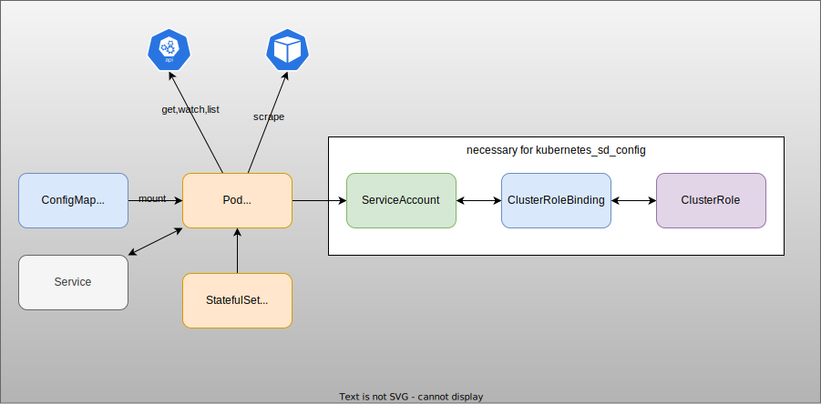
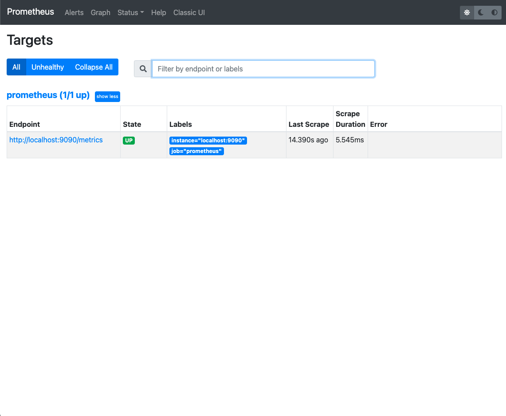

# Prometheus


## Diagram




## Getting Started

1. Deploy Prometheus in `monitoring` namespace.

    ```
    kubectl create ns monitoring
    kubectl apply -k .
    ```
1. Check on browser.
    ```
    kubectl -n monitoring port-forward svc/prometheus 9090:9090
    ```
    Open http://localhost:9090

    You can see `prometheus (1/1 up)`.

    This is defined in `prometheus.yml`

    ```yaml
    scrape_configs:
      - job_name: 'prometheus'
        # metrics_path defaults to '/metrics'
        # scheme defaults to 'http'.
        static_configs:
          - targets: ['localhost:9090']
    ```

    

## Configuration

### 1. Remove `scrape_config`

1. Update `prometheus.yml` with
    ```yaml
    global:
      scrape_interval:     15s
      evaluation_interval: 15s
    ```

    ```
    kubectl apply -k .
    ```

    ※ Not updated.

1. Manually reload.
    ```
    curl -X POST http://localhost:9090/-/reload
    ```

    You'll the logs:

    ```
    ts=2022-02-03T12:17:18.390Z caller=main.go:1128 level=info msg="Loading configuration file" filename=/etc/prometheus/prometheus.yml
    ts=2022-02-03T12:17:18.390Z caller=main.go:1165 level=info msg="Completed loading of configuration file" filename=/etc/prometheus/prometheus.yml totalDuration=717.8µs db_storage=5.4µs remote_storage=7.2µs web_handler=5.4µs query_engine=6.1µs scrape=299.6µs scrape_sd=14.2µs notify=6.2µs notify_sd=5.8µs rules=4.7µs
    ```

    ※ Need to wait for a while for some reason..(why?)

1. Check http://localhost:9090/targets -> Targets become empty.

### 2. Use `kubernetes_sd_config` - `endpoints` role

1. Try simple `role: endpoints`.

    ```yaml
    - job_name: 'prometheus-endpoints-role'
      kubernetes_sd_configs:
        - role: endpoints
    ```

    ```
    curl -X POST http://localhost:9090/-/reload
    ```

    -> all the pods behind endpoints are scraped.

1. Specify `namespaces`.

    ```yaml
    - job_name: 'prometheus-endpoints-role'
      kubernetes_sd_configs:
        - role: endpoints
          namespaces:
            own_namespace: true
            names:
              - monitoring
    ```

    ```
    curl -X POST http://localhost:9090/-/reload
    ```

    -> Only pods behind endpoints in monitoring namespace are scraped.

## References
- [prometheus](https://github.com/prometheus/prometheus)
