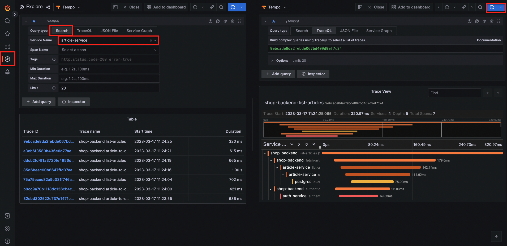

# [Tempo](https://github.com/grafana/tempo)

## [Getting Started](https://grafana.com/docs/tempo/latest/getting-started/docker-example/)

1. Clone
    ```
    git clone https://github.com/grafana/tempo.git && cd tempo/example/docker-compose/local
    ```
1. Run

    ```
    docker compose up
    ```

    Inside this compose, https://github.com/grafana/xk6-client-tracing/ is an app to generate traces

1. Open grafana http://localhost:3000

    
