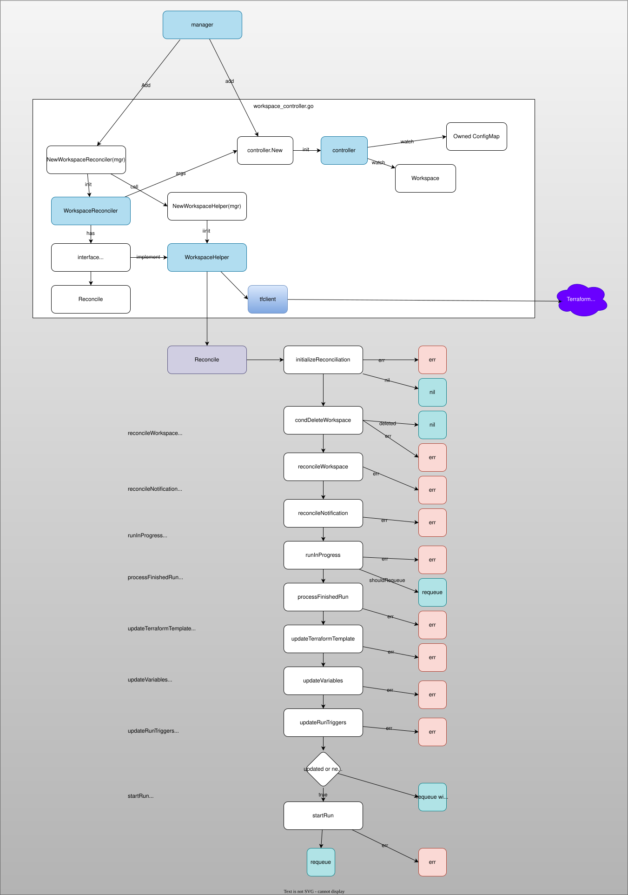

# [terraform-k8s](https://github.com/hashicorp/terraform-k8s)

Kubernetes operator to configure Terraform Cloud with CRD.

Latest release: [v1.1.2](https://github.com/hashicorp/terraform-k8s/releases/tag/v1.1.2).
This repository is archived; for new deployments use Terraform Cloud's current
Kubernetes integration rather than starting a new installation from this
operator.

Lifecycle of a Terraform Workspace:

1. A workspaces is created with CR `Workspace` with `ConfigMap`.
1. The operator detect the creation and start reconciliation loop.
1. If the configuration is valid, the first run will be executed.
1. After the run, the reconciliation loop is kept being called with an interval.
1. When any change or diff is detected, the operator will make the actual status and desired status same.
